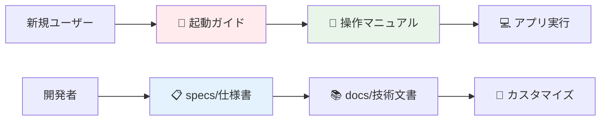

# 📊 株主対話デモアプリケーション

[](https://opensource.org/licenses/MIT)
[](https://developer.mozilla.org/docs/Web/HTML)
[](https://developer.mozilla.org/docs/Web/CSS)
[](https://developer.mozilla.org/docs/Web/JavaScript)
[](https://tailwindcss.com/)
[](https://azure.microsoft.com/ja-jp/products/ai-services/openai-service)

## 🚀 [アプリケーションを開く → src/](./src/)

> **Azure OpenAI GPT-4.1-mini** を使用した株主と取締役の対話シミュレーションアプリケーション

## 📋 概要

この株主対話デモアプリケーションは、Azure OpenAI の GPT-4.1-mini モデルを活用して、株主総会での株主と取締役の対話をリアルにシミュレートするWebアプリケーションです。PDFファイルから決算資料や株主総会資料を読み込み、その内容に基づいた自然な対話を自動生成します。

### ✨ 主な特徴

- 🤖 **Azure OpenAI 連携** - GPT-4.1-mini による高品質な対話生成
- 📄 **PDF 解析機能** - 決算資料・株主総会資料の自動テキスト抽出
- 🌐 **多言語対応** - 日本語、英語、中国語など7言語での対話生成
- 🎯 **自動対話進行** - 株主と取締役が5ターンの自然な対話を展開
- 📱 **レスポンシブデザイン** - PC・タブレット・スマートフォン対応
- ⚡ **ブラウザ完結** - サーバー不要でローカル環境のみで動作

## 🛠️ 技術スタック

### フロントエンド

| 技術                                     | バージョン | 用途                         |
| ---------------------------------------- | ---------- | ---------------------------- |
| HTML5                                    | Latest     | セマンティックなマークアップ |
| CSS3                                     | Latest     | スタイリング                 |
| [Tailwind CSS](https://tailwindcss.com/) | 3.x (CDN)  | ユーティリティファースト CSS |
| JavaScript                               | ES6+       | アプリケーションロジック     |
| [PDF.js](https://mozilla.github.io/pdf.js/) | 3.11.174 (CDN) | PDF ファイル処理        |

### クラウドサービス

| サービス                                 | 用途                         |
| ---------------------------------------- | ---------------------------- |
| [Azure OpenAI](https://azure.microsoft.com/ja-jp/products/ai-services/openai-service) | 対話生成エンジン |
| GPT-4.1-mini                             | 大規模言語モデル             |

### 対応言語

- 🇯🇵 **日本語** (既定)
- 🇺🇸 **English**
- 🇨🇳 **中文**
- 🇩🇪 **Deutsch**
- 🇫🇷 **Français**
- 🇪🇸 **Español**
- 🇰🇷 **한국어**

## 📁 プロジェクト構造

```
📦 株主対話デモアプリケーション/
├── 📄 Readme.md                 # プロジェクト概要・クイックスタート
├── 📁 src/                      # 🚀 アプリケーションソース
│   ├── 📄 index.html            # メインアプリケーション
│   ├── 📁 css/                  # スタイルシート
│   │   └── 📄 styles.css        # カスタムCSS
│   ├── 📁 js/                   # JavaScript
│   │   └── 📄 script.js         # メインアプリケーションロジック
│   └── 📄 test-powerpoint-pdf.js # PowerPoint PDF処理テスト
├── 📁 specs/                    # 📋 技術仕様書（NEW!）
│   ├── 📄 README.md             # 仕様書ディレクトリ索引
│   ├── 📄 functional-requirements.md     # 機能要件仕様書
│   ├── 📄 non-functional-requirements.md # 非機能要件仕様書
│   ├── 📄 technology-selection.md        # 技術選定理由書
│   └── 📄 system-specifications.md       # システム仕様書
└── 📁 docs/                     # 📚 利用者・開発者向けドキュメント
    ├── 📄 README.md             # ドキュメント索引
    ├── 📄 startup-guide.md      # 🚀 起動ガイド（NEW!）
    ├── 📄 operation-manual.md   # 📖 操作マニュアル（NEW!）
    ├── 📄 user-manual.md        # ユーザーマニュアル
    ├── 📄 features.md           # 機能仕様書
    ├── 📄 system-architecture.md # システムアーキテクチャ
    ├── 📄 api-integration.md    # API連携ガイド
    ├── 📄 developer-guide.md    # 開発者ガイド
    ├── 📄 ui-design.md          # UI設計仕様書
    └── 📄 [その他の機能仕様書...]  # 各機能の詳細仕様
```

### 📋 ディレクトリ別用途

| ディレクトリ | 用途 | 対象者 |
|-------------|------|--------|
| **📁 src/** | 実行可能なアプリケーション | 全ユーザー |
| **📁 specs/** | **技術仕様書・要件定義** | **アーキテクト・開発者** |
| **📁 docs/** | **利用ガイド・操作方法** | **全ユーザー・開発者** |

## 🚀 クイックスタート

### 前提条件

- 📌 モダンな Web ブラウザ (Chrome 90+, Firefox 88+, Safari 14+)
- 📌 Azure OpenAI サービスのアクセス権
- 📌 アップロード用の PDF ファイル（決算短信、株主総会資料等）

### 使用方法

#### 1. アプリケーションの起動

```bash
# リポジトリをクローン
git clone https://github.com/tokawa-ms/20250725-kabunushi-demo-001.git
cd 20250725-kabunushi-demo-001

# ブラウザでsrc/index.htmlを開く
# または簡易Webサーバーを起動
cd src
python -m http.server 8000
# ブラウザで http://localhost:8000 を開く
```

#### 2. Azure OpenAI の設定

1. **接続情報の入力**
   - エンドポイント URL: `https://your-resource.openai.azure.com/`
   - API キー: Azure ポータルで取得したキー
   - デプロイメント名: `gpt-4o-mini` (または使用するモデル名)
   - API バージョン: `2024-02-15-preview`

2. **接続テスト**
   - 「🔗 接続テスト」ボタンで動作確認
   - 「💾 設定保存」で設定をローカルに保存

#### 3. PDF ファイルの準備

1. **ファイルアップロード**
   - 「📄 PDF資料アップロード」で決算資料等を選択
   - 複数ファイルの同時アップロード対応

2. **プレビュー確認**
   - アップロードした PDF の内容をプレビューで確認
   - ページ送り・戻しで内容を確認

#### 4. 対話シミュレーションの実行

**方法A: 質問候補を使用した対話**
1. **質問候補の自動生成**
   - Azure OpenAI接続 + PDFアップロード完了後、自動的に6つの質問候補が生成される
   - 「❓ 株主質問候補」セクションに表示される

2. **質問選択と対話開始**
   - 任意の質問候補をクリック
   - 質問候補セクションが自動的に折り畳まれる
   - 選択した質問で対話が開始される

3. **対話進行**
   - 株主と取締役が自動的に5ターンの対話を実施
   - リアルタイムで対話内容が表示される

**方法B: 従来の対話開始**
1. **対話開始**
   - 「🚀 対話開始」ボタンをクリック
   - 自動的に株主からの質問が生成される

2. **対話進行**
   - 株主と取締役が自動的に5ターンの対話を実施
   - リアルタイムで対話内容が表示される

**共通: 結果確認**
- 対話完了後に要約が自動生成される
- 各吹き出しをクリックで詳細表示可能

## 💡 主な機能

### 🔧 Azure OpenAI 連携機能
- **接続設定**: エンドポイント、APIキー、デプロイメント名の設定
- **接続テスト**: 設定した情報での Azure OpenAI 接続確認
- **設定保存**: ブラウザローカルストレージでの設定永続化
- **折り畳み機能**: 設定完了後の自動折り畳みでUI最適化

### 📄 PDF 管理機能
- **ファイルアップロード**: 複数PDFファイルの同時アップロード
- **プレビュー表示**: PDF.js による高品質プレビュー
- **ページナビゲーション**: ページ送り・戻し機能
- **テキスト抽出**: PDF内容の自動テキスト解析

### 💬 対話シミュレーション機能
- **質問候補生成**: PDF解析による6つの株主質問候補の自動生成
- **質問候補選択**: クリックで任意の質問を選択して対話開始
- **自動質問生成**: PDFを基にした株主からの自然な質問
- **自動回答生成**: 取締役の立場からの適切な回答
- **5ターン対話**: 段階的に深まる対話の自動進行
- **対話要約**: 完了後の対話内容の自動要約
- **ポップアップ表示**: 各発言の詳細表示機能
- **折り畳み機能**: 質問候補セクションの表示/非表示切り替え

### 🌐 多言語・UI機能
- **7言語対応**: 日本語、英語、中国語、ドイツ語、フランス語、スペイン語、韓国語
- **言語セレクタ同期**: 2箇所の言語選択ドロップダウンが完全同期
- **レスポンシブデザイン**: PC・タブレット・スマートフォン完全対応
- **自動拡張UI**: 対話表示領域の自動スクロール・拡張
- **アニメーション**: スムーズなUI遷移エフェクト

## 📱 対応環境

### ブラウザ対応

- 📱 **モバイル**: Chrome Mobile 90+, Safari Mobile 14+
- 📊 **タブレット**: iPad Safari 14+, Android Chrome 90+
- 💻 **デスクトップ**: Chrome 90+, Firefox 88+, Safari 14+, Edge 90+

### 画面サイズ対応

- **スマートフォン**: 320px ～ 768px
- **タブレット**: 768px ～ 1024px
- **デスクトップ**: 1024px 以上

## 🔒 セキュリティとプライバシー

### API キーの取り扱い

- ✅ **ローカル保存**: ブラウザローカルストレージでの安全な保存
- ✅ **暗号化通信**: Azure OpenAI API との HTTPS 通信
- ✅ **UI入力**: 設定画面での安全な API キー入力
- ❌ **ハードコード禁止**: ソースコードへの API キー埋め込み禁止

### データプライバシー

- **PDFファイル**: ブラウザ内のみで処理、外部送信なし
- **対話履歴**: ブラウザメモリ内のみ、永続化なし
- **設定情報**: ローカルストレージでの端末内保存

## 📚 ドキュメント

詳細な技術ドキュメントは以下のディレクトリに体系的に整理されています：

### 🚀 今すぐ始める（初回利用者向け）

| ドキュメント | 用途 | 所要時間 |
|-------------|------|----------|
| **[🚀 起動ガイド](./docs/startup-guide.md)** | **Azure OpenAI準備・初回セットアップ** | **15分** |
| **[📖 操作マニュアル](./docs/operation-manual.md)** | **画面操作・機能利用方法** | **10分** |

### 📋 仕様書・技術文書（開発者向け）

| ディレクトリ | 内容 | 対象者 |
|-------------|------|--------|
| **[📋 specs/](./specs/)** | **機能要件・非機能要件・技術選定・システム仕様** | **アーキテクト・開発者** |
| **[📚 docs/](./docs/)** | 利用ガイド・機能仕様・API連携・開発方法 | 全ユーザー・開発者 |

### ⚡ クイックアクセス



### 🎯 主要な新機能ドキュメント

- **包括的な仕様書**: 機能要件・非機能要件・技術選定理由・システム設計を網羅
- **詳細な起動ガイド**: Azure OpenAI の準備からトラブルシューティングまで完全サポート
- **操作マニュアル**: 画面ごと・機能ごとの詳細な操作手順
- **30以上のMermaidダイアグラム**: システム構成・データフロー・UI設計を視覚化

## 🤝 コントリビューション

プロジェクトへの貢献を歓迎します！

1. このリポジトリをフォーク
2. フィーチャーブランチを作成 (`git checkout -b feature/amazing-feature`)
3. 変更をコミット (`git commit -m 'Add amazing feature'`)
4. ブランチにプッシュ (`git push origin feature/amazing-feature`)
5. Pull Request を作成

## 📄 ライセンス

このプロジェクトは [MIT License](LICENSE) の下で公開されています。

## 🆘 サポートとリソース

- 📖 **技術ドキュメント**: [docs/](./docs/) ディレクトリ
- 💬 **GitHub Discussions**: [Discussions](https://github.com/tokawa-ms/20250725-kabunushi-demo-001/discussions)
- 🐛 **Issue 報告**: [Issues](https://github.com/tokawa-ms/20250725-kabunushi-demo-001/issues)
- 📧 **Azure OpenAI**: [公式ドキュメント](https://docs.microsoft.com/ja-jp/azure/cognitive-services/openai/)

## 📊 開発統計


---

<div align="center">
  <strong>🚀 AI 駆動の株主対話シミュレーション 🤖</strong><br>
  Made with ❤️ and Azure OpenAI GPT-4.1-mini
</div>
