# 📚 株主対話デモアプリケーション ドキュメント

## 🎯 概要

この docs ディレクトリには、**株主対話デモアプリケーション**に関する包括的なドキュメントが整理されています。Azure OpenAI を活用した AI 駆動の対話シミュレーションシステムの利用方法から技術詳細まで、あらゆる側面をカバーしています。

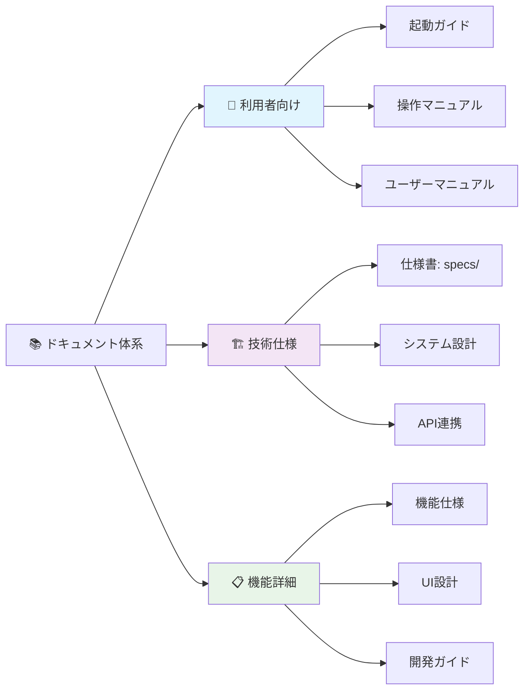

## 🗂️ ドキュメント索引

### 🚀 利用者向けドキュメント（初回利用者必須）

| ドキュメント | 説明 | 対象者 | 重要度 |
|-------------|------|--------|---------|
| **[🚀 起動ガイド](./startup-guide.md)** | **初回セットアップ・Azure OpenAI準備** | **全ユーザー** | **🔥 必須** |
| **[📖 操作マニュアル](./operation-manual.md)** | **画面操作・機能利用の詳細手順** | **全ユーザー** | **🔥 必須** |
| **[ユーザーマニュアル](./user-manual.md)** | アプリケーションの詳細な使用方法 | エンドユーザー | ⭐ 推奨 |

### 📋 仕様書・設計ドキュメント（技術者向け）

| ドキュメント | 説明 | 対象者 |
|-------------|------|--------|
| **[📋 仕様書: specs/](../specs/)** | **機能要件・非機能要件・技術選定・システム仕様** | **アーキテクト・開発者** |
| **[システムアーキテクチャ](./system-architecture.md)** | 技術アーキテクチャと設計原則 | アーキテクト・開発者 |
| **[UI設計仕様書](./ui-design.md)** | インターフェース設計とビジュアルデザイン | デザイナー・フロントエンド開発者 |

### 🔧 技術・開発ドキュメント

| ドキュメント | 説明 | 対象者 |
|-------------|------|--------|
| **[API連携ガイド](./api-integration.md)** | Azure OpenAI との連携実装 | 開発者・DevOps |
| **[開発者ガイド](./developer-guide.md)** | 開発・カスタマイズ・拡張方法 | 開発者 |

### 📋 機能別詳細仕様

| ドキュメント | 説明 | 対象者 |
|-------------|------|--------|
| **[機能仕様書](./features.md)** | 実装済み機能の詳細仕様 | プロダクトマネージャー・開発者 |
| **[質問候補機能](./question-candidates.md)** | 株主質問候補生成・表示機能の詳細仕様 | 開発者 |
| **[折り畳み機能](./collapse-feature.md)** | 設定セクション折り畳み機能の仕様 | 開発者 |
| **[ポップアップ機能](./popup-functionality.md)** | 吹き出しモーダル表示機能の仕様 | 開発者 |
| **[自動拡張機能](./dialogue-auto-expansion.md)** | 対話表示自動拡張機能の仕様 | 開発者 |
| **[PowerPoint PDF処理](./powerpoint-pdf-processing.md)** | PowerPoint PDF最適化処理の仕様 | 開発者 |

## 🎯 ドキュメント利用ガイド

### 📱 初めてのユーザー（新規利用者向け）

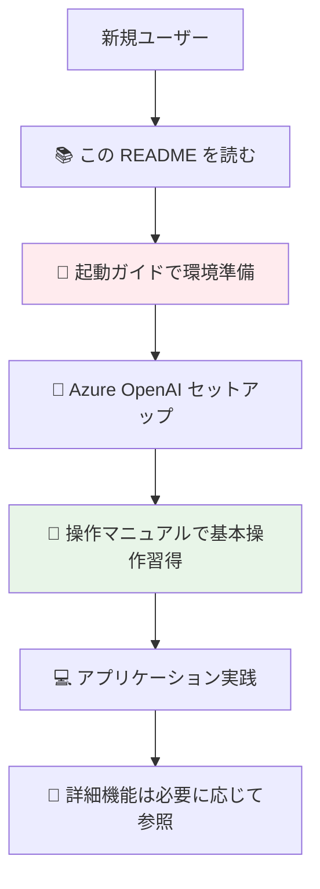

**推奨学習フロー**:
1. **[🚀 起動ガイド](./startup-guide.md)** で Azure OpenAI の準備とアプリケーション起動
2. **[📖 操作マニュアル](./operation-manual.md)** で画面操作と基本的な使用方法を習得
3. アプリケーションで実際の対話シミュレーションを体験
4. 必要に応じて **[ユーザーマニュアル](./user-manual.md)** で詳細機能を確認

### 🔧 開発者・エンジニア向け

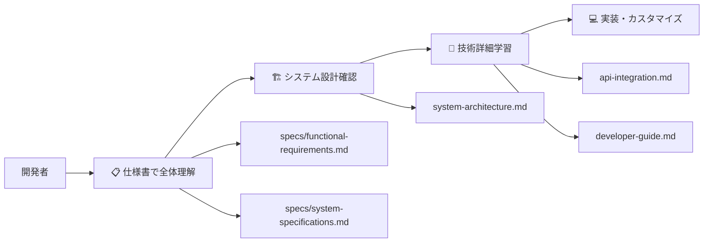

**技術理解フロー**:
1. **[📋 仕様書ディレクトリ](../specs/)** でシステム全体を把握
   - [機能要件仕様書](../specs/functional-requirements.md)
   - [システム仕様書](../specs/system-specifications.md)
   - [技術選定理由書](../specs/technology-selection.md)
2. **[システムアーキテクチャ](./system-architecture.md)** で技術構成を理解
3. **[API連携ガイド](./api-integration.md)** で Azure OpenAI 統合を学習
4. **[開発者ガイド](./developer-guide.md)** でカスタマイズ方法を確認
5. 各機能の詳細仕様書で実装詳細を参照

### 🎨 デザイナー・UI/UX担当者向け

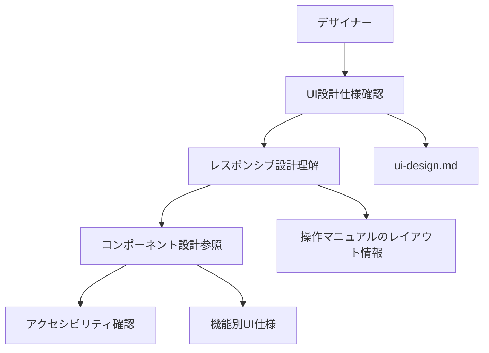

**デザイン理解フロー**:
1. **[UI設計仕様書](./ui-design.md)** でデザインシステムを確認
2. **[操作マニュアル](./operation-manual.md)** でレスポンシブレイアウトを理解
3. 各機能仕様書でコンポーネント設計を参照
4. 実際のアプリケーションでユーザー体験を確認

### 📊 プロジェクトマネージャー・企画者向け

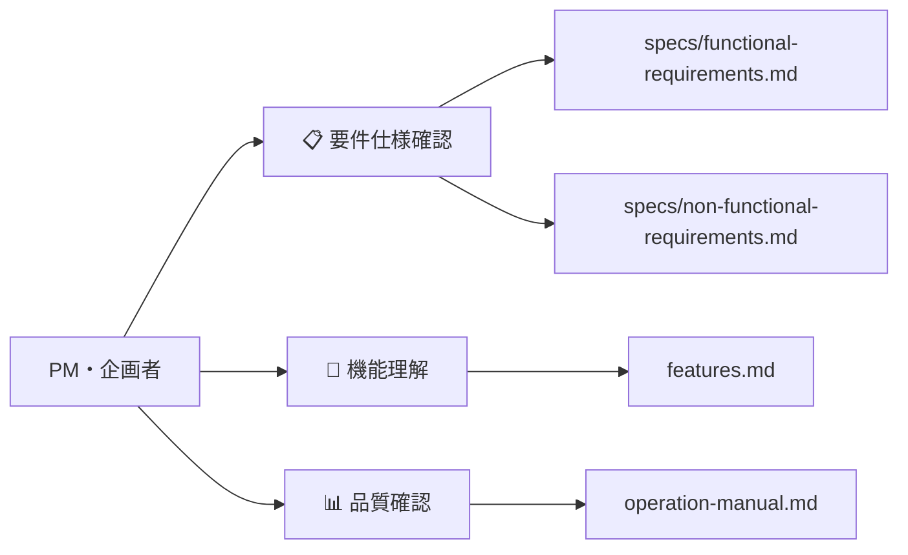

**プロジェクト管理フロー**:
1. **[機能要件仕様書](../specs/functional-requirements.md)** で実装範囲を確認
2. **[非機能要件仕様書](../specs/non-functional-requirements.md)** で品質基準を把握
3. **[機能仕様書](./features.md)** で実装済み機能を確認
4. **[操作マニュアル](./operation-manual.md)** でユーザー体験を理解

## 🔄 技術スタック概要

### フロントエンド技術

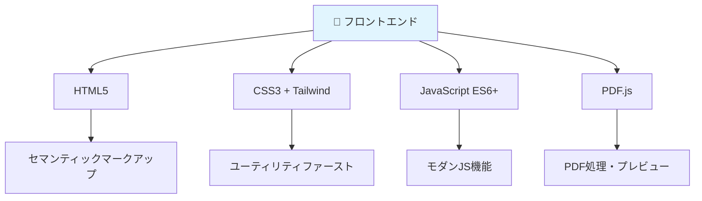

### 外部サービス・API

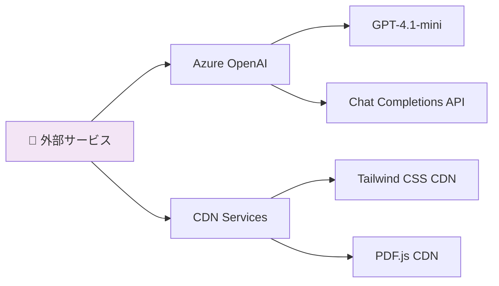

### 対応言語・環境

| カテゴリ | 詳細 |
|----------|------|
| **対応言語** | 🇯🇵 日本語、🇺🇸 English、🇨🇳 中文、🇩🇪 Deutsch、🇫🇷 Français、🇪🇸 Español、🇰🇷 한국어 |
| **対応ブラウザ** | Chrome 90+、Firefox 88+、Safari 14+、Edge 90+ |
| **デバイス** | デスクトップ、タブレット、スマートフォン |
| **動作環境** | ローカル・クラウド両対応、サーバー不要 |

## 📊 実装済み機能概要

### コア機能

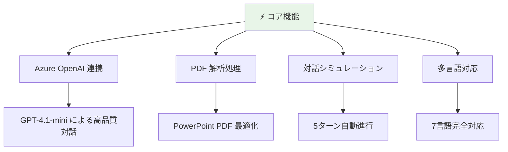

### UI/UX機能

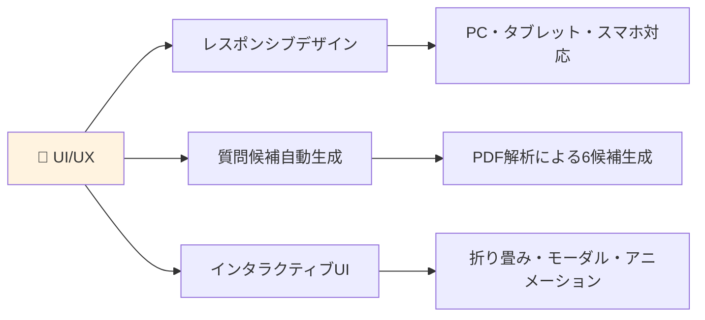

### 技術機能

- **🔒 セキュリティ**: APIキー安全管理、HTTPS通信、XSS対策
- **⚡ パフォーマンス**: CDN活用、非同期処理、メモリ最適化
- **🔧 保守性**: モジュラー設計、エラーハンドリング、ログ出力
- **🔄 拡張性**: プラグイン構造、設定外部化、API抽象化

## 🚀 クイックスタートリンク

### 🎯 今すぐ始める

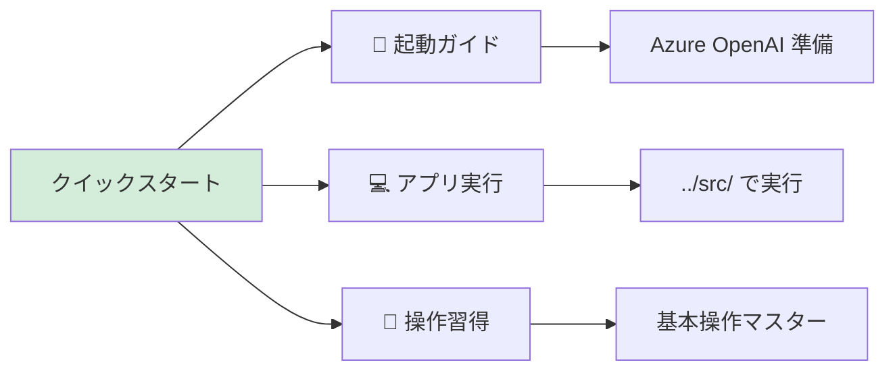

| 目的 | リンク | 所要時間 |
|------|--------|----------|
| **🔧 環境準備** | [起動ガイド](./startup-guide.md) | 15分 |
| **💻 アプリ実行** | [../src/index.html](../src/) | 即座 |
| **📖 操作習得** | [操作マニュアル](./operation-manual.md) | 10分 |
| **📋 技術理解** | [仕様書](../specs/) | 30分+ |

### 🆘 重要なセットアップ情報

#### 必須の事前準備
1. **Azure OpenAI 準備**: [起動ガイド - Azure OpenAI準備](./startup-guide.md#azure-openai-の準備)
2. **ブラウザ要件**: Chrome 90+、Firefox 88+、Safari 14+、Edge 90+
3. **サンプルPDF**: 決算短信・株主総会資料などのPDFファイル

#### 推奨セットアップフロー
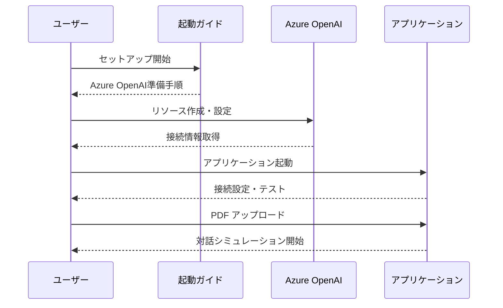

## 💡 活用シナリオ・ユースケース

### ビジネス活用

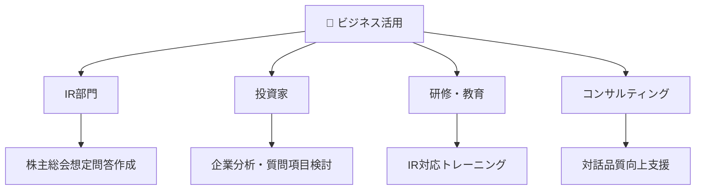

### 技術活用・学習

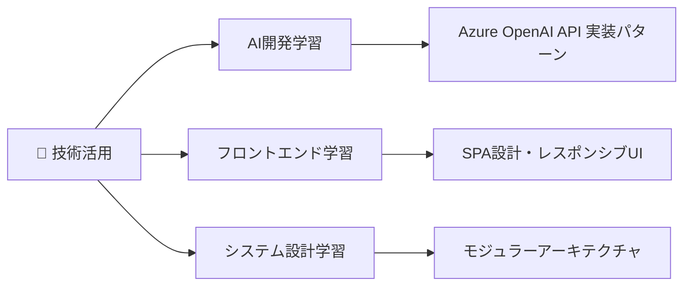

## 🔧 カスタマイズ・拡張可能性

### 追加可能な機能

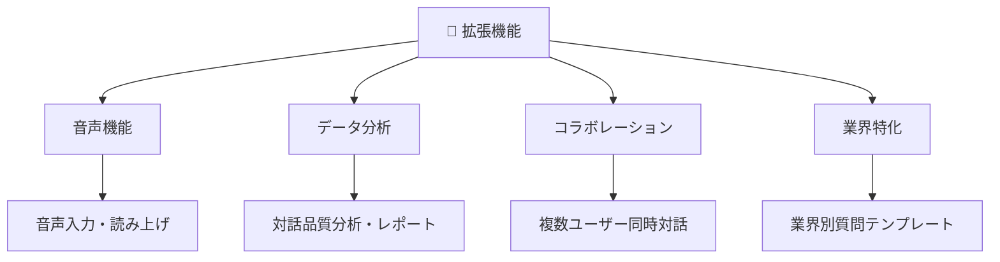

### 技術的拡張

| 拡張領域 | 現在 | 拡張後 | 実装難易度 |
|----------|------|--------|-----------|
| **PWA化** | Webアプリ | オフライン対応 | ⭐⭐ |
| **他AI対応** | Azure OpenAI | OpenAI・Claude等 | ⭐⭐⭐ |
| **データベース** | ローカル保存 | 履歴永続化 | ⭐⭐⭐⭐ |
| **認証機能** | 認証なし | ユーザー管理 | ⭐⭐⭐⭐ |

## 🆘 サポート・問い合わせ

### 自己解決リソース

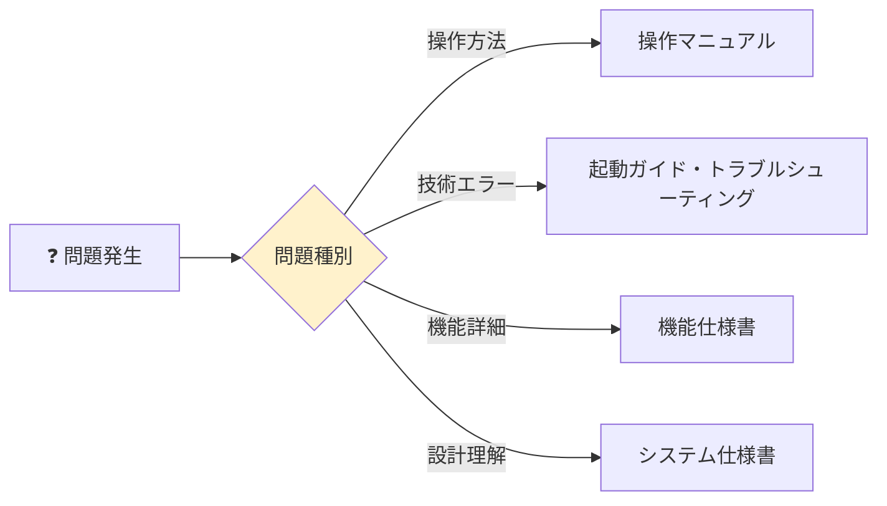

### 外部サポート

| サポート種別 | 連絡先 | 対応範囲 |
|-------------|--------|----------|
| **技術サポート** | [GitHub Issues](https://github.com/tokawa-ms/20250725-kabunushi-demo-001/issues) | バグ報告・機能要望 |
| **技術相談** | [GitHub Discussions](https://github.com/tokawa-ms/20250725-kabunushi-demo-001/discussions) | 実装相談・質問 |
| **Azure サポート** | [Azure Portal](https://portal.azure.com) | Azure OpenAI 関連 |

### Azure OpenAI 関連リソース

- **公式ドキュメント**: [Azure OpenAI Service](https://docs.microsoft.com/azure/cognitive-services/openai/)
- **価格情報**: [Azure OpenAI Pricing](https://azure.microsoft.com/pricing/details/cognitive-services/openai-service/)
- **クイックスタート**: [Azure OpenAI Quickstart](https://docs.microsoft.com/azure/cognitive-services/openai/quickstart)

## 📝 ドキュメント更新履歴

| 日付 | 更新内容 | 担当者 | バージョン |
|------|----------|--------|-----------|
| 2025-07-31 | **仕様書ディレクトリ新設・ドキュメント大幅強化** | システムアーキテクト | **v2.0** |
| | - specs/ ディレクトリ作成（4つの包括的仕様書） | | |
| | - 起動ガイド・操作マニュアル新規作成 | | |
| | - 30+ Mermaidダイアグラム追加 | | |
| | - ドキュメント索引・利用ガイド整備 | | |
| 2024-01-XX | 初版作成、全ドキュメント整備 | GitHub Copilot | v1.0 |

## 📄 ライセンス・著作権

このプロジェクトは [MIT License](../LICENSE) の下で公開されています。

**技術スタック・ライセンス**:
- **HTML5・CSS3・JavaScript**: W3C・ECMA標準
- **Tailwind CSS**: MIT License
- **PDF.js**: Apache License 2.0
- **Azure OpenAI**: Microsoft Azure Terms

---

  
## 🚀 AI 駆動の株主対話シミュレーション 🤖

**Made with ❤️ and Azure OpenAI GPT-4.1-mini**

**[📱 今すぐアプリを起動 →](../src/)**

