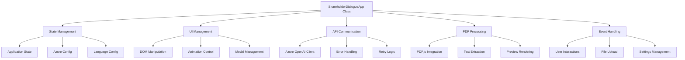

# 開発者ガイド

## 概要

株主対話デモアプリケーションの開発・カスタマイズ・拡張方法について詳細に説明します。本ガイドでは、アーキテクチャの理解からカスタム機能の追加まで、開発者が知っておくべき全ての情報を提供します。

## 🛠️ 開発環境のセットアップ

### 前提条件

```json
{
  "nodejs": "16.0.0以上（開発ツール用）",
  "browser": "Chrome 90+, Firefox 88+, Safari 14+",
  "git": "バージョン管理用",
  "vscode": "推奨エディタ（拡張機能対応）"
}
```

### リポジトリのクローンと初期設定

```bash
# リポジトリをクローン
git clone https://github.com/tokawa-ms/20250725-kabunushi-demo-001.git
cd 20250725-kabunushi-demo-001

# 開発用サーバーの起動
cd src
python -m http.server 8000

# または Node.js を使用する場合
npx http-server . -p 8000 -c-1
```

### 推奨する VS Code 拡張機能

```json
{
  "recommendations": [
    "ms-vscode.vscode-html",
    "bradlc.vscode-tailwindcss",
    "ms-vscode.vscode-javascript",
    "formulahendry.auto-rename-tag",
    "ms-vscode.live-server",
    "github.copilot",
    "github.copilot-chat"
  ]
}
```

## 📁 コードベース構造

### ファイル構成の詳細

```
src/
├── index.html                 # メインアプリケーション
├── css/
│   └── styles.css            # カスタムスタイル定義
└── js/
    └── script.js            # メインアプリケーションロジック (1091行)

docs/
├── README.md                 # ドキュメント索引
├── features.md              # 機能仕様書
├── ui-design.md             # UI設計仕様
├── system-architecture.md   # システムアーキテクチャ
├── api-integration.md       # API連携ガイド
├── user-manual.md           # ユーザーマニュアル
├── developer-guide.md       # 本ドキュメント
├── collapse-feature.md      # 折り畳み機能仕様
├── popup-functionality.md   # ポップアップ機能仕様
└── dialogue-auto-expansion.md # 自動拡張機能仕様
```

### 主要コンポーネントの責任分離



## 🏗️ アプリケーションアーキテクチャ

### クラス設計の詳細

```javascript
class ShareholderDialogueApp {
    constructor() {
        // 状態管理
        this.state = {
            isConnected: false,
            uploadedFiles: [],
            currentPdfData: null,
            currentPage: 1,
            totalPages: 0,
            dialogueHistory: [],
            conversationTurn: 0,
            pdfContent: '',
            isDialogueInProgress: false,
            selectedLanguage: 'ja',
            settingsCollapsed: false
        };

        // Azure OpenAI設定
        this.azureConfig = {
            endpoint: '',
            apiKey: '',
            deploymentName: '',
            apiVersion: '2024-02-15-preview'
        };

        // 多言語対応設定
        this.languageConfig = {
            // 7言語の設定オブジェクト
        };

        // DOM要素の参照
        this.elements = {};
    }

    // 主要メソッド
    async initialize() { /* 初期化処理 */ }
    initializeElements() { /* DOM要素参照の初期化 */ }
    setupEventListeners() { /* イベントリスナー設定 */ }
    loadSettings() { /* 設定読み込み */ }
    
    // PDF関連メソッド
    async handleFileUpload(event) { /* ファイルアップロード処理 */ }
    async extractTextFromPDF(file) { /* PDFテキスト抽出 */ }
    async renderPDFPreview(file) { /* PDFプレビュー表示 */ }
    
    // API通信メソッド
    async callAzureOpenAI(prompt, maxTokens) { /* Azure OpenAI API呼び出し */ }
    async testConnection() { /* 接続テスト */ }
    
    // 対話生成メソッド
    async startDialogue() { /* 対話開始 */ }
    async generateShareholderQuestion() { /* 株主質問生成 */ }
    async generateDirectorResponse(question) { /* 取締役回答生成 */ }
    async generateSummary() { /* 対話要約生成 */ }
    
    // UI更新メソッド
    addDialogueMessage(role, content, icon) { /* 対話メッセージ追加 */ }
    updateConnectionStatus(status, message) { /* 接続状態更新 */ }
    scrollToLatestMessage() { /* 最新メッセージへスクロール */ }
}
```

### 状態管理パターン

```javascript
// 状態更新の一元管理
updateState(key, value) {
    console.log(`🔄 状態更新: ${key} = ${value}`);
    this.state[key] = value;
    
    // 状態変更に応じたUI更新
    this.onStateChange(key, value);
}

onStateChange(key, value) {
    switch (key) {
        case 'isConnected':
            this.updateConnectionUI(value);
            break;
        case 'dialogueHistory':
            this.updateDialogueUI();
            break;
        case 'selectedLanguage':
            this.saveLanguagePreference(value);
            break;
    }
}

// イミュータブルな状態更新
updateDialogueHistory(newEntry) {
    this.updateState('dialogueHistory', [
        ...this.state.dialogueHistory,
        { ...newEntry, timestamp: Date.now() }
    ]);
}
```

## 🎨 UI/UX カスタマイズ

### CSS カスタムプロパティによるテーマ設定

```css
:root {
    /* カラーパレット */
    --primary-blue: #3B82F6;
    --primary-green: #10B981;
    --primary-purple: #8B5CF6;
    
    /* タイポグラフィ */
    --font-size-base: 1rem;
    --font-size-lg: 1.125rem;
    --line-height-base: 1.5;
    
    /* スペーシング */
    --spacing-xs: 0.25rem;
    --spacing-sm: 0.5rem;
    --spacing-md: 1rem;
    --spacing-lg: 1.5rem;
    --spacing-xl: 2rem;
    
    /* アニメーション */
    --transition-fast: 0.15s ease;
    --transition-normal: 0.3s ease;
    --transition-slow: 0.5s ease;
}

/* ダークモード対応例 */
@media (prefers-color-scheme: dark) {
    :root {
        --bg-primary: #1F2937;
        --text-primary: #F9FAFB;
        --border-color: #374151;
    }
}
```

### レスポンシブデザインのカスタマイズ

```css
/* モバイルファーストアプローチ */
.container {
    padding: var(--spacing-sm);
}

/* タブレット対応 */
@media (min-width: 768px) {
    .container {
        padding: var(--spacing-md);
    }
    
    .grid-layout {
        display: grid;
        grid-template-columns: 1fr 1fr;
        gap: var(--spacing-lg);
    }
}

/* デスクトップ対応 */
@media (min-width: 1024px) {
    .container {
        max-width: 80rem;
        margin: 0 auto;
        padding: var(--spacing-lg);
    }
    
    .grid-layout {
        grid-template-columns: 1fr 2fr;
    }
}
```

### アニメーション設定のカスタマイズ

```css
/* カスタムアニメーション */
@keyframes slideInFromLeft {
    from {
        opacity: 0;
        transform: translateX(-100px);
    }
    to {
        opacity: 1;
        transform: translateX(0);
    }
}

@keyframes bounceIn {
    0% {
        opacity: 0;
        transform: scale(0.3);
    }
    50% {
        opacity: 1;
        transform: scale(1.05);
    }
    70% {
        transform: scale(0.9);
    }
    100% {
        opacity: 1;
        transform: scale(1);
    }
}

/* アニメーション適用クラス */
.animate-slide-in {
    animation: slideInFromLeft var(--transition-normal);
}

.animate-bounce-in {
    animation: bounceIn 0.6s cubic-bezier(0.68, -0.55, 0.265, 1.55);
}
```

## 🔧 機能拡張ガイド

### 新しい言語の追加

```javascript
// 1. languageConfig オブジェクトに新言語を追加
this.languageConfig.hindi = {
    name: 'हिन्दी',
    shareholderPrompt: 'आप एक अनुभवी व्यक्तिगत शेयरधारक हैं...',
    directorPrompt: 'आप कंपनी के निदेशक हैं...',
    summaryPrompt: 'निम्नलिखित शेयरधारक बैठक की चर्चा का सारांश दें...',
    startMessage: 'वार्तालाप शुरू हो रहा है...',
    endMessage: 'वार्तालाप पूरा हो गया है...'
};

// 2. HTML の select 要素に option を追加
// index.html の languageSelect 要素に以下を追加:
// <option value="hindi">हिन्दी</option>

// 3. フォント対応（必要に応じて）
@import url('https://fonts.googleapis.com/css2?family=Noto+Sans+Devanagari:wght@400;500;600;700&display=swap');

.hindi-text {
    font-family: 'Noto Sans Devanagari', sans-serif;
}
```

### カスタムプロンプトテンプレートの追加

```javascript
class PromptTemplateManager {
    constructor() {
        this.templates = {
            conservative: {
                temperature: 0.3,
                shareholderPrompt: '控えめで礼儀正しい株主として...',
                directorPrompt: '慎重で丁寧な取締役として...'
            },
            aggressive: {
                temperature: 0.8,
                shareholderPrompt: '積極的で鋭い質問をする株主として...',
                directorPrompt: '防御的だが誠実な取締役として...'
            },
            technical: {
                temperature: 0.5,
                shareholderPrompt: '技術的な詳細に興味のある株主として...',
                directorPrompt: '技術面に精通した取締役として...'
            }
        };
    }

    getTemplate(type) {
        return this.templates[type] || this.templates.conservative;
    }

    addTemplate(name, template) {
        this.templates[name] = template;
        console.log(`📝 新しいプロンプトテンプレート追加: ${name}`);
    }
}

// 使用例
const templateManager = new PromptTemplateManager();
const template = templateManager.getTemplate('aggressive');
```

### 音声読み上げ機能の追加

```javascript
class SpeechManager {
    constructor() {
        this.synthesis = window.speechSynthesis;
        this.isEnabled = false;
        this.currentLanguage = 'ja-JP';
    }

    enable() {
        if (!this.synthesis) {
            console.warn('⚠️ 音声合成がサポートされていません');
            return false;
        }
        this.isEnabled = true;
        return true;
    }

    async speak(text, language = this.currentLanguage) {
        if (!this.isEnabled || !text) return;

        return new Promise((resolve) => {
            const utterance = new SpeechSynthesisUtterance(text);
            utterance.lang = language;
            utterance.rate = 0.9;
            utterance.pitch = 1.0;
            utterance.volume = 0.8;

            utterance.onend = () => {
                console.log('🔊 音声読み上げ完了');
                resolve();
            };

            utterance.onerror = (error) => {
                console.error('❌ 音声読み上げエラー:', error);
                resolve();
            };

            this.synthesis.speak(utterance);
        });
    }

    stop() {
        this.synthesis.cancel();
    }

    setLanguage(language) {
        const languageMap = {
            'ja': 'ja-JP',
            'en': 'en-US',
            'zh': 'zh-CN',
            'de': 'de-DE',
            'fr': 'fr-FR',
            'es': 'es-ES',
            'ko': 'ko-KR'
        };
        this.currentLanguage = languageMap[language] || 'ja-JP';
    }
}

// ShareholderDialogueApp クラスへの統合
class ShareholderDialogueApp {
    constructor() {
        // 既存のコンストラクタ
        this.speechManager = new SpeechManager();
    }

    addDialogueMessage(role, content, icon) {
        // 既存のメッセージ追加処理
        
        // 音声読み上げ機能
        if (this.speechManager.isEnabled && role !== 'system') {
            this.speechManager.speak(content);
        }
    }
}
```

### データエクスポート機能の追加

```javascript
class DataExporter {
    static exportDialogueAsJSON(dialogueHistory) {
        const exportData = {
            timestamp: new Date().toISOString(),
            version: '1.0',
            dialogueHistory: dialogueHistory.map(entry => ({
                role: entry.role,
                content: entry.content,
                timestamp: entry.timestamp,
                turnNumber: entry.turnNumber
            }))
        };

        this.downloadFile(
            JSON.stringify(exportData, null, 2),
            `dialogue-${Date.now()}.json`,
            'application/json'
        );
    }

    static exportDialogueAsMarkdown(dialogueHistory) {
        let markdown = '# 株主対話シミュレーション結果\n\n';
        markdown += `生成日時: ${new Date().toLocaleString('ja-JP')}\n\n`;

        dialogueHistory.forEach((entry, index) => {
            const icon = entry.role === 'shareholder' ? '👤' : 
                        entry.role === 'director' ? '👔' : '📋';
            const roleName = entry.role === 'shareholder' ? '株主' :
                           entry.role === 'director' ? '取締役' : 'システム';
            
            markdown += `## ${icon} ${roleName} ${entry.turnNumber ? `(ターン${entry.turnNumber})` : ''}\n\n`;
            markdown += `${entry.content}\n\n`;
        });

        this.downloadFile(
            markdown,
            `dialogue-${Date.now()}.md`,
            'text/markdown'
        );
    }

    static exportDialogueAsPDF(dialogueHistory) {
        // PDF生成ライブラリ（jsPDF等）を使用
        // この例では簡略化
        console.log('📄 PDF出力機能は追加のライブラリが必要です');
    }

    static downloadFile(content, filename, mimeType) {
        const blob = new Blob([content], { type: mimeType });
        const url = URL.createObjectURL(blob);
        
        const a = document.createElement('a');
        a.href = url;
        a.download = filename;
        a.style.display = 'none';
        
        document.body.appendChild(a);
        a.click();
        document.body.removeChild(a);
        
        URL.revokeObjectURL(url);
        console.log(`💾 ファイルをダウンロード: ${filename}`);
    }
}

// エクスポートボタンの追加例
function addExportButtons() {
    const exportContainer = document.createElement('div');
    exportContainer.className = 'flex gap-2 mt-4';
    exportContainer.innerHTML = `
        <button id="exportJSON" class="btn-secondary">
            📄 JSON形式でエクスポート
        </button>
        <button id="exportMarkdown" class="btn-secondary">
            📝 Markdown形式でエクスポート
        </button>
    `;

    // 対話履歴セクションに追加
    const dialogueSection = document.querySelector('#dialogueContainer').parentElement;
    dialogueSection.appendChild(exportContainer);

    // イベントリスナーの追加
    document.getElementById('exportJSON').addEventListener('click', () => {
        DataExporter.exportDialogueAsJSON(this.state.dialogueHistory);
    });

    document.getElementById('exportMarkdown').addEventListener('click', () => {
        DataExporter.exportDialogueAsMarkdown(this.state.dialogueHistory);
    });
}
```

## 🧪 テストとデバッグ

### 単体テストの作成

```javascript
// tests/unit/test-azure-client.js
class AzureOpenAIClientTest {
    static async runTests() {
        console.log('🧪 Azure OpenAI Client テスト開始');
        
        const tests = [
            this.testConfigValidation,
            this.testPromptGeneration,
            this.testErrorHandling,
            this.testTokenUsage
        ];

        for (const test of tests) {
            try {
                await test();
                console.log(`✅ ${test.name} - 合格`);
            } catch (error) {
                console.error(`❌ ${test.name} - 失敗:`, error.message);
            }
        }
    }

    static testConfigValidation() {
        const validConfig = {
            endpoint: 'https://test.openai.azure.com/',
            apiKey: 'test-key-12345678901234567890123456789012',
            deploymentName: 'gpt-4o-mini',
            apiVersion: '2024-02-15-preview'
        };

        const client = new AzureOpenAIClient(validConfig);
        
        if (!client.endpoint || !client.apiKey) {
            throw new Error('設定の初期化に失敗');
        }
    }

    static testPromptGeneration() {
        const promptOptimizer = new PromptOptimizer();
        const shortContent = 'テストコンテンツ';
        const optimized = promptOptimizer.optimizePrompt('テストプロンプト', shortContent, 1000);
        
        if (!optimized.includes('テストプロンプト') || !optimized.includes('テストコンテンツ')) {
            throw new Error('プロンプト最適化が正しく動作していません');
        }
    }

    static testErrorHandling() {
        const errorHandler = new ErrorHandler();
        
        try {
            errorHandler.handle(new Error('テストエラー'), 'テストコンテキスト');
        } catch (error) {
            throw new Error('エラーハンドリングでエラーが発生');
        }
    }

    static testTokenUsage() {
        const monitor = new UsageMonitor();
        monitor.recordUsage(100, 'gpt-4o-mini');
        
        const report = monitor.getUsageReport();
        if (report.totalTokens !== 100) {
            throw new Error('使用量監視が正しく動作していません');
        }
    }
}

// テスト実行
// AzureOpenAIClientTest.runTests();
```

### インテグレーションテストの作成

```javascript
// tests/integration/test-dialogue-flow.js
class DialogueFlowTest {
    static async testFullDialogueFlow() {
        console.log('🔄 対話フロー統合テスト開始');
        
        // モックデータの準備
        const mockPDFContent = 'テスト決算資料: 売上高100億円、営業利益10億円...';
        const mockConfig = {
            endpoint: 'https://test.openai.azure.com/',
            apiKey: 'test-key',
            deploymentName: 'gpt-4o-mini',
            apiVersion: '2024-02-15-preview'
        };

        try {
            // 1. アプリケーション初期化
            const app = new ShareholderDialogueApp();
            app.azureConfig = mockConfig;
            app.state.pdfContent = mockPDFContent;

            // 2. 接続テスト（モック）
            const connectionResult = await this.mockConnectionTest(app);
            console.log('📡 接続テスト結果:', connectionResult.success);

            // 3. 質問生成テスト（モック）
            const questionResult = await this.mockQuestionGeneration(app);
            console.log('❓ 質問生成結果:', questionResult.content);

            // 4. 回答生成テスト（モック）
            const answerResult = await this.mockAnswerGeneration(app, questionResult.content);
            console.log('💬 回答生成結果:', answerResult.content);

            // 5. UI更新テスト
            this.testUIUpdates(app, questionResult, answerResult);

            console.log('✅ 対話フロー統合テスト完了');
            return true;

        } catch (error) {
            console.error('❌ 対話フロー統合テスト失敗:', error);
            return false;
        }
    }

    static async mockConnectionTest(app) {
        // 実際のAPI呼び出しを模擬
        return new Promise(resolve => {
            setTimeout(() => {
                resolve({ success: true, message: 'モック接続成功' });
            }, 100);
        });
    }

    static async mockQuestionGeneration(app) {
        return {
            content: '今期の業績好調の要因について詳しく教えてください。',
            tokens: 50,
            turnNumber: 1
        };
    }

    static async mockAnswerGeneration(app, question) {
        return {
            content: `${question}についてお答えします。主な要因は新規事業の寄与と既存事業の効率化です。`,
            tokens: 80,
            turnNumber: 1
        };
    }

    static testUIUpdates(app, questionResult, answerResult) {
        // DOM操作のテスト
        const testContainer = document.createElement('div');
        testContainer.id = 'test-dialogue-container';
        document.body.appendChild(testContainer);

        // メッセージ追加のテスト
        app.elements.dialogueContainer = testContainer;
        app.addDialogueMessage('shareholder', questionResult.content, '👤');
        app.addDialogueMessage('director', answerResult.content, '👔');

        const messages = testContainer.querySelectorAll('.chat-bubble');
        if (messages.length !== 2) {
            throw new Error('UIメッセージ追加が正しく動作していません');
        }

        // クリーンアップ
        document.body.removeChild(testContainer);
    }
}
```

### パフォーマンステスト

```javascript
class PerformanceTest {
    static async measureRenderingPerformance() {
        console.log('⚡ レンダリングパフォーマンステスト開始');
        
        const startTime = performance.now();
        
        // 大量のメッセージ追加をシミュレート
        const testMessages = Array.from({ length: 100 }, (_, i) => ({
            role: i % 2 === 0 ? 'shareholder' : 'director',
            content: `テストメッセージ ${i + 1}: ${'長い'.repeat(50)}テキスト`,
            icon: i % 2 === 0 ? '👤' : '👔'
        }));

        const container = document.createElement('div');
        container.className = 'space-y-4';
        document.body.appendChild(container);

        // メッセージ追加のパフォーマンス測定
        for (const message of testMessages) {
            this.addTestMessage(container, message);
        }

        const endTime = performance.now();
        const duration = endTime - startTime;

        console.log(`📊 100件メッセージレンダリング時間: ${duration.toFixed(2)}ms`);
        console.log(`📊 1件あたりの平均時間: ${(duration / 100).toFixed(2)}ms`);

        // クリーンアップ
        document.body.removeChild(container);

        return duration;
    }

    static addTestMessage(container, message) {
        const messageElement = document.createElement('div');
        messageElement.className = `chat-bubble ${message.role}-bubble`;
        messageElement.innerHTML = `
            <div class="flex items-start space-x-3">
                <span class="text-lg">${message.icon}</span>
                <div class="flex-1">
                    <div class="chat-content">${message.content}</div>
                </div>
            </div>
        `;
        container.appendChild(messageElement);
    }

    static async measureMemoryUsage() {
        if (!performance.memory) {
            console.warn('⚠️ メモリ測定がサポートされていません');
            return;
        }

        const initialMemory = performance.memory.usedJSHeapSize;
        console.log(`📊 初期メモリ使用量: ${(initialMemory / 1024 / 1024).toFixed(2)}MB`);

        // メモリ集約的な処理をシミュレート
        const largeArray = Array.from({ length: 10000 }, (_, i) => ({
            id: i,
            content: 'テストデータ'.repeat(100),
            timestamp: Date.now()
        }));

        const peakMemory = performance.memory.usedJSHeapSize;
        console.log(`📊 ピークメモリ使用量: ${(peakMemory / 1024 / 1024).toFixed(2)}MB`);
        console.log(`📊 メモリ増加量: ${((peakMemory - initialMemory) / 1024 / 1024).toFixed(2)}MB`);

        // メモリクリーンアップ
        largeArray.length = 0;
        if (window.gc) {
            window.gc();
        }

        const finalMemory = performance.memory.usedJSHeapSize;
        console.log(`📊 クリーンアップ後: ${(finalMemory / 1024 / 1024).toFixed(2)}MB`);
    }
}
```

## 🚀 デプロイメント

### GitHub Pages での公開

```yaml
# .github/workflows/deploy.yml
name: Deploy to GitHub Pages

on:
  push:
    branches: [ main ]
  pull_request:
    branches: [ main ]

jobs:
  deploy:
    runs-on: ubuntu-latest
    
    steps:
    - name: Checkout
      uses: actions/checkout@v3
      
    - name: Setup Pages
      uses: actions/configure-pages@v2
      
    - name: Build and optimize
      run: |
        # CSS最適化（必要に応じて）
        # npx postcss src/css/styles.css --output src/css/styles.min.css
        
        # JS最小化（必要に応じて）
        # npx terser src/js/script.js --output src/js/script.min.js
      
    - name: Upload artifact
      uses: actions/upload-pages-artifact@v1
      with:
        path: './src'
        
    - name: Deploy to GitHub Pages
      id: deployment
      uses: actions/deploy-pages@v1
```

### 本番環境最適化

```javascript
// production-optimizer.js
class ProductionOptimizer {
    static minifyCSS(cssContent) {
        return cssContent
            .replace(/\s+/g, ' ')
            .replace(/;\s*}/g, '}')
            .replace(/\s*{\s*/g, '{')
            .replace(/:\s+/g, ':')
            .replace(/,\s+/g, ',')
            .trim();
    }

    static removeDebugLogs(jsContent) {
        return jsContent
            .replace(/console\.log\([^)]*\);?\n?/g, '')
            .replace(/console\.debug\([^)]*\);?\n?/g, '')
            .replace(/console\.info\([^)]*\);?\n?/g, '');
    }

    static optimizeImages(imageFiles) {
        // 画像最適化ロジック
        console.log('🖼️ 画像最適化を実行');
    }

    static generateServiceWorker() {
        const swContent = `
const CACHE_NAME = 'shareholder-dialogue-v1';
const urlsToCache = [
    '/',
    '/css/styles.css',
    '/js/script.js',
    'https://cdn.tailwindcss.com',
    'https://cdnjs.cloudflare.com/ajax/libs/pdf.js/3.11.174/pdf.min.js'
];

self.addEventListener('install', (event) => {
    event.waitUntil(
        caches.open(CACHE_NAME)
            .then((cache) => cache.addAll(urlsToCache))
    );
});

self.addEventListener('fetch', (event) => {
    event.respondWith(
        caches.match(event.request)
            .then((response) => {
                return response || fetch(event.request);
            })
    );
});
        `;
        
        return swContent;
    }
}
```

## 📊 監視とメンテナンス

### エラー監視の実装

```javascript
class ErrorMonitoring {
    static initialize() {
        // グローバルエラーハンドラー
        window.addEventListener('error', this.handleError.bind(this));
        window.addEventListener('unhandledrejection', this.handlePromiseRejection.bind(this));
        
        // パフォーマンス監視
        this.startPerformanceMonitoring();
    }

    static handleError(event) {
        const errorInfo = {
            message: event.message,
            filename: event.filename,
            lineno: event.lineno,
            colno: event.colno,
            error: event.error?.stack,
            timestamp: new Date().toISOString(),
            userAgent: navigator.userAgent,
            url: window.location.href
        };

        console.error('🚨 グローバルエラー捕捉:', errorInfo);
        
        // エラーレポートの送信（実際の実装では適切なエラー収集サービスを使用）
        this.sendErrorReport(errorInfo);
    }

    static handlePromiseRejection(event) {
        const errorInfo = {
            reason: event.reason,
            promise: event.promise,
            timestamp: new Date().toISOString(),
            url: window.location.href
        };

        console.error('🚨 未処理Promise拒否:', errorInfo);
        this.sendErrorReport(errorInfo);
    }

    static startPerformanceMonitoring() {
        // Core Web Vitals の監視
        new PerformanceObserver((entryList) => {
            for (const entry of entryList.getEntries()) {
                console.log(`📊 ${entry.name}: ${entry.value}`);
            }
        }).observe({ entryTypes: ['measure', 'navigation', 'resource'] });
    }

    static sendErrorReport(errorInfo) {
        // 実際の実装では適切なエラー収集サービス（Sentry等）を使用
        console.log('📡 エラーレポート送信:', errorInfo);
    }
}

// アプリケーション起動時に初期化
// ErrorMonitoring.initialize();
```

### パフォーマンス監視

```javascript
class PerformanceMonitoring {
    static startMonitoring() {
        // API呼び出し時間の監視
        this.monitorAPICallDuration();
        
        // メモリ使用量の監視
        this.monitorMemoryUsage();
        
        // ユーザーインタラクションの監視
        this.monitorUserInteractions();
    }

    static monitorAPICallDuration() {
        const originalFetch = window.fetch;
        
        window.fetch = async function(...args) {
            const startTime = performance.now();
            
            try {
                const response = await originalFetch.apply(this, args);
                const endTime = performance.now();
                const duration = endTime - startTime;
                
                console.log(`📡 API呼び出し時間: ${duration.toFixed(2)}ms - ${args[0]}`);
                
                if (duration > 5000) {
                    console.warn(`⚠️ 遅いAPI呼び出し検出: ${duration.toFixed(2)}ms`);
                }
                
                return response;
            } catch (error) {
                const endTime = performance.now();
                console.error(`❌ API呼び出しエラー (${endTime - startTime}ms):`, error);
                throw error;
            }
        };
    }

    static monitorMemoryUsage() {
        if (!performance.memory) return;
        
        setInterval(() => {
            const memory = performance.memory;
            const usedMB = Math.round(memory.usedJSHeapSize / 1024 / 1024);
            const limitMB = Math.round(memory.jsHeapSizeLimit / 1024 / 1024);
            const usagePercent = (usedMB / limitMB * 100).toFixed(1);
            
            console.log(`💾 メモリ使用量: ${usedMB}MB / ${limitMB}MB (${usagePercent}%)`);
            
            if (usagePercent > 80) {
                console.warn(`⚠️ メモリ使用量が高い: ${usagePercent}%`);
            }
        }, 30000); // 30秒ごと
    }

    static monitorUserInteractions() {
        const interactions = ['click', 'scroll', 'keydown'];
        
        interactions.forEach(eventType => {
            document.addEventListener(eventType, (event) => {
                const timestamp = new Date().toISOString();
                console.log(`👆 ユーザーインタラクション: ${eventType} - ${timestamp}`);
            }, { passive: true });
        });
    }
}
```

## 🔒 セキュリティ考慮事項

### セキュアコーディング実践

```javascript
// 入力値サニタイゼーション
class SecurityUtils {
    static sanitizeInput(input) {
        if (typeof input !== 'string') {
            return '';
        }
        
        return input
            .replace(/</g, '&lt;')
            .replace(/>/g, '&gt;')
            .replace(/"/g, '&quot;')
            .replace(/'/g, '&#x27;')
            .replace(/&/g, '&amp;');
    }

    static validateApiKey(apiKey) {
        if (!apiKey || typeof apiKey !== 'string') {
            throw new Error('APIキーが無効です');
        }
        
        if (apiKey.length < 20) {
            throw new Error('APIキーが短すぎます');
        }
        
        if (!/^[a-zA-Z0-9]+$/.test(apiKey)) {
            throw new Error('APIキーに無効な文字が含まれています');
        }
        
        return true;
    }

    static validateUrl(url) {
        try {
            const parsedUrl = new URL(url);
            
            if (parsedUrl.protocol !== 'https:') {
                throw new Error('HTTPSのURLのみ許可されています');
            }
            
            if (!parsedUrl.hostname.endsWith('.openai.azure.com')) {
                throw new Error('Azure OpenAIのドメインのみ許可されています');
            }
            
            return true;
        } catch (error) {
            throw new Error(`無効なURL: ${error.message}`);
        }
    }

    static rateLimit(fn, limit = 10, windowMs = 60000) {
        const calls = [];
        
        return function(...args) {
            const now = Date.now();
            
            // 時間窓内の呼び出しをフィルタリング
            const recentCalls = calls.filter(time => now - time < windowMs);
            
            if (recentCalls.length >= limit) {
                throw new Error('レート制限に達しました。しばらく待ってから再試行してください。');
            }
            
            calls.push(now);
            return fn.apply(this, args);
        };
    }
}
```

## 📚 参考資料とリソース

### 技術文書

- [Azure OpenAI API リファレンス](https://docs.microsoft.com/azure/cognitive-services/openai/reference)
- [PDF.js ドキュメント](https://mozilla.github.io/pdf.js/)
- [Tailwind CSS ガイド](https://tailwindcss.com/docs)
- [Web Components 仕様](https://developer.mozilla.org/docs/Web/Web_Components)

### 開発ツール

```bash
# 有用な開発ツール
npm install -g http-server        # ローカル開発サーバー
npm install -g terser             # JavaScript最小化
npm install -g postcss-cli        # CSS最適化
npm install -g eslint             # コード品質チェック
```

### 推奨エディタ設定

```json
// .vscode/settings.json
{
    "editor.formatOnSave": true,
    "editor.codeActionsOnSave": {
        "source.fixAll.eslint": true
    },
    "html.format.indentInnerHtml": true,
    "css.validate": true,
    "javascript.preferences.quoteStyle": "single",
    "emmet.includeLanguages": {
        "html": "html"
    }
}
```

これで開発者向けの包括的なガイドが完成しました。実際の開発やカスタマイズの際に参考にしてください。