# 📖 操作方法マニュアル

## 🎯 概要

**株主対話デモアプリケーション**の具体的な操作方法について、画面ごと・機能ごとに詳細に説明します。初心者から上級者まで、誰でも効率的にアプリケーションを活用できるよう手順を整理しています。

## 🖥️ 画面構成と基本操作

### メイン画面レイアウト
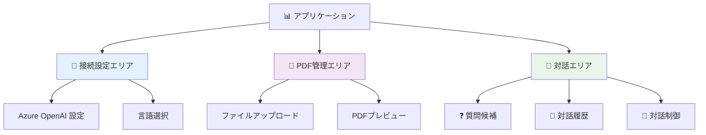

### レスポンシブレイアウト

#### デスクトップ（1024px以上）
```
┌─────────────────────────────────────────────────────────┐
│ 📊 株主対話デモアプリケーション                              │
├─────────────────────────────────────────────────────────┤
│ 🔧 Azure OpenAI 接続設定 [折り畳みボタン]                   │
│ [設定フォーム...]                                         │
├─────────────────┬───────────────────────────────────────┤
│ 📄 PDF管理       │ 💬 対話シミュレーション                 │
│ [アップロード]    │ ❓ 質問候補 [折り畳みボタン]            │
│ [プレビュー]      │ [質問候補リスト...]                     │
│                 │ [🚀 対話開始] [🗑️ 対話クリア]           │
│                 │ [対話履歴表示...]                       │
└─────────────────┴───────────────────────────────────────┘
```

#### タブレット・スマートフォン（768px未満）
```
┌───────────────────────────────┐
│ 📊 株主対話デモアプリケーション    │
├───────────────────────────────┤
│ 🔧 Azure OpenAI 接続設定       │
│ [設定フォーム...]              │
├───────────────────────────────┤
│ 📄 PDF管理                    │
│ [アップロード・プレビュー]       │
├───────────────────────────────┤
│ 💬 対話シミュレーション         │
│ ❓ 質問候補                   │
│ [対話制御・履歴]               │
└───────────────────────────────┘
```

## 🔧 Azure OpenAI 接続設定

### 基本設定手順

#### ステップ1: 設定エリアの展開
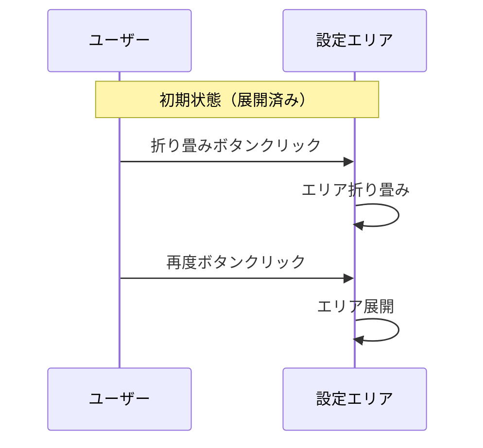

**操作手順**:
1. 画面上部の「🔧 Azure OpenAI 接続設定」セクションを確認
2. 右端の ⬇️ ボタンで折り畳み/展開が可能
3. 初回は展開状態で表示される

#### ステップ2: 接続情報の入力

| 項目 | 説明 | 入力例 | 注意点 |
|------|------|--------|--------|
| **エンドポイント URL** | Azure OpenAI リソースのURL | `https://your-resource.openai.azure.com/` | 末尾の `/` を含める |
| **API キー** | Azure で生成されたキー | `abcd1234...` | パスワード形式で非表示 |
| **デプロイメント名** | モデルのデプロイ名 | `gpt-4o-mini` | Azure Studio で確認 |
| **API バージョン** | 使用するAPIバージョン | `2024-02-15-preview` | 通常変更不要 |

#### ステップ3: 言語設定
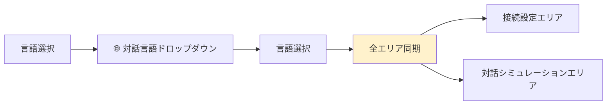

**対応言語**:
- 🇯🇵 **日本語**（既定）
- 🇺🇸 **English**
- 🇨🇳 **中文**
- 🇩🇪 **Deutsch**
- 🇫🇷 **Français**
- 🇪🇸 **Español**
- 🇰🇷 **한국어**

#### ステップ4: 接続テストと保存

**接続テスト手順**:
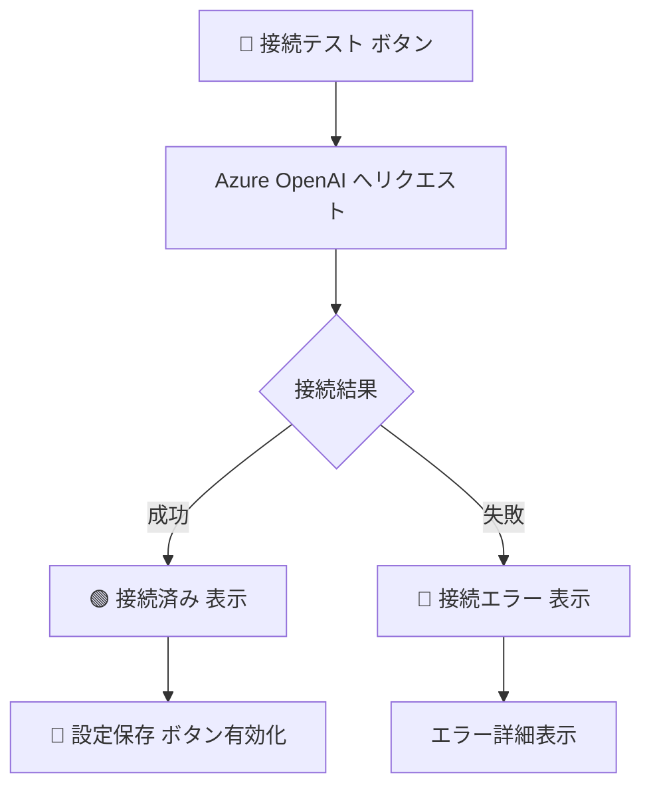

1. **「🔗 接続テスト」**ボタンをクリック
2. 接続結果を確認
   - **成功**: 🟢 接続済み - Azure OpenAI との接続が確認されました
   - **失敗**: 🔴 接続エラー - [具体的なエラーメッセージ]
3. 成功後、**「💾 設定保存」**ボタンをクリック
4. 設定がローカルストレージに保存される

### 詳細設定・トラブルシューティング

#### エラー対応表
| エラーコード | 原因 | 解決方法 |
|-------------|------|----------|
| **401** | APIキー無効 | Azure Portal でキーを確認・再発行 |
| **403** | リソースアクセス権限なし | Azure でロール・権限を確認 |
| **404** | エンドポイント・デプロイメント名誤り | 設定値をAzure Portal で再確認 |
| **429** | レート制限到達 | 少し待ってから再試行 |
| **500** | サーバーエラー | Azure サービス状況を確認 |

## 📄 PDFファイル管理

### ファイルアップロード機能

#### 基本アップロード手順
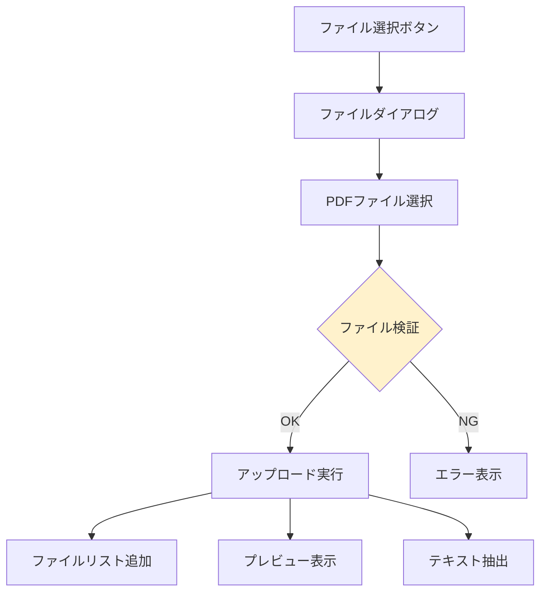

**操作手順**:
1. **「📄 PDF資料アップロード」**セクションのファイル選択ボタンをクリック
2. ファイルダイアログでPDFファイルを選択
3. 複数ファイルの同時選択も可能（Ctrl+クリック）
4. 選択後、自動的にアップロード・処理が開始される

#### 対応ファイル仕様
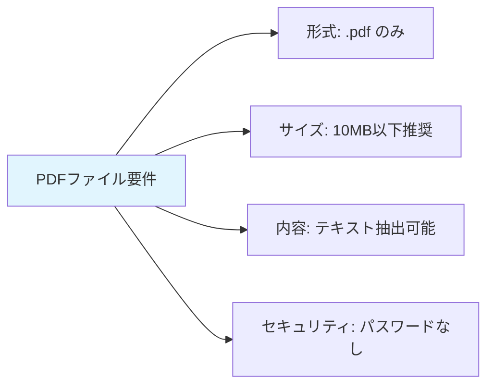

#### アップロードファイルリスト

アップロード済みファイルは以下の形式で表示されます：
```
📄 2024年度決算短信.pdf (1.2MB) [プレビュー] [削除]
📄 株主総会資料.pdf (850KB) [プレビュー] [削除]
```

**ファイル操作**:
- **[プレビュー]**: 該当ファイルをプレビューエリアに表示
- **[削除]**: ファイルリストから削除

### PDFプレビュー機能

#### プレビュー表示
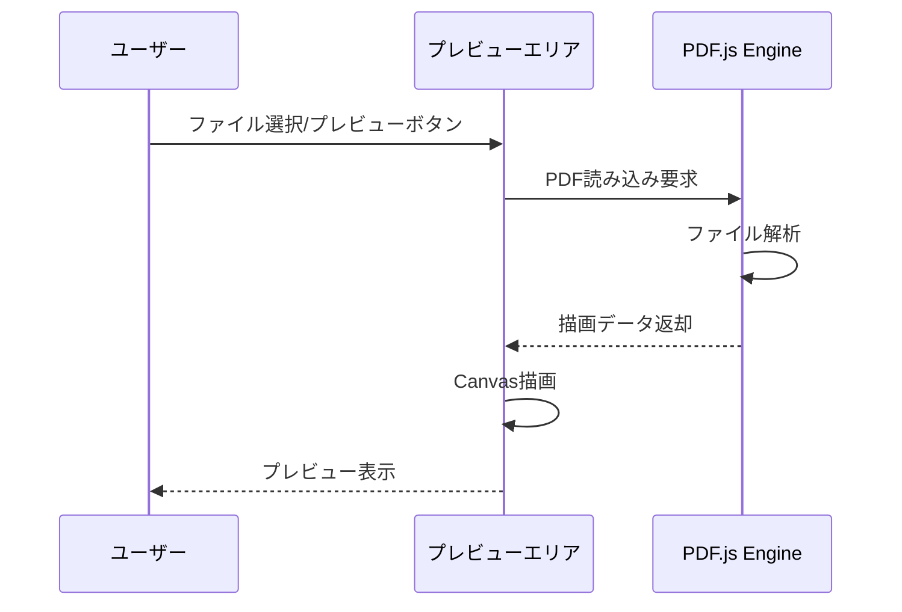

#### ページナビゲーション

プレビュー下部にナビゲーションコントロールが表示されます：
```
[⬅️ 前のページ]    ページ 1 / 5    [次のページ ➡️]
```

**操作方法**:
- **前のページ**: ⬅️ ボタンまたは左矢印キー
- **次のページ**: ➡️ ボタンまたは右矢印キー
- **ページ情報**: 現在ページ / 総ページ数を表示

#### 表示品質調整

プレビューは画面サイズに応じて自動調整されます：
- **デスクトップ**: 高解像度表示
- **タブレット**: 中解像度、タッチ対応
- **スマートフォン**: 低解像度、スワイプ対応

## 💬 対話シミュレーション機能

### 質問候補機能（推奨）

#### 自動生成フロー
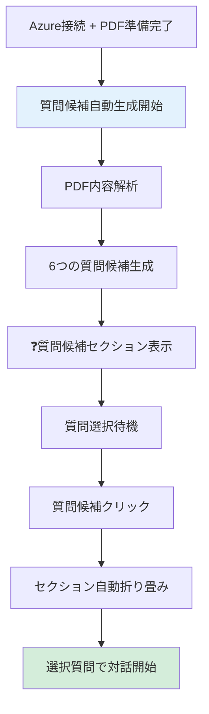

#### 質問候補の構成

生成される6つの質問は以下の観点に基づきます：

| 番号 | 観点 | 例 |
|------|------|---|
| **1** | 業績・財務状況 | 「売上高が前年比で減少していますが、その主な要因と今後の回復見通しを教えてください」 |
| **2** | 経営戦略・将来計画 | 「中期経営計画の進捗状況と、目標達成に向けた具体的な施策を教えてください」 |
| **3** | 株主還元政策 | 「配当政策の方針と、今後の株主還元の考え方について説明してください」 |
| **4** | リスク・課題 | 「事業リスクとして挙げられている項目について、具体的な対策を教えてください」 |
| **5** | 市場環境対応 | 「競争環境の変化にどのように対応していく計画でしょうか」 |
| **6** | その他重要課題 | 「ESGの取り組み状況と今後の方針について教えてください」 |

#### 質問候補の操作

**表示・操作**:
```
❓ 株主質問候補 [⬇️折り畳みボタン]

💡 PDF資料の内容に基づいて生成された質問候補です。クリックして対話を開始してください。

[1] 売上高が前年比で減少していますが、その主な要因と... [▶️]
[2] 中期経営計画の進捗状況と、目標達成に向けた...      [▶️]
[3] 配当政策の方針と、今後の株主還元の考え方に...      [▶️]
...
```

**操作方法**:
- **質問候補クリック**: 該当質問で対話開始
- **⬇️ボタン**: 質問候補セクションの折り畳み/展開
- **自動折り畳み**: 質問選択時に自動的にセクション折り畳み

### 手動対話開始（従来方式）

#### 対話制御パネル
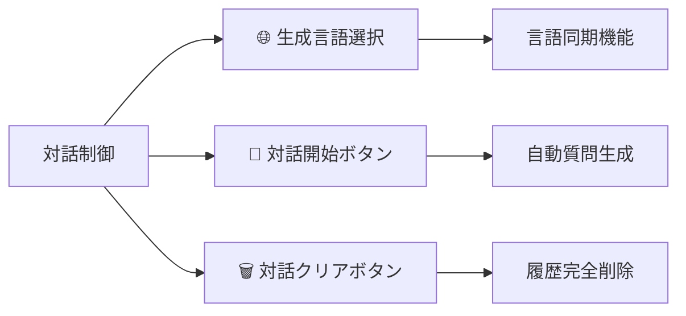

**パネル構成**:
```
💬 対話シミュレーション

🌐 生成言語: [日本語 ▼]

[🚀 対話開始] [🗑️対話クリア]

📝 Azure OpenAI に接続してPDFファイルをアップロードしてから対話を開始してください
```

#### 手動開始手順

1. **前提条件確認**:
   - ✅ Azure OpenAI 接続済み
   - ✅ PDFファイルアップロード済み

2. **言語選択**:
   - 「🌐 生成言語」ドロップダウンで対話言語を選択
   - 接続設定エリアの言語選択と自動同期

3. **対話開始**:
   - **「🚀 対話開始」**ボタンをクリック
   - 自動的に株主からの質問が生成される

### 対話実行フロー

#### 自動進行シーケンス
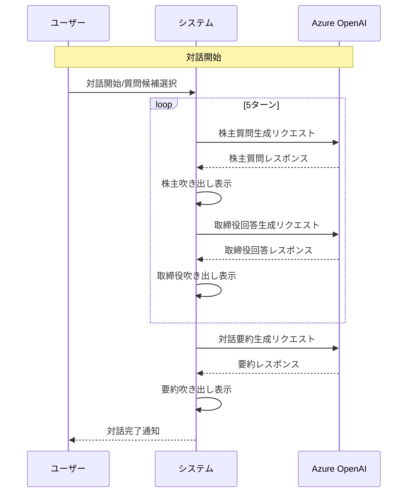

#### 対話表示形式

**吹き出しデザイン**:
```
👤株主: [青い吹き出し]
「決算内容について質問があります...」

👔取締役: [緑の吹き出し]  
「ご質問にお答えいたします...」

📊システム: [紫の吹き出し]
「対話要約: 今回の対話では...」
```

#### リアルタイム更新

- **生成中表示**: 🔄 ローディングアニメーション
- **逐次表示**: メッセージが生成され次第即座に表示
- **自動スクロール**: 新しいメッセージに自動フォーカス
- **エラー表示**: 生成失敗時のエラーメッセージ

### 対話履歴の詳細表示

#### ポップアップモーダル機能
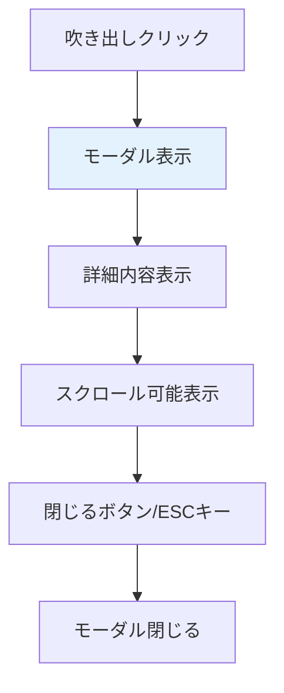

**モーダル表示内容**:
```
┌─────────────────────────────────────┐
│ 💬 吹き出しの内容                     │ [×]
├─────────────────────────────────────┤
│                                     │
│ [詳細なメッセージ内容]                │
│ - リスト形式                         │
│ - マークダウン対応                    │
│ - 長文も完全表示                      │
│                                     │
├─────────────────────────────────────┤
│                           [閉じる]   │
└─────────────────────────────────────┘
```

**操作方法**:
- **開く**: 任意の吹き出しをクリック
- **閉じる**: ×ボタン、「閉じる」ボタン、ESCキー、背景クリック

## 🎛️ 高度な操作・設定

### ショートカットキー

| キー | 機能 | 利用場面 |
|------|------|----------|
| **ESC** | モーダル閉じる | 詳細表示時 |
| **←→** | ページ送り | PDFプレビュー時 |
| **Ctrl+S** | 設定保存 | 接続設定時 |
| **F5** | リロード | エラー時の回復 |

### 設定の保存・復元

#### 自動保存される設定
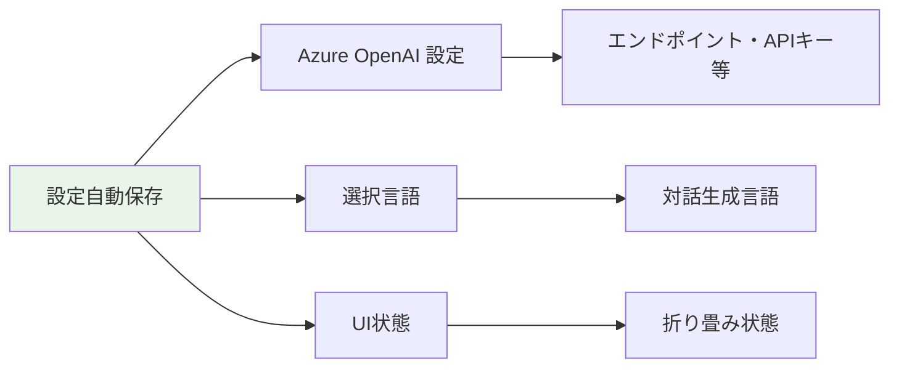

#### 手動リセット方法

**設定リセット**:
```javascript
// ブラウザ開発者ツールのコンソールで実行
localStorage.clear();
location.reload();
```

**対話履歴クリア**:
- 「🗑️ 対話クリア」ボタンで履歴削除
- ページリロードでも履歴削除

### パフォーマンス最適化

#### 推奨利用環境
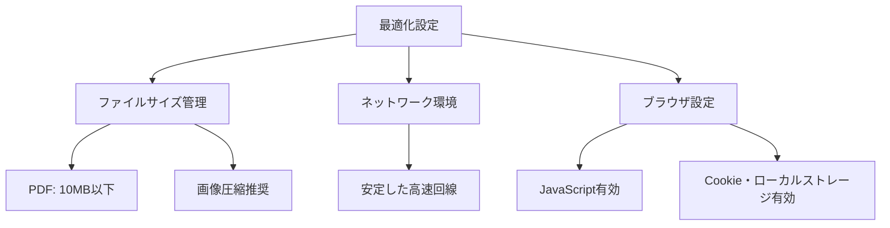

#### メモリ使用量管理

**メモリ節約のコツ**:
- 不要なPDFファイルは削除
- 長時間利用後はページリロード
- 複数タブでの同時利用を避ける
- 大容量ファイルは分割して処理

---

## 📞 サポート・ヘルプ

### 自己解決のためのチェックリスト

#### 基本動作確認
- [ ] インターネット接続は安定しているか
- [ ] Azure OpenAI 設定は正しいか
- [ ] PDFファイルは正常に読み込まれているか
- [ ] ブラウザは対応バージョンか
- [ ] JavaScript は有効か

#### エラー時の確認手順
1. **ブラウザ開発者ツール**を開く（F12）
2. **Console**タブでエラーメッセージ確認
3. **Network**タブで通信状況確認
4. ページリロードして再試行
5. 問題が継続する場合はサポートに連絡

### 追加リソース
- **[起動ガイド](./startup-guide.md)**: 初回セットアップ
- **[機能仕様書](../specs/functional-requirements.md)**: 詳細機能説明
- **[GitHub Issues](https://github.com/tokawa-ms/20250725-kabunushi-demo-001/issues)**: 問題報告

---

**文書バージョン**: 1.0  
**作成日**: 2025年7月31日  
**最終更新**: 2025年7月31日  
**対象アプリケーション**: 株主対話デモアプリケーション v1.0