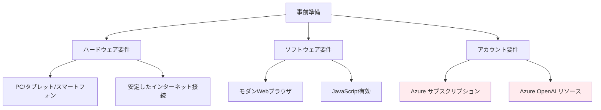
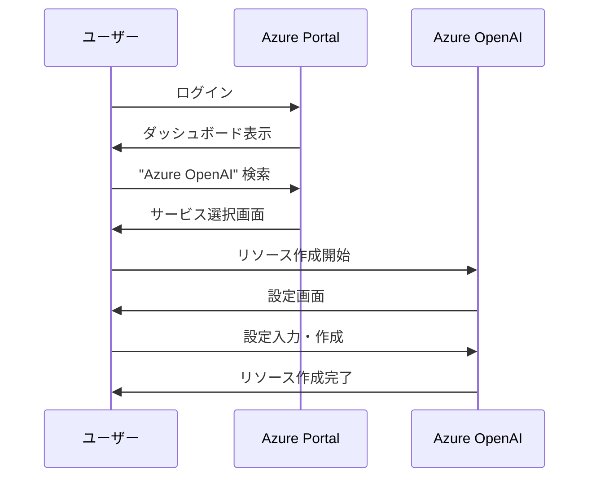
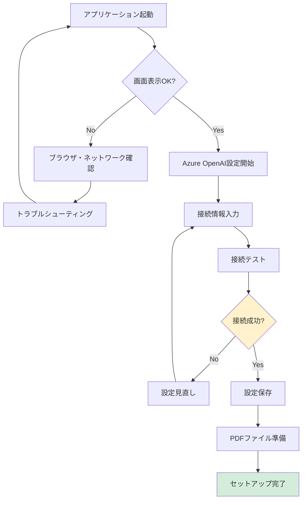
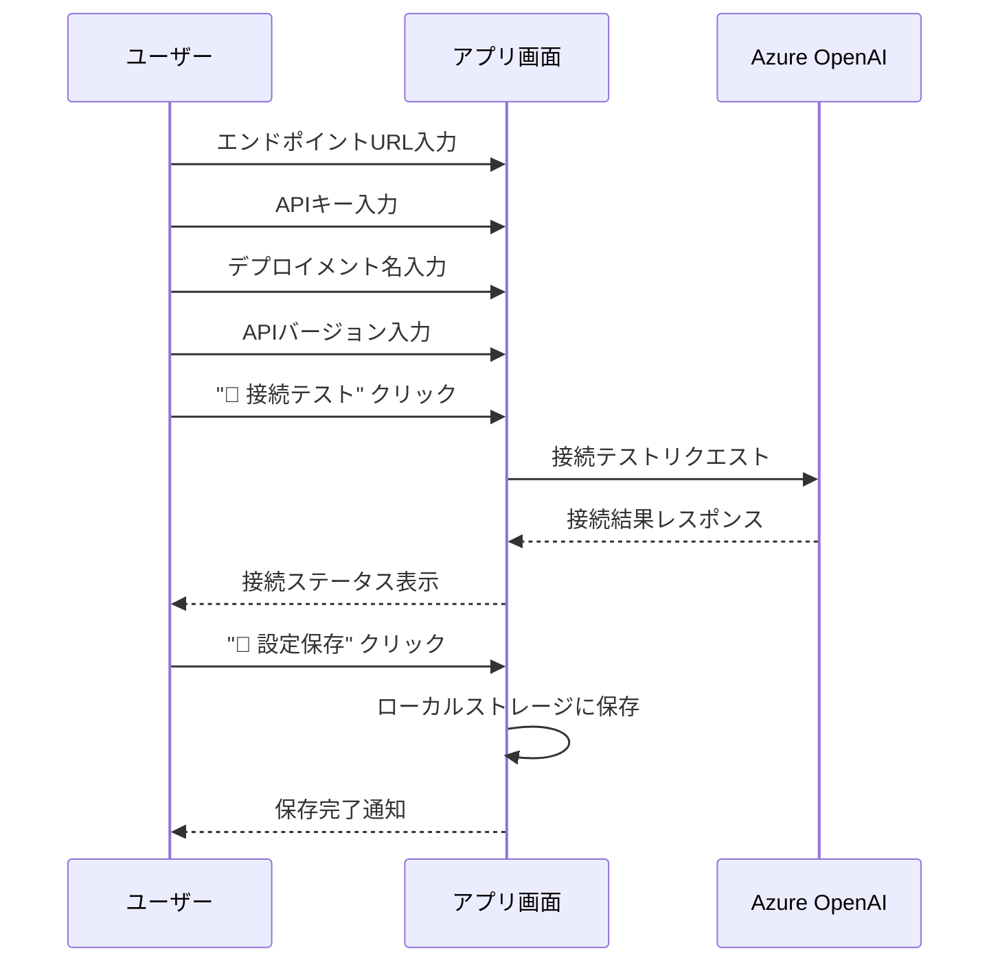
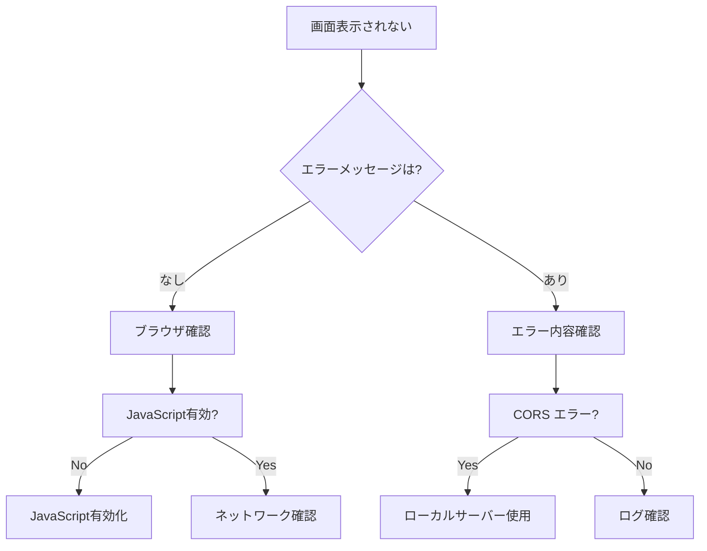
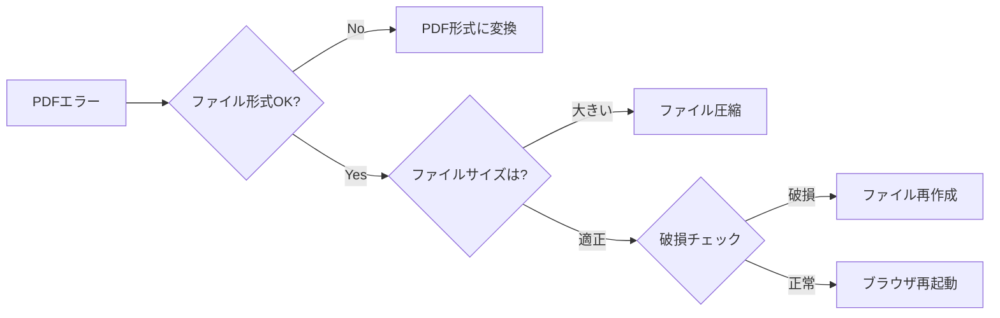

# 🚀 アプリケーション起動ガイド

## 🎯 概要

**株主対話デモアプリケーション**の起動方法について、初回セットアップから日常利用まで詳細に説明します。技術的な知識がなくても、手順に従って確実にアプリケーションを起動できます。

## 📋 事前準備

### 必要な環境・アカウント



#### ✅ 必須要件チェックリスト

| カテゴリ | 項目 | 要件 | チェック |
|----------|------|------|----------|
| **ハードウェア** | デバイス | PC・タブレット・スマートフォン | ☐ |
| | メモリ | 4GB以上推奨 | ☐ |
| | ストレージ | 空き容量100MB以上 | ☐ |
| **ネットワーク** | インターネット | 安定した接続（1Mbps以上） | ☐ |
| **ブラウザ** | Chrome | 90以上 | ☐ |
| | Firefox | 88以上 | ☐ |
| | Safari | 14以上 | ☐ |
| | Edge | 90以上 | ☐ |
| **Azure** | サブスクリプション | 有効なAzureアカウント | ☐ |
| | OpenAI リソース | デプロイ済みGPT-4.1-mini | ☐ |

### Azure OpenAI の準備

#### 1. Azure OpenAI リソースの作成


#### 2. 必要な設定情報の収集

| 設定項目 | 取得場所 | 例 |
|----------|----------|---|
| **エンドポイント URL** | リソース概要ページ | `https://your-resource.openai.azure.com/` |
| **API キー** | リソース管理ページ > キー | `1234567890abcdef...` |
| **デプロイメント名** | Azure OpenAI Studio | `gpt-4o-mini` |
| **API バージョン** | 固定値 | `2024-02-15-preview` |

#### 3. GPT-4.1-mini モデルのデプロイ

**手順**:
1. Azure OpenAI Studio にアクセス
2. 「デプロイメント」セクションを選択
3. 「新しいデプロイメントを作成」をクリック
4. モデル: `gpt-4o-mini` を選択
5. デプロイメント名を入力（例: `gpt-4o-mini`）
6. 「作成」をクリック

## 🚀 アプリケーション起動方法

### 方法1: ブラウザで直接開く（推奨）

#### ダウンロード版の場合
```bash
# 1. リポジトリをクローン
git clone https://github.com/tokawa-ms/20250725-kabunushi-demo-001.git

# 2. ディレクトリに移動
cd 20250725-kabunushi-demo-001

# 3. ブラウザでHTMLファイルを開く
# ファイルマネージャーでsrc/index.htmlをダブルクリック
# または、ブラウザのアドレスバーにファイルパスを入力
```

#### オンライン版の場合
```
# ブラウザのアドレスバーに以下のURLを入力
https://tokawa-ms.github.io/20250725-kabunushi-demo-001/src/

# または
GitHub Pages で公開されている場合のURL
```

### 方法2: ローカルWebサーバー使用（推奨）

#### Python を使用した場合
```bash
# ディレクトリに移動
cd 20250725-kabunushi-demo-001/src

# Python 3 の場合
python -m http.server 8000

# Python 2 の場合
python -m SimpleHTTPServer 8000

# ブラウザで以下のURLを開く
http://localhost:8000
```

#### Node.js を使用した場合
```bash
# http-server をインストール（初回のみ）
npm install -g http-server

# ディレクトリに移動
cd 20250725-kabunushi-demo-001/src

# サーバー起動
http-server -p 8000

# ブラウザで以下のURLを開く
http://localhost:8000
```

#### Live Server（VS Code拡張）を使用した場合
```
1. VS Code で src/index.html を開く
2. ファイル右クリック > "Open with Live Server"
3. ブラウザが自動的に開く
```

### 方法3: GitHub Codespaces 使用

```bash
# 1. GitHub でリポジトリを開く
# 2. "Code" ボタン > "Codespaces" タブ
# 3. "Create codespace on main" をクリック
# 4. Codespace 起動後、ターミナルで以下を実行

cd src
python -m http.server 8000

# 5. "Ports" タブでポート8000を公開
# 6. 表示されるURLをクリック
```

## ⚙️ 初回セットアップ

### 起動確認フロー


### ステップ1: 画面表示確認

正常に起動すると以下の画面が表示されます：

```
📊 株主対話デモアプリケーション
Azure OpenAI GPT-4.1-miniを使用した株主と取締役の対話シミュレーション

🔧 Azure OpenAI 接続設定
[展開ボタン]

エンドポイント URL  [                    ]
API キー           [                    ]
デプロイメント名    [                    ]
API バージョン      [                    ]

[🔗 接続テスト] [💾 設定保存] 未接続

📄 PDF資料アップロード        💬 対話シミュレーション
[ファイル選択]                [🚀 対話開始]
```

### ステップ2: Azure OpenAI 接続設定

#### 設定入力手順


#### 入力例
```
エンドポイント URL: https://your-openai-resource.openai.azure.com/
API キー: 1234567890abcdef1234567890abcdef
デプロイメント名: gpt-4o-mini
API バージョン: 2024-02-15-preview
```

#### 接続テストの結果

**✅ 成功時**:
```
🟢 接続済み - Azure OpenAI との接続が確認されました
```

**❌ 失敗時**:
```
🔴 接続エラー - 設定を確認してください
エラー詳細: [具体的なエラーメッセージ]
```

### ステップ3: PDFファイル準備

#### 対応ファイル形式
- **ファイル形式**: PDF（.pdf）のみ
- **ファイルサイズ**: 10MB以下推奨
- **内容**: 決算短信、株主総会資料、IR資料など

#### 推奨ファイル例
```
✅ 2024年度第2四半期決算短信.pdf
✅ 第99回定時株主総会招集通知.pdf  
✅ 中期経営計画説明資料.pdf
✅ 統合報告書2024.pdf

❌ 画像のみのスキャンPDF（テキスト抽出不可）
❌ パスワード保護されたPDF
❌ 破損したPDFファイル
```

### ステップ4: 動作確認

#### 基本動作テスト手順
1. **PDFアップロード**: テストファイルを選択・アップロード
2. **プレビュー確認**: PDFが正常に表示されることを確認
3. **質問候補生成**: 自動的に6つの質問候補が生成されることを確認
4. **対話テスト**: 質問候補を1つ選択して対話が開始されることを確認

## 🔧 トラブルシューティング

### よくある問題と解決方法

#### 問題1: アプリケーションが表示されない


**解決手順**:
1. **ブラウザの開発者ツール**を開く（F12キー）
2. **Console**タブでエラーメッセージを確認
3. **Network**タブでファイル読み込み状況を確認

#### 問題2: Azure OpenAI 接続エラー

| エラーメッセージ | 原因 | 解決方法 |
|----------------|------|----------|
| **401 Unauthorized** | APIキーが無効 | Azure Portal でキーを再確認 |
| **404 Not Found** | エンドポイントまたはデプロイメント名が間違い | 設定値を再確認 |
| **429 Too Many Requests** | リクエスト制限に到達 | 少し時間をおいてから再試行 |
| **Network Error** | ネットワーク接続問題 | インターネット接続を確認 |

#### 問題3: PDFファイルが読み込まれない



**チェック項目**:
- [ ] ファイル拡張子が`.pdf`
- [ ] ファイルサイズが10MB以下
- [ ] PDFが破損していない
- [ ] パスワード保護されていない

#### 問題4: 対話が生成されない

**確認手順**:
1. Azure OpenAI の接続状態確認
2. PDFファイルのテキスト抽出状況確認
3. ブラウザのコンソールログ確認
4. ネットワーク接続状況確認

### デバッグモード

#### ブラウザ開発者ツールの活用
```javascript
// コンソールで以下のコマンドを実行してデバッグ情報を確認

// 1. アプリケーション状態確認
console.log('App State:', window.app?.state);

// 2. Azure設定確認
console.log('Azure Config:', window.app?.azureConfig);

// 3. PDF内容確認
console.log('PDF Content:', window.app?.state?.pdfContent);

// 4. 対話履歴確認
console.log('Dialogue History:', window.app?.state?.dialogueHistory);
```

## 📞 サポート・お問い合わせ

### セルフヘルプリソース
- **[ユーザーマニュアル](./user-manual.md)**: 詳細な操作方法
- **[操作方法ガイド](./operation-manual.md)**: 具体的な操作手順
- **[FAQ](./README.md#よくある質問)**: よくある質問と回答

### 技術サポート
- **GitHub Issues**: [問題報告・機能要望](https://github.com/tokawa-ms/20250725-kabunushi-demo-001/issues)
- **GitHub Discussions**: [技術相談・質問](https://github.com/tokawa-ms/20250725-kabunushi-demo-001/discussions)

### Azure 関連サポート
- **Azure サポート**: [Azure Portal サポートセンター](https://portal.azure.com/#blade/Microsoft_Azure_Support/HelpAndSupportBlade)
- **Azure OpenAI ドキュメント**: [公式ガイド](https://docs.microsoft.com/azure/cognitive-services/openai/)

---

## 📝 補足情報

**作成日**: 2025年7月31日  
**対象バージョン**: v1.0  
**最終更新**: 2025年7月31日  
**次回レビュー**: 2025年10月31日

### 関連ドキュメント
- [操作方法マニュアル](./operation-manual.md)
- [機能仕様書](../specs/functional-requirements.md)
- [システム仕様書](../specs/system-specifications.md)