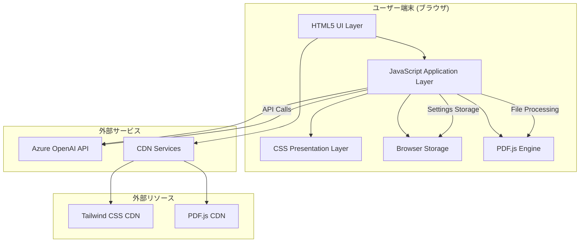
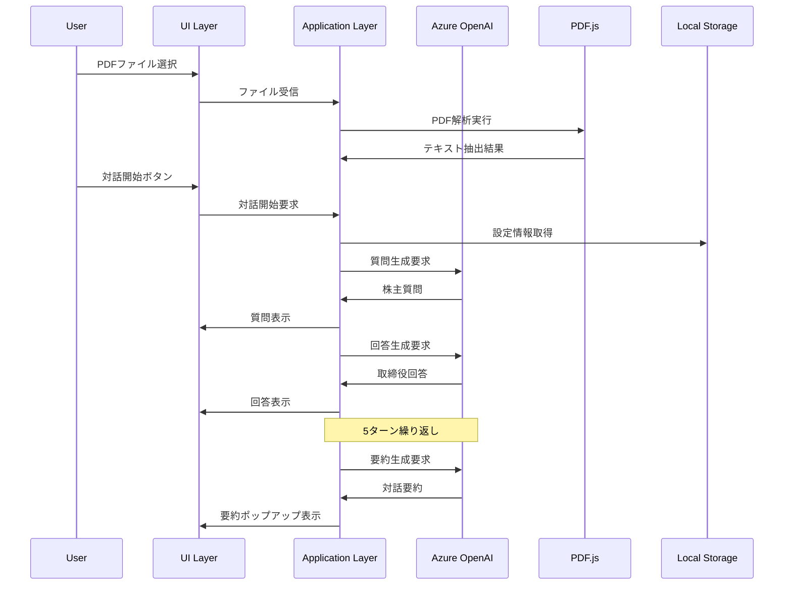
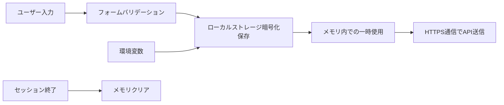

# システムアーキテクチャ設計書

## 概要

株主対話デモアプリケーションのシステムアーキテクチャについて、技術的な観点から詳細に説明します。本アプリケーションは、フロントエンドのみで完結するSPA（シングルページアプリケーション）として設計され、Azure OpenAI APIを活用した AI 駆動の対話生成システムです。

## システム全体像



## アーキテクチャ原則

### 🏗️ 設計原則

1. **クライアントサイド完結**: サーバーレス環境での完全動作
2. **外部API依存**: Azure OpenAI APIによる高品質なAI機能
3. **モジュラー設計**: 機能別の明確な責任分離
4. **ステート管理**: 一元化された状態管理
5. **セキュリティファースト**: API キーの安全な取り扱い

### 🔄 データフロー



## レイヤー構成

### 1. プレゼンテーションレイヤー (HTML + CSS)

#### 責任範囲
- ユーザーインターフェースの構造定義
- 視覚的スタイリングとレイアウト
- レスポンシブデザインの実装
- アクセシビリティ対応

#### 主要技術
```yaml
HTML5:
  - セマンティックマークアップ
  - form要素による入力管理
  - canvas要素でのPDFレンダリング
  - modal要素での対話拡張表示

CSS3:
  - Tailwind CSS（ユーティリティファースト）
  - カスタムCSS（コンポーネント固有スタイル）
  - CSS Grid & Flexbox（レイアウト）
  - CSS Animations（UXエンハンス）
```

#### ファイル構成
```
src/
├── index.html                 # メインHTMLドキュメント
└── css/
    └── styles.css            # カスタムスタイル定義
```

### 2. アプリケーションレイヤー (JavaScript)

#### 責任範囲
- ビジネスロジックの実装
- 状態管理
- API通信制御
- イベント処理
- エラーハンドリング

#### アーキテクチャパターン

**クラスベース設計**
```javascript
class ShareholderDialogueApp {
    constructor() {
        // 状態初期化
        this.state = { /* アプリケーション状態 */ };
        this.azureConfig = { /* Azure設定 */ };
        this.languageConfig = { /* 多言語設定 */ };
    }
    
    // 初期化メソッド
    async initialize() { /* 起動処理 */ }
    
    // 状態管理メソッド
    updateState(key, value) { /* 状態更新 */ }
    
    // API通信メソッド
    async callAzureOpenAI(prompt) { /* API呼び出し */ }
    
    // UI更新メソッド
    updateUI(element, content) { /* DOM操作 */ }
}
```

#### 主要モジュール

**1. 状態管理モジュール**
```javascript
// アプリケーション状態の一元管理
state: {
    isConnected: boolean,           // Azure接続状態
    uploadedFiles: Array,           // アップロードファイル一覧
    currentPdfData: Object,         // 現在のPDFデータ
    dialogueHistory: Array,         // 対話履歴
    conversationTurn: number,       // 対話ターン数
    pdfContent: string,            // 抽出PDFテキスト
    isDialogueInProgress: boolean, // 対話進行状態
    selectedLanguage: string,      // 選択言語
    settingsCollapsed: boolean     // 設定UI状態
}
```

**2. Azure OpenAI 連携モジュール**
```javascript
async callAzureOpenAI(prompt, maxTokens = 500) {
    const response = await fetch(`${this.azureConfig.endpoint}/openai/deployments/${this.azureConfig.deploymentName}/chat/completions?api-version=${this.azureConfig.apiVersion}`, {
        method: 'POST',
        headers: {
            'Content-Type': 'application/json',
            'api-key': this.azureConfig.apiKey
        },
        body: JSON.stringify({
            messages: [
                { role: 'system', content: prompt },
                { role: 'user', content: this.state.pdfContent }
            ],
            max_tokens: maxTokens,
            temperature: 0.7
        })
    });
    
    return await response.json();
}
```

**3. PDF処理モジュール**
```javascript
async extractTextFromPDF(file) {
    const arrayBuffer = await file.arrayBuffer();
    const pdf = await pdfjsLib.getDocument(arrayBuffer).promise;
    
    let fullText = '';
    for (let pageNum = 1; pageNum <= pdf.numPages; pageNum++) {
        const page = await pdf.getPage(pageNum);
        const textContent = await page.getTextContent();
        fullText += textContent.items.map(item => item.str).join(' ');
    }
    
    return fullText;
}
```

**4. 対話管理モジュール**
```javascript
async generateShareholderQuestion() {
    const prompt = this.languageConfig[this.state.selectedLanguage].shareholderPrompt;
    const response = await this.callAzureOpenAI(prompt);
    return response.choices[0].message.content;
}

async generateDirectorResponse(question) {
    const prompt = `${this.languageConfig[this.state.selectedLanguage].directorPrompt}\n\n質問: ${question}`;
    const response = await this.callAzureOpenAI(prompt);
    return response.choices[0].message.content;
}
```

### 3. データレイヤー (Browser Storage + External APIs)

#### ローカルストレージ

**設定データの永続化**
```javascript
// Azure OpenAI設定の保存
localStorage.setItem('azureOpenAIConfig', JSON.stringify({
    endpoint: string,
    apiKey: string,
    deploymentName: string,
    apiVersion: string
}));

// 言語設定の保存
localStorage.setItem('selectedLanguage', string);

// UI設定の保存
localStorage.setItem('settingsCollapsed', boolean);
```

#### 外部API連携

**Azure OpenAI Chat Completions API**
```yaml
Endpoint: https://{resource}.openai.azure.com/
Path: /openai/deployments/{deployment-name}/chat/completions
Method: POST
Headers:
  Content-Type: application/json
  api-key: {api-key}
Parameters:
  api-version: 2024-02-15-preview
Payload:
  messages: Array<{role, content}>
  max_tokens: number
  temperature: number
```

## セキュリティアーキテクチャ

### 🔐 API キー管理



#### セキュリティ対策

1. **API キー保護**
   ```javascript
   // ローカルストレージでの暗号化保存
   const encryptedConfig = btoa(JSON.stringify(config));
   localStorage.setItem('azureOpenAIConfig', encryptedConfig);
   
   // 使用時の復号化
   const decryptedConfig = JSON.parse(atob(localStorage.getItem('azureOpenAIConfig')));
   ```

2. **通信セキュリティ**
   - HTTPS強制通信
   - CORS対応
   - リクエストヘッダーの適切な設定

3. **データ保護**
   - PDFファイルのブラウザ内のみ処理
   - 対話履歴の一時保存（永続化なし）
   - センシティブ情報のログ出力回避

### 🛡️ エラーハンドリング

```javascript
class ErrorHandler {
    static handle(error, context) {
        console.error(`🚨 エラー発生 [${context}]:`, error);
        
        // エラータイプ別の処理
        if (error.name === 'NetworkError') {
            this.showNetworkError();
        } else if (error.status === 401) {
            this.showAuthError();
        } else if (error.status === 429) {
            this.showRateLimitError();
        } else {
            this.showGenericError(error.message);
        }
    }
    
    static showUserFriendlyMessage(message) {
        // センシティブ情報を含まないユーザー向けメッセージ表示
    }
}
```

## パフォーマンスアーキテクチャ

### ⚡ 最適化戦略

#### 1. リソース読み込み最適化

```html
<!-- CDNの効率的活用 -->
<script src="https://cdn.tailwindcss.com"></script>
<script src="https://cdnjs.cloudflare.com/ajax/libs/pdf.js/3.11.174/pdf.min.js"></script>

<!-- 非同期読み込み -->
<script src="js/script.js" defer></script>
```

#### 2. メモリ管理

```javascript
class MemoryManager {
    static cleanup() {
        // 使用済みPDFデータのクリーンアップ
        if (this.currentPdfData) {
            this.currentPdfData = null;
        }
        
        // 不要なイベントリスナーの除去
        this.removeEventListeners();
        
        // ガベージコレクションの促進
        if (window.gc) {
            window.gc();
        }
    }
}
```

#### 3. API呼び出し最適化

```javascript
// トークン数の最適化
const optimizedPrompt = this.truncateContent(originalPrompt, 4000);

// レスポンス時間の制御
const controller = new AbortController();
setTimeout(() => controller.abort(), 30000); // 30秒タイムアウト

fetch(apiUrl, {
    signal: controller.signal,
    // ... その他のオプション
});
```

### 📊 パフォーマンス監視

```javascript
class PerformanceMonitor {
    static logApiCall(startTime, endTime, apiType) {
        const duration = endTime - startTime;
        console.log(`📈 API呼び出し [${apiType}]: ${duration}ms`);
        
        if (duration > 10000) {
            console.warn(`⚠️ 長時間API呼び出し検出: ${duration}ms`);
        }
    }
    
    static logMemoryUsage() {
        if (performance.memory) {
            const memory = performance.memory;
            console.log('💾 メモリ使用量:', {
                used: Math.round(memory.usedJSHeapSize / 1024 / 1024) + 'MB',
                total: Math.round(memory.totalJSHeapSize / 1024 / 1024) + 'MB',
                limit: Math.round(memory.jsHeapSizeLimit / 1024 / 1024) + 'MB'
            });
        }
    }
}
```

## スケーラビリティ設計

### 🔄 拡張可能性

#### 1. 多言語対応の拡張

```javascript
// 新しい言語の追加
this.languageConfig.newLanguage = {
    name: '新言語名',
    shareholderPrompt: 'プロンプトテンプレート',
    directorPrompt: 'プロンプトテンプレート',
    summaryPrompt: 'プロンプトテンプレート',
    startMessage: 'メッセージ',
    endMessage: 'メッセージ'
};
```

#### 2. 新機能モジュールの追加

```javascript
// プラグイン方式での機能拡張
class PluginManager {
    static registerPlugin(name, plugin) {
        this.plugins[name] = plugin;
        plugin.initialize();
    }
    
    static loadPlugin(name) {
        return this.plugins[name];
    }
}

// 使用例: 音声読み上げプラグイン
const speechPlugin = {
    initialize() {
        this.synthesis = window.speechSynthesis;
    },
    speak(text, language) {
        const utterance = new SpeechSynthesisUtterance(text);
        utterance.lang = language;
        this.synthesis.speak(utterance);
    }
};

PluginManager.registerPlugin('speech', speechPlugin);
```

#### 3. API Provider の抽象化

```javascript
// 複数のAIプロバイダー対応
class AIProviderFactory {
    static createProvider(type, config) {
        switch (type) {
            case 'azure':
                return new AzureOpenAIProvider(config);
            case 'openai':
                return new OpenAIProvider(config);
            case 'claude':
                return new ClaudeProvider(config);
            default:
                throw new Error(`未対応のプロバイダー: ${type}`);
        }
    }
}

class AzureOpenAIProvider {
    async generateResponse(prompt) {
        // Azure OpenAI固有の実装
    }
}
```

## 監視・ログ設計

### 📝 ログレベル体系

```javascript
class Logger {
    static levels = {
        ERROR: 0,
        WARN: 1,
        INFO: 2,
        DEBUG: 3,
        VERBOSE: 4
    };
    
    static log(level, message, data = null) {
        const timestamp = new Date().toISOString();
        const logEntry = {
            timestamp,
            level: Object.keys(this.levels)[level],
            message,
            data
        };
        
        switch (level) {
            case this.levels.ERROR:
                console.error(`🚨 [${timestamp}] ${message}`, data);
                break;
            case this.levels.WARN:
                console.warn(`⚠️ [${timestamp}] ${message}`, data);
                break;
            case this.levels.INFO:
                console.info(`ℹ️ [${timestamp}] ${message}`, data);
                break;
            case this.levels.DEBUG:
                console.debug(`🐛 [${timestamp}] ${message}`, data);
                break;
            case this.levels.VERBOSE:
                console.log(`📝 [${timestamp}] ${message}`, data);
                break;
        }
    }
}
```

### 📊 メトリクス収集

```javascript
class MetricsCollector {
    static metrics = {
        apiCalls: 0,
        totalTokensUsed: 0,
        averageResponseTime: 0,
        errorCount: 0,
        userSessions: 0
    };
    
    static recordAPICall(tokens, responseTime) {
        this.metrics.apiCalls++;
        this.metrics.totalTokensUsed += tokens;
        this.metrics.averageResponseTime = 
            (this.metrics.averageResponseTime + responseTime) / 2;
    }
    
    static getMetrics() {
        return { ...this.metrics };
    }
}
```

## デプロイメント戦略

### 🚀 静的サイトデプロイ

```yaml
# GitHub Pagesでの公開設定
name: Deploy to GitHub Pages
on:
  push:
    branches: [ main ]
jobs:
  deploy:
    runs-on: ubuntu-latest
    steps:
      - uses: actions/checkout@v2
      - name: Setup Pages
        uses: actions/configure-pages@v2
      - name: Upload artifact
        uses: actions/upload-pages-artifact@v1
        with:
          path: './src'
      - name: Deploy to GitHub Pages
        uses: actions/deploy-pages@v1
```

### 🌍 CDN活用

```javascript
// CDNフォールバック戦略
const loadTailwindCSS = () => {
    const script = document.createElement('script');
    script.src = 'https://cdn.tailwindcss.com';
    script.onerror = () => {
        // フォールバック先の読み込み
        const fallback = document.createElement('link');
        fallback.rel = 'stylesheet';
        fallback.href = './css/tailwind-fallback.css';
        document.head.appendChild(fallback);
    };
    document.head.appendChild(script);
};
```

## 今後の技術的課題

### 🔮 将来的な拡張計画

1. **Progressive Web App (PWA) 対応**
   - Service Worker による オフライン機能
   - アプリケーションキャッシュ戦略
   - プッシュ通知機能

2. **リアルタイム機能**
   - WebSocket による リアルタイム対話
   - 複数ユーザー間での対話共有
   - コラボレーション機能

3. **高度なAI機能**
   - 音声入力・出力対応
   - 画像解析機能の追加
   - 感情分析・トーン調整

4. **データ分析機能**
   - 対話品質の自動評価
   - ユーザー行動分析
   - パフォーマンス最適化の自動化