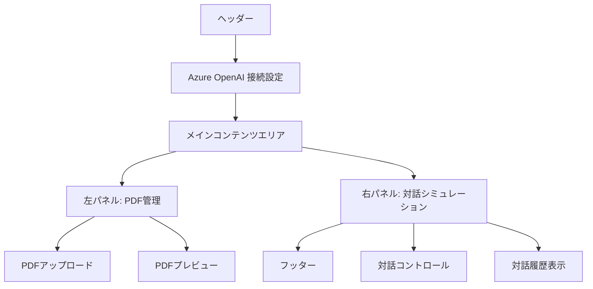

# UI設計仕様書

## 概要

株主対話デモアプリケーションのUI/UX設計について詳細に記述します。このアプリケーションは、直感的で使いやすいインターフェースを通じて、複雑な AI 対話機能を簡単に利用できるよう設計されています。

## 設計原則

### 🎯 ユーザビリティ原則
- **シンプルさ**: 必要な機能に素早くアクセスできる直感的な操作
- **視認性**: 重要な情報とアクションボタンの明確な視覚的区別
- **フィードバック**: ユーザーの操作に対する適切な応答とガイダンス
- **エラー防止**: 誤操作を避けるための適切なバリデーションと警告

### 🎨 視覚デザイン原則
- **一貫性**: 全体を通じた統一されたデザイン言語
- **階層性**: 情報の重要度に応じた適切な視覚的重み付け
- **レスポンシブ**: あらゆるデバイスサイズでの最適な表示
- **アクセシビリティ**: 色覚・視覚に配慮した包括的デザイン

## レイアウト構成

### 全体構造



### グリッドシステム

#### デスクトップ (1024px以上)
- **コンテナ**: 最大幅 7xl (80rem) + 中央配置
- **左パネル**: 1/3 幅 (PDF管理機能)
- **右パネル**: 2/3 幅 (対話機能) 
- **ガップ**: 1rem (16px)

#### タブレット (768px - 1024px)
- **コンテナ**: フル幅 - 2rem マージン
- **パネル**: 縦積み表示
- **ガップ**: 0.75rem (12px)

#### モバイル (320px - 768px)
- **コンテナ**: フル幅 - 1rem マージン
- **パネル**: 縦積み表示
- **ガップ**: 0.5rem (8px)

## カラーパレット

### プライマリカラー

| 色名 | 16進数 | RGB | 用途 |
|------|--------|-----|------|
| Azure Blue | `#3B82F6` | rgb(59, 130, 246) | 株主の吹き出し、プライマリボタン |
| Deep Blue | `#1D4ED8` | rgb(29, 78, 216) | Azure Blue のホバー状態 |
| Emerald Green | `#10B981` | rgb(16, 185, 129) | 取締役の吹き出し、成功状態 |
| Dark Green | `#047857` | rgb(4, 120, 87) | Green のホバー状態 |
| Purple | `#8B5CF6` | rgb(139, 92, 246) | システムメッセージ、特別なアクション |
| Dark Purple | `#7C3AED` | rgb(124, 58, 237) | Purple のホバー状態 |

### ニュートラルカラー

| 色名 | 16進数 | RGB | 用途 |
|------|--------|-----|------|
| Gray 50 | `#F9FAFB` | rgb(249, 250, 251) | 背景色 |
| Gray 100 | `#F3F4F6` | rgb(243, 244, 246) | カード背景 |
| Gray 300 | `#D1D5DB` | rgb(209, 213, 219) | ボーダー |
| Gray 600 | `#4B5563` | rgb(75, 85, 99) | セカンダリテキスト |
| Gray 900 | `#111827` | rgb(17, 24, 39) | プライマリテキスト |

## タイポグラフィ

### フォントスタック
```css
font-family: -apple-system, BlinkMacSystemFont, 'Segoe UI', 'Roboto', 
             'Helvetica Neue', Arial, 'Noto Sans', sans-serif,
             'Apple Color Emoji', 'Segoe UI Emoji', 'Segoe UI Symbol',
             'Noto Color Emoji';
```

### 見出しスケール

| レベル | サイズ | 行間 | フォントウェイト | 用途 |
|--------|--------|------|------------------|------|
| H1 | 1.875rem (30px) | 1.2 | 700 (Bold) | ページタイトル |
| H2 | 1.25rem (20px) | 1.3 | 600 (SemiBold) | セクションタイトル |
| H3 | 1.125rem (18px) | 1.4 | 600 (SemiBold) | サブセクション |

### 本文テキスト

| 要素 | サイズ | 行間 | フォントウェイト |
|------|--------|------|------------------|
| 通常テキスト | 1rem (16px) | 1.5 | 400 (Regular) |
| 小テキスト | 0.875rem (14px) | 1.4 | 400 (Regular) |
| キャプション | 0.75rem (12px) | 1.3 | 400 (Regular) |

## コンポーネント設計

### ボタン

#### プライマリボタン
```css
.btn-primary {
    background: linear-gradient(135deg, #3B82F6, #1D4ED8);
    color: white;
    padding: 0.5rem 1.5rem;
    border-radius: 0.375rem;
    font-weight: 500;
    transition: all 0.2s ease;
}

.btn-primary:hover {
    transform: translateY(-1px);
    box-shadow: 0 4px 12px rgba(59, 130, 246, 0.4);
}
```

#### セカンダリボタン
```css
.btn-secondary {
    background: #F3F4F6;
    color: #374151;
    border: 1px solid #D1D5DB;
    padding: 0.5rem 1.5rem;
    border-radius: 0.375rem;
    transition: all 0.2s ease;
}

.btn-secondary:hover {
    background: #E5E7EB;
    border-color: #9CA3AF;
}
```

### 吹き出し (チャットバブル)

#### 基本構造
```css
.chat-bubble {
    max-width: 80%;
    border-radius: 1rem;
    padding: 1rem;
    margin: 0.5rem 0;
    box-shadow: 0 2px 8px rgba(0, 0, 0, 0.1);
    position: relative;
    cursor: pointer;
    transition: transform 0.2s ease, box-shadow 0.2s ease;
}

.chat-bubble:hover {
    transform: translateY(-2px);
    box-shadow: 0 4px 12px rgba(0, 0, 0, 0.15);
}
```

#### 役割別スタイル

**株主の吹き出し**
```css
.shareholder-bubble {
    background: linear-gradient(135deg, #3B82F6, #1D4ED8);
    color: white;
    align-self: flex-start;
}

.shareholder-bubble::before {
    content: '';
    position: absolute;
    bottom: -10px;
    left: 20px;
    border-width: 10px 10px 0 0;
    border-color: #1D4ED8 transparent transparent transparent;
}
```

**取締役の吹き出し**
```css
.director-bubble {
    background: linear-gradient(135deg, #10B981, #047857);
    color: white;
    align-self: flex-end;
}

.director-bubble::before {
    content: '';
    position: absolute;
    bottom: -10px;
    right: 20px;
    border-width: 10px 0 0 10px;
    border-color: #047857 transparent transparent transparent;
}
```

**システムメッセージ**
```css
.system-bubble {
    background: linear-gradient(135deg, #8B5CF6, #7C3AED);
    color: white;
    align-self: center;
    text-align: center;
}

.system-bubble::before {
    content: '';
    position: absolute;
    bottom: -10px;
    left: 50%;
    transform: translateX(-50%);
    border-width: 10px 10px 0 10px;
    border-color: #7C3AED transparent transparent transparent;
}
```

### フォーム要素

#### テキスト入力
```css
.form-input {
    width: 100%;
    padding: 0.75rem;
    border: 1px solid #D1D5DB;
    border-radius: 0.375rem;
    font-size: 1rem;
    transition: border-color 0.2s ease, box-shadow 0.2s ease;
}

.form-input:focus {
    outline: none;
    border-color: #3B82F6;
    box-shadow: 0 0 0 3px rgba(59, 130, 246, 0.1);
}
```

#### セレクトボックス
```css
.form-select {
    appearance: none;
    background-image: url("data:image/svg+xml,%3csvg xmlns='http://www.w3.org/2000/svg' fill='none' viewBox='0 0 20 20'%3e%3cpath stroke='%236b7280' stroke-linecap='round' stroke-linejoin='round' stroke-width='1.5' d='m6 8 4 4 4-4'/%3e%3c/svg%3e");
    background-position: right 0.5rem center;
    background-repeat: no-repeat;
    background-size: 1.5em 1.5em;
    padding-right: 2.5rem;
}
```

## インタラクション設計

### アニメーション

#### フェードイン
```css
@keyframes fadeIn {
    from {
        opacity: 0;
        transform: translateY(10px);
    }
    to {
        opacity: 1;
        transform: translateY(0);
    }
}

.fade-in {
    animation: fadeIn 0.5s ease-in;
}
```

#### スライドイン
```css
@keyframes slideIn {
    from {
        opacity: 0;
        transform: translateX(-20px);
    }
    to {
        opacity: 1;
        transform: translateX(0);
    }
}

.slide-in {
    animation: slideIn 0.3s ease-out;
}
```

### モーダル設計

#### 背景オーバーレイ
```css
.modal-overlay {
    position: fixed;
    inset: 0;
    background: rgba(0, 0, 0, 0.5);
    backdrop-filter: blur(4px);
    z-index: 50;
    display: flex;
    align-items: center;
    justify-content: center;
    padding: 1rem;
}
```

#### モーダルコンテンツ
```css
.modal-content {
    background: white;
    border-radius: 0.5rem;
    box-shadow: 0 20px 25px -5px rgba(0, 0, 0, 0.1);
    width: 100%;
    max-width: 4xl;
    max-height: 90vh;
    overflow: hidden;
    animation: modalSlideIn 0.3s ease-out;
}

@keyframes modalSlideIn {
    from {
        opacity: 0;
        transform: scale(0.9) translateY(-20px);
    }
    to {
        opacity: 1;
        transform: scale(1) translateY(0);
    }
}
```

## レスポンシブ設計

### ブレークポイント

| サイズ | 最小幅 | 最大幅 | 説明 |
|--------|--------|--------|------|
| Mobile | 320px | 767px | スマートフォン |
| Tablet | 768px | 1023px | タブレット |
| Desktop | 1024px | - | デスクトップ・ラップトップ |

### レスポンシブ調整

#### モバイル対応
```css
@media (max-width: 768px) {
    .container {
        padding-left: 0.5rem;
        padding-right: 0.5rem;
    }
    
    .chat-bubble {
        max-width: 95%;
        font-size: 0.875rem;
    }
    
    .grid-layout {
        grid-template-columns: 1fr;
        gap: 0.5rem;
    }
}
```

## アクセシビリティ

### カラーコントラスト

全てのテキストとUI要素は WCAG 2.1 AA レベルのコントラスト比を満たします：

- **通常テキスト**: 4.5:1 以上
- **大きなテキスト**: 3:1 以上
- **UI コンポーネント**: 3:1 以上

### キーボードナビゲーション

- **Tab キー**: 論理的な順序でのフォーカス移動
- **Enter/Space**: ボタンとリンクの実行
- **Escape**: モーダルとドロップダウンの閉じる操作
- **矢印キー**: リスト項目間の移動

### スクリーンリーダー対応

```html
<!-- 適切な aria-label の使用 -->
<button aria-label="設定を折り畳む/展開する">
    <svg><!-- アイコン --></svg>
</button>

<!-- 状態の通知 -->
<div role="status" aria-live="polite">
    接続テスト完了
</div>

<!-- 見出し階層の適切な使用 -->
<h1>株主対話デモアプリケーション</h1>
<h2>Azure OpenAI 接続設定</h2>
<h3>対話履歴</h3>
```

## パフォーマンス最適化

### CSS最適化

- **Critical CSS**: 初期表示に必要なスタイルの優先読み込み
- **CSS Purging**: 未使用スタイルの除去（本番環境）
- **CSS Minification**: ファイルサイズの最小化

### 画像とアセット

- **SVG Icons**: ベクター形式での軽量アイコン
- **Lazy Loading**: 必要時のリソース読み込み
- **CDN活用**: 外部ライブラリの効率的な配信

### レンダリング最適化

```css
/* スムーズなスクロール */
html {
    scroll-behavior: smooth;
}

/* ハードウェアアクセラレーション */
.chat-bubble {
    will-change: transform;
    transform: translateZ(0);
}

/* 再描画の最適化 */
.loading-spinner {
    transform: translate3d(0, 0, 0);
}
```

## 今後の拡張性

### テーマ機能
- CSS カスタムプロパティによるテーマ切り替え
- ダークモード対応
- ユーザーカスタマイズ可能なカラーパレット

### 国際化対応
- RTL（右から左）言語のレイアウト
- 可変テキスト長に対応したコンポーネント設計
- 文化的差異に配慮したアイコンとカラー

### アニメーション拡張
- より豊富なマイクロインタラクション
- 音声・触覚フィードバック
- パララックススクロール効果