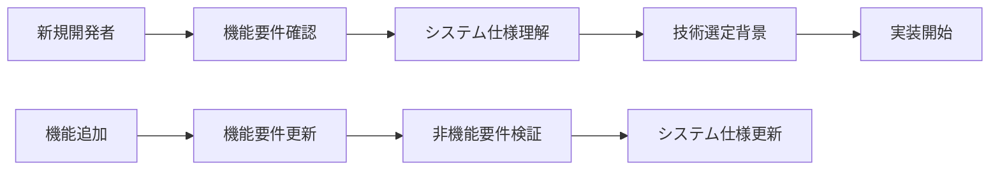
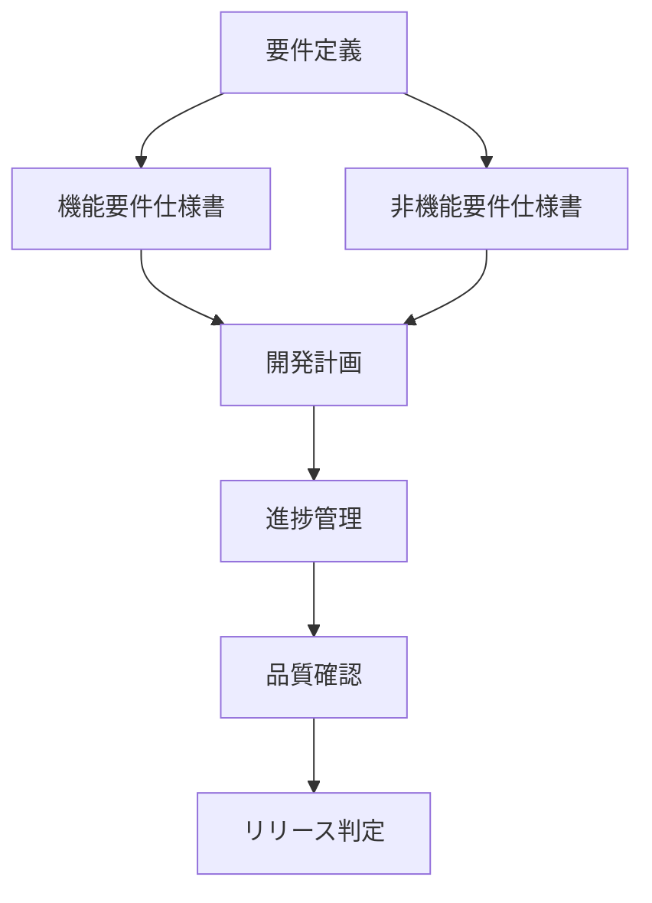
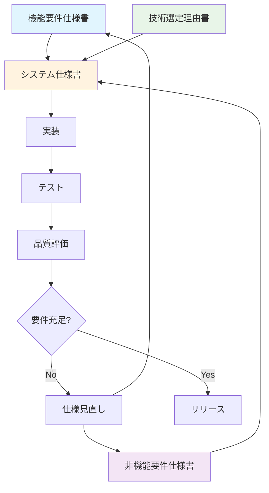
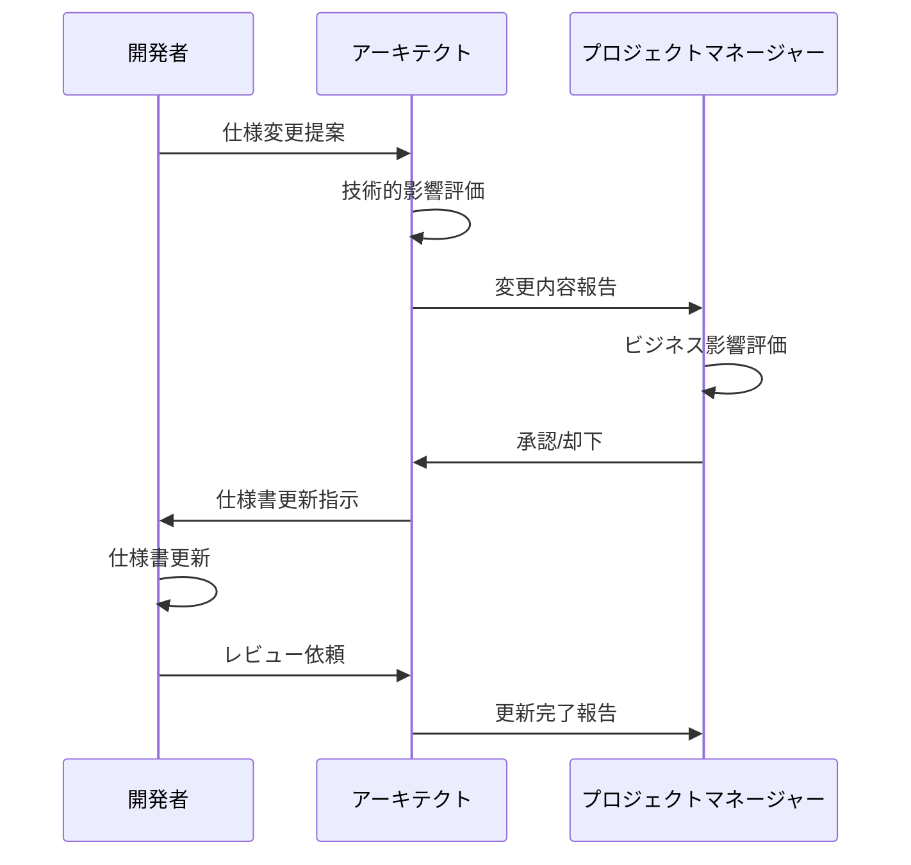
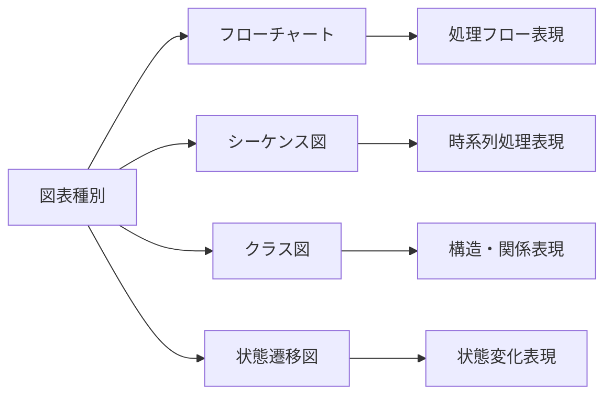

# 📋 仕様書ディレクトリ

## 🎯 概要

このディレクトリには、**株主対話デモアプリケーション**の包括的な仕様書が格納されています。機能要件から技術選定まで、システム開発・運用に必要な全ての仕様を体系的に整理しています。

## 📁 仕様書一覧

### 📋 要件仕様書

| ドキュメント | 概要 | 対象読者 |
|-------------|------|----------|
| **[機能要件仕様書](./functional-requirements.md)** | 実装すべき機能の詳細定義 | PM・開発者・QA |
| **[非機能要件仕様書](./non-functional-requirements.md)** | パフォーマンス・品質要件 | アーキテクト・インフラ |

### 🏗️ 設計仕様書

| ドキュメント | 概要 | 対象読者 |
|-------------|------|----------|
| **[システム仕様書](./system-specifications.md)** | アーキテクチャ・設計の詳細 | アーキテクト・開発者 |
| **[技術選定理由書](./technology-selection.md)** | 技術選択の根拠と比較 | アーキテクト・リードエンジニア |

## 🎯 仕様書の活用方法

### 開発者向け


### プロジェクト管理者向け


## 📊 仕様書間の関係性



## 🔄 仕様書の更新プロセス

### 更新トリガー
| トリガー | 対象仕様書 | 更新レベル |
|----------|-----------|-----------|
| **新機能追加** | 機能要件・システム仕様 | Major |
| **性能要件変更** | 非機能要件・システム仕様 | Major |
| **技術変更** | 技術選定・システム仕様 | Major |
| **バグ修正** | 該当仕様書 | Minor |
| **ドキュメント改善** | 全般 | Patch |

### 更新フロー


## 📋 品質基準

### 仕様書品質チェックリスト

#### 📝 内容品質
- [ ] **完全性**: 必要な情報がすべて記載されている
- [ ] **正確性**: 実装と仕様が一致している
- [ ] **一貫性**: 他の仕様書との整合性が取れている
- [ ] **明確性**: 曖昧な表現がなく理解しやすい

#### 🎨 文書品質
- [ ] **構造化**: 論理的な構成で整理されている
- [ ] **ビジュアル**: 図表を適切に活用している
- [ ] **検索性**: 目次・索引が充実している
- [ ] **保守性**: 更新しやすい構造になっている

#### 🔄 メンテナンス性
- [ ] **追跡可能性**: 変更履歴が記録されている
- [ ] **バージョン管理**: 適切なバージョン番号付与
- [ ] **承認プロセス**: 責任者による承認済み
- [ ] **定期レビュー**: 定期的な見直しスケジュール

## 🛠️ 仕様書作成ガイドライン

### Mermaid図表の使用方針


### 表形式の使用方針
| 用途 | 形式 | 例 |
|------|------|---|
| **要件一覧** | 項目・詳細・優先度 | 機能要件表 |
| **比較検討** | 選択肢・評価軸・結果 | 技術選定表 |
| **仕様詳細** | パラメータ・値・説明 | API仕様表 |
| **チェックリスト** | 項目・状態・備考 | 品質チェック表 |

### 文書構造テンプレート
```
# タイトル

## 🎯 概要
- 目的・スコープ・対象読者

## 📋 [メイン内容]
- 詳細仕様・要件・設計

## 🔄 関連情報  
- 関連文書・前提条件・制約

## 📊 付録
- 参考資料・用語集・変更履歴
```

## 📈 メトリクス・KPI

### 仕様書品質指標
| 指標 | 目標値 | 測定方法 |
|------|--------|----------|
| **実装一致率** | 95%以上 | 実装レビュー |
| **レビュー指摘事項** | 5件以下/文書 | レビュー記録 |
| **更新頻度** | 月1回以上 | Git履歴 |
| **利用率** | 80%以上 | アクセス解析 |

### 開発効率指標
| 指標 | 期待効果 | 測定方法 |
|------|----------|----------|
| **要件理解時間** | 50%短縮 | 新規メンバー調査 |
| **実装誤差** | 30%削減 | バグ・手戻り分析 |
| **レビュー効率** | 40%向上 | レビュー時間測定 |

## 🔗 関連リソース

### 外部ドキュメント
- [📚 docs/ - 利用者向けドキュメント](../docs/)
- [💻 src/ - ソースコード](../src/)
- [📄 README.md - プロジェクト概要](../README.md)

### 参考文献
- [Azure OpenAI Service Documentation](https://docs.microsoft.com/azure/cognitive-services/openai/)
- [PDF.js Documentation](https://mozilla.github.io/pdf.js/)
- [Tailwind CSS Documentation](https://tailwindcss.com/docs)

### 開発ツール
- [Mermaid Live Editor](https://mermaid.live/)
- [Markdown Editor](https://stackedit.io/)
- [Git Version Control](https://git-scm.com/)

---

## 📝 ドキュメント管理情報

**ディレクトリ作成日**: 2025年7月31日  
**管理者**: 開発チーム  
**最終更新**: 2025年7月31日  
**次回レビュー**: 2025年10月31日  

### 変更履歴
| 日付 | 変更内容 | 担当者 |
|------|----------|--------|
| 2025-07-31 | 初版作成 | システムアーキテクト |
| - | - | - |