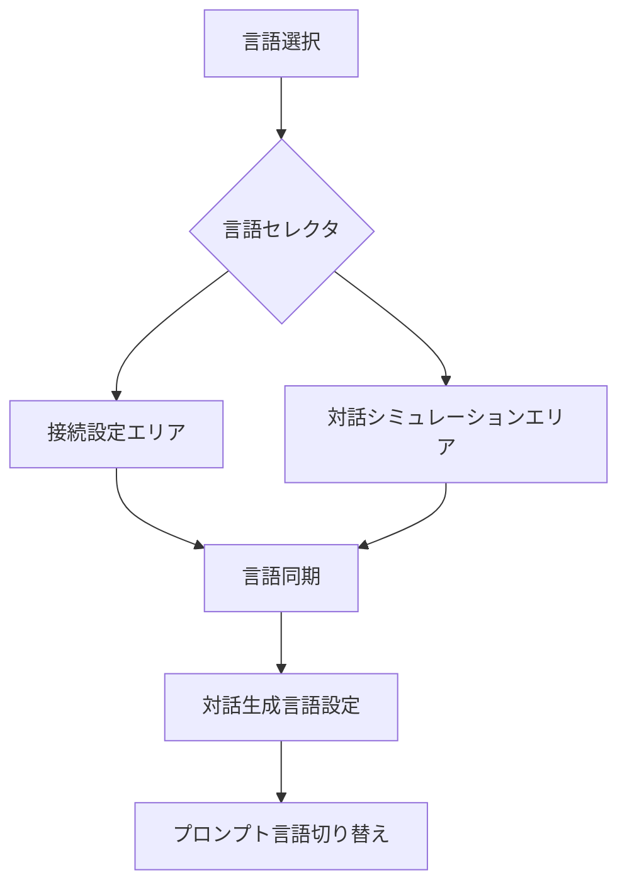
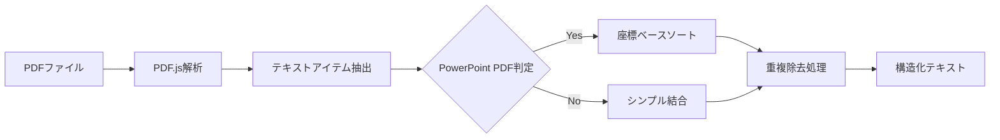
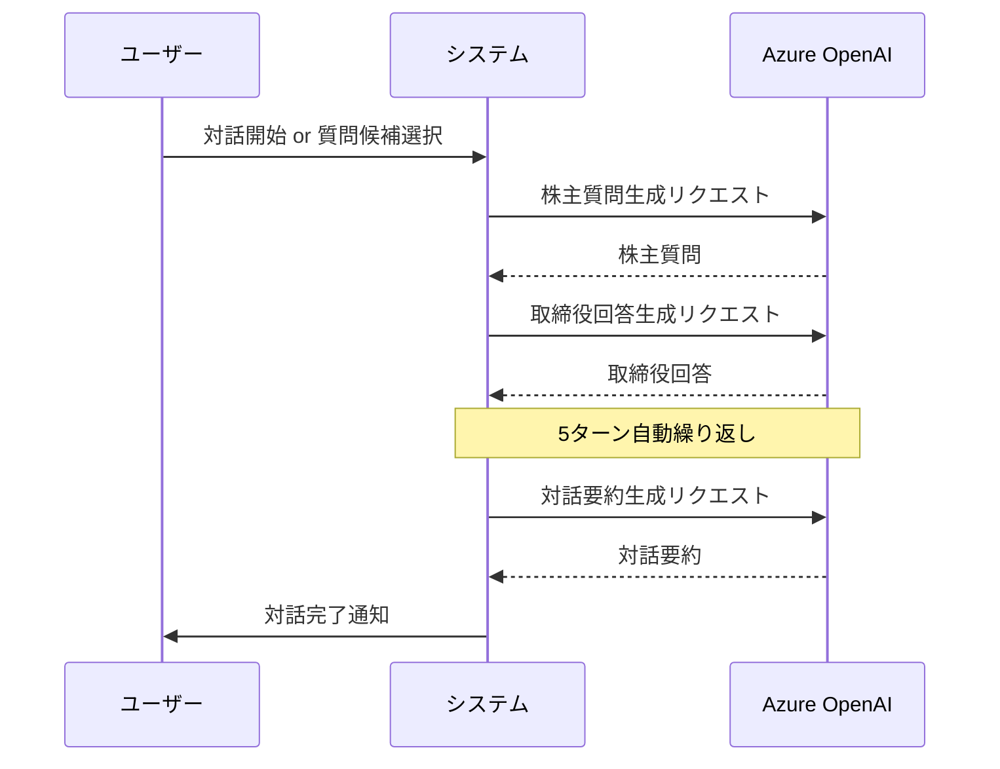
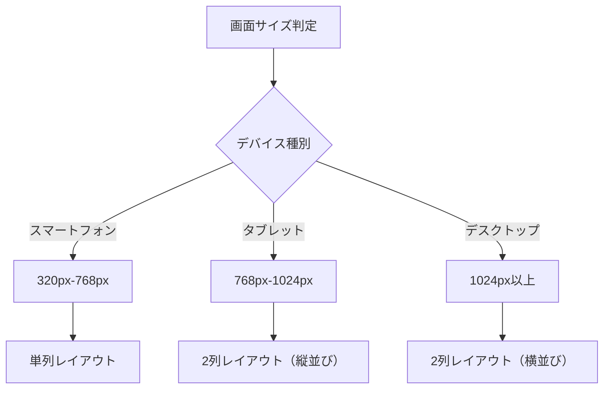
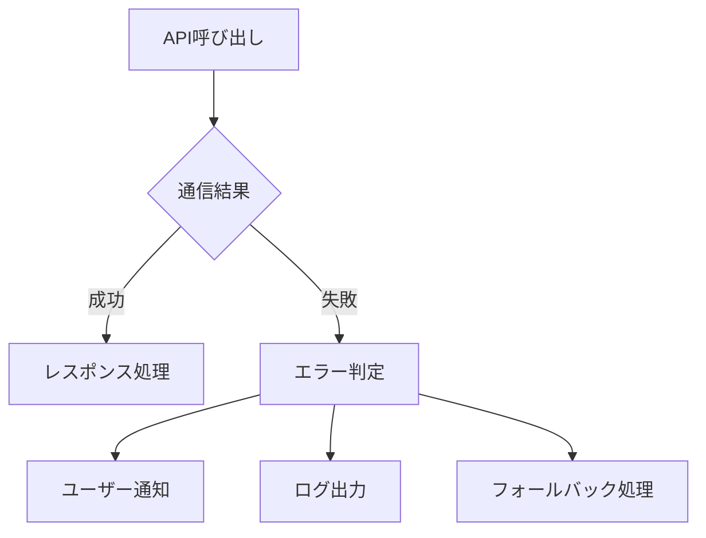
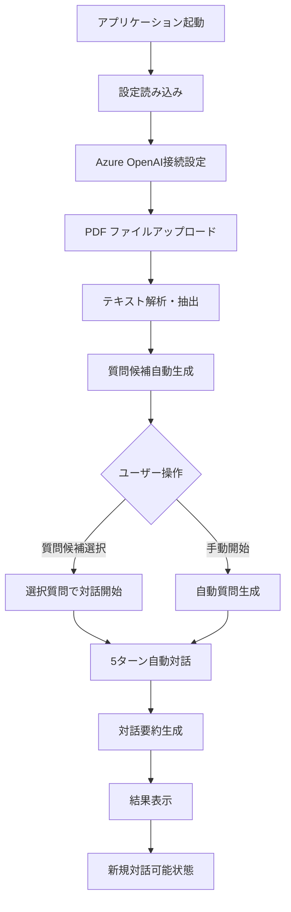

# 機能要件仕様書

## 🎯 アプリケーション概要

**株主対話デモアプリケーション**は、Azure OpenAI GPT-4.1-miniを活用した株主総会での株主と取締役の対話シミュレーションシステムです。決算資料や株主総会資料のPDFファイルを解析し、リアルな対話を自動生成します。

## 📋 機能要件一覧

### 1. Azure OpenAI連携機能 🔗

#### 1.1 接続設定機能
| 項目 | 詳細 |
|------|------|
| **機能概要** | Azure OpenAI サービスへの接続設定・管理 |
| **入力項目** | エンドポイントURL、APIキー、デプロイメント名、APIバージョン |
| **検証機能** | 接続テスト機能による設定値の妥当性確認 |
| **設定保存** | ブラウザローカルストレージでの設定永続化 |
| **セキュリティ** | APIキーのパスワード形式入力、ハードコード禁止 |

#### 1.2 多言語対応

**対応言語**:
- 🇯🇵 日本語（既定）
- 🇺🇸 English  
- 🇨🇳 中文
- 🇩🇪 Deutsch
- 🇫🇷 Français
- 🇪🇸 Español
- 🇰🇷 한국어

### 2. PDFファイル管理機能 📄

#### 2.1 ファイルアップロード機能
| 機能 | 仕様 |
|------|------|
| **対象ファイル** | PDF形式（.pdf） |
| **アップロード方式** | 複数ファイル同時選択対応 |
| **ファイルサイズ制限** | ブラウザメモリ依存（推奨: 10MB以下） |
| **処理方式** | クライアントサイド処理（サーバー送信なし） |

#### 2.2 PDFプレビュー機能
| 機能 | 仕様 |
|------|------|
| **プレビューエンジン** | PDF.js 3.11.174 |
| **表示機能** | ページナビゲーション（前/次ページ） |
| **レスポンシブ対応** | 画面サイズに応じた自動調整 |
| **レンダリング品質** | 高品質Canvas描画 |

#### 2.3 テキスト抽出機能

**PowerPoint PDF 特別処理**:
- 座標ベースでのテキストソート
- 重複テキストの自動除去
- レイアウト構造の復元

### 3. 対話シミュレーション機能 💬

#### 3.1 質問候補生成機能
| 項目 | 詳細 |
|------|------|
| **生成タイミング** | Azure OpenAI接続 + PDF アップロード完了後 |
| **生成数** | 6つの質問候補 |
| **生成観点** | 業績・財務、経営戦略、株主還元、リスク、市場環境、その他課題 |
| **表示形式** | カード形式、ホバーエフェクト付き |
| **操作性** | クリック選択で対話開始 |

#### 3.2 自動対話進行機能

**対話フロー**:
1. **開始**: ユーザー操作または質問候補選択
2. **進行**: 株主質問 → 取締役回答を5ターン自動実行
3. **完了**: 対話要約の自動生成
4. **表示**: リアルタイム吹き出し表示

#### 3.3 対話表示機能
| 機能 | 仕様 |
|------|------|
| **表示形式** | チャット形式の吹き出し |
| **役割別デザイン** | 株主（青）、取締役（緑）、システム（紫） |
| **拡張表示** | クリックでモーダルポップアップ |
| **自動スクロール** | 新しいメッセージへの自動フォーカス |

### 4. UI/UX機能 🎨

#### 4.1 レスポンシブデザイン

#### 4.2 折り畳み機能
| 対象セクション | 動作 |
|---------------|------|
| **接続設定** | 手動切り替え、設定完了後の自動折り畳み |
| **質問候補** | 手動切り替え、質問選択時の自動折り畳み |
| **アニメーション** | スムーズな開閉トランジション |

#### 4.3 言語セレクタ同期機能
- 2箇所の言語選択ドロップダウンの完全同期
- 一方の変更が他方に即座に反映
- 対話生成言語の連動切り替え

### 5. データ管理機能 💾

#### 5.1 ローカルストレージ機能
| 保存データ | 形式 | 用途 |
|-----------|------|------|
| **Azure OpenAI設定** | JSON | 接続情報の永続化 |
| **言語設定** | String | 選択言語の記憶 |
| **UI状態** | Boolean | 折り畳み状態の保持 |

#### 5.2 セッション管理
- ブラウザリロード時の設定復元
- 対話履歴のメモリ内保持（セッション限定）
- ファイルアップロード状態の維持

### 6. エラーハンドリング機能 ⚠️

#### 6.1 API通信エラー

#### 6.2 ファイル処理エラー
- PDFファイル破損時の適切なエラー表示
- 非対応ファイル形式の検出と警告
- ファイルサイズ超過時の処理

#### 6.3 ネットワークエラー
- Azure OpenAI接続失敗時の再試行機能
- タイムアウト処理とユーザー通知
- オフライン状態の検出

### 7. セキュリティ機能 🔒

#### 7.1 APIキー管理
| 項目 | 実装 |
|------|------|
| **入力形式** | パスワードフィールド（非表示） |
| **保存形式** | ローカルストレージ（暗号化なし） |
| **送信方式** | HTTPS通信のみ |
| **ハードコード禁止** | ソースコードへの埋め込み禁止 |

#### 7.2 データプライバシー
- PDFファイルのローカル処理のみ
- 対話履歴の永続化禁止
- 第三者サービスへのデータ送信なし

### 8. パフォーマンス要件 ⚡

#### 8.1 レスポンス時間
| 操作 | 目標時間 |
|------|----------|
| **PDF アップロード** | 2秒以内 |
| **プレビュー表示** | 1秒以内 |
| **質問候補生成** | 30秒以内 |
| **対話ターン生成** | 15秒以内 |

#### 8.2 メモリ使用量
- PDFファイル処理時の効率的なメモリ管理
- 対話履歴の適切なガベージコレクション
- 大容量ファイル処理時のメモリリーク防止

## 🔄 機能間連携フロー

## 📊 機能優先度マトリクス

| 機能カテゴリ | 必須 | 重要 | 便利 |
|-------------|------|------|------|
| **Azure OpenAI連携** | ✅ | - | - |
| **PDF処理** | ✅ | - | - |
| **基本対話生成** | ✅ | - | - |
| **多言語対応** | - | ✅ | - |
| **質問候補生成** | - | ✅ | - |
| **UI/UXアニメーション** | - | - | ✅ |
| **PowerPoint PDF最適化** | - | - | ✅ |

## 🎯 受け入れ基準

### 基本機能
- [ ] Azure OpenAI への正常な接続が可能
- [ ] PDFファイルのアップロードと表示が正常に動作
- [ ] 5ターンの自動対話が生成される
- [ ] 全ての言語で対話が生成される

### 品質基準
- [ ] レスポンシブデザインが全デバイスで正常動作
- [ ] エラー時に適切なユーザー通知が表示される
- [ ] 設定がブラウザ再起動後も保持される
- [ ] APIキーが安全に管理される

### パフォーマンス基準
- [ ] PDFプレビューが2秒以内に表示
- [ ] 対話生成が適切な時間内に完了
- [ ] メモリリークが発生しない
- [ ] 大容量PDFでもクラッシュしない

---

**文書バージョン**: 1.0  
**作成日**: 2025年7月31日  
**最終更新**: 2025年7月31日  
**承認者**: 開発チーム