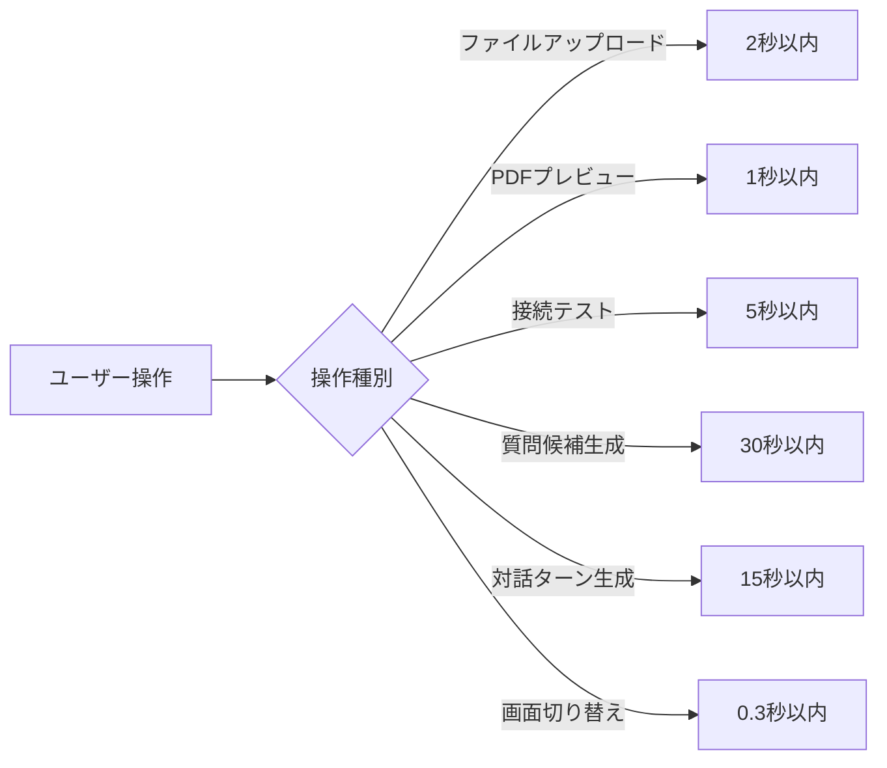
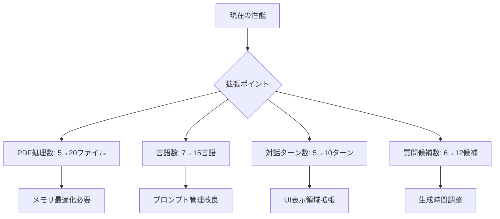
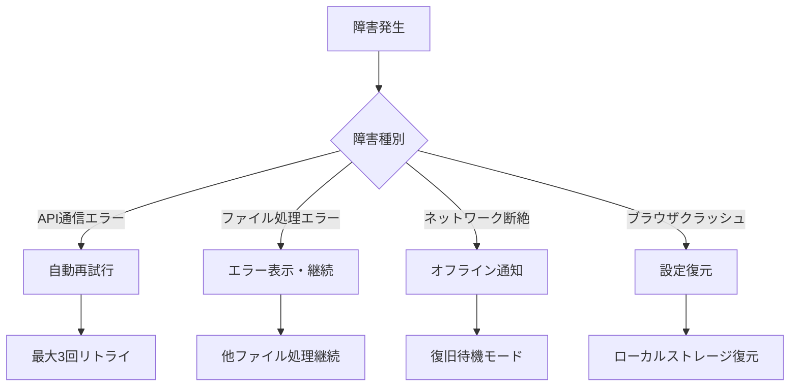
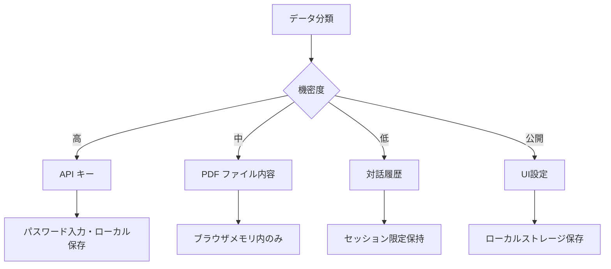
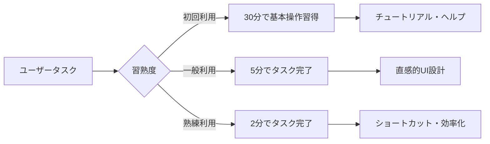
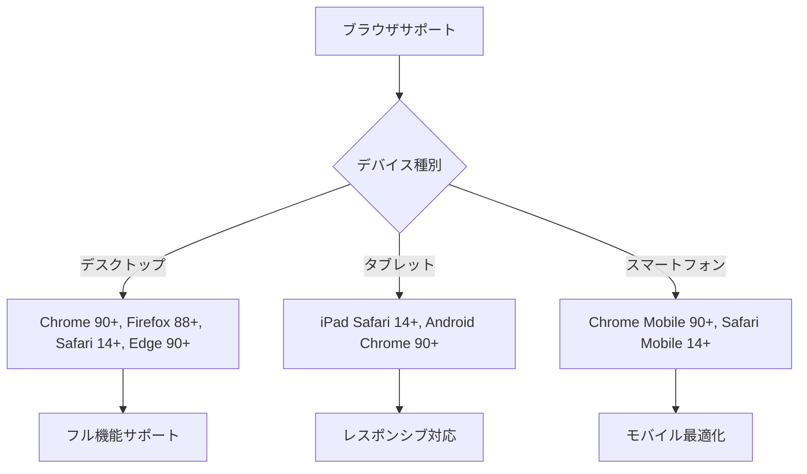
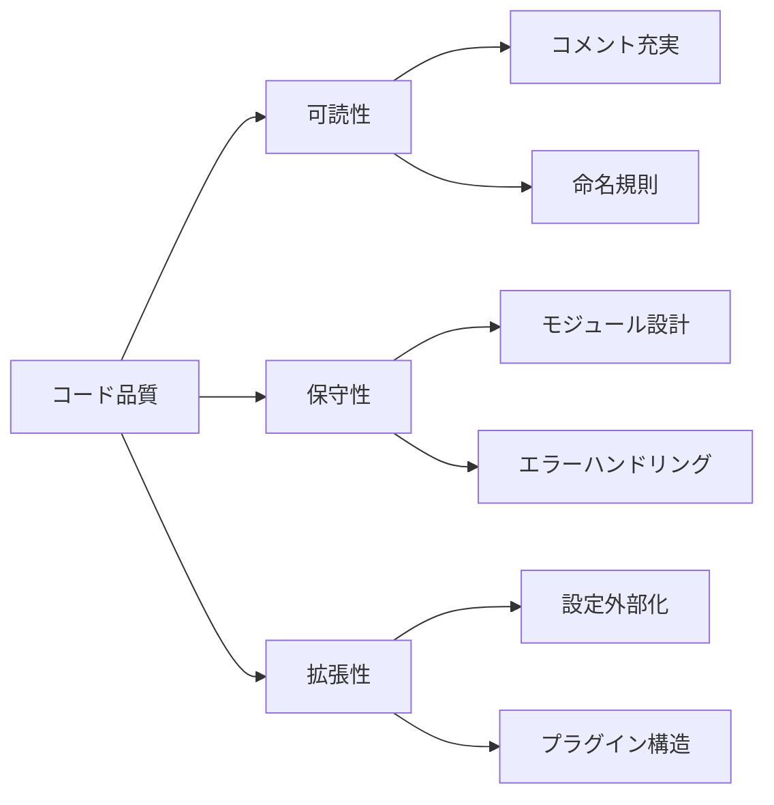
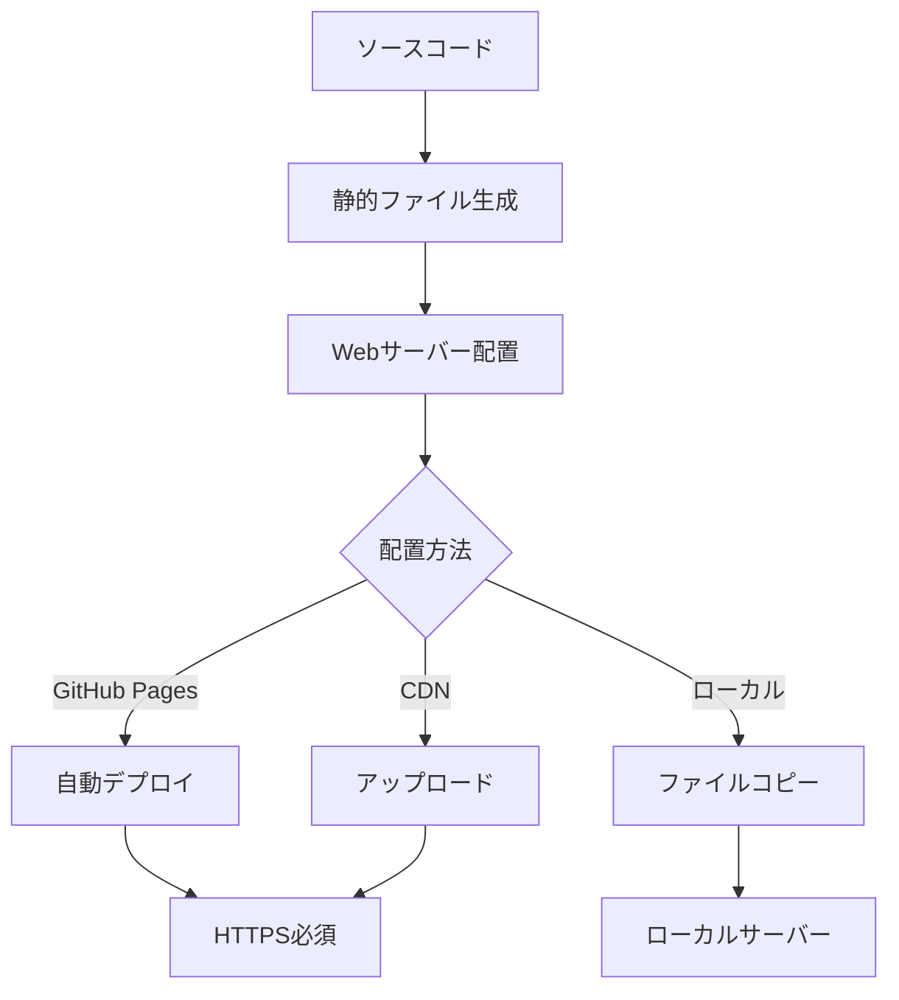
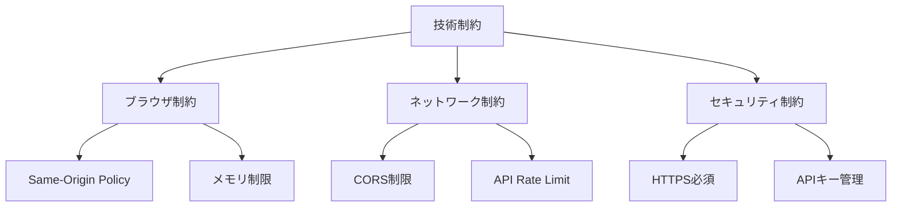
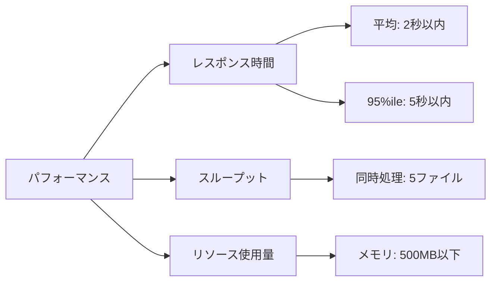

# 非機能要件仕様書

## 🎯 アプリケーション概要

**株主対話デモアプリケーション**の非機能要件について、パフォーマンス、セキュリティ、可用性、保守性などの品質特性を定義します。

## 📊 非機能要件一覧

### 1. パフォーマンス要件 ⚡

#### 1.1 レスポンス時間要件

| 操作 | 目標時間 | 最大許容時間 | 備考 |
|------|----------|-------------|------|
| **アプリケーション起動** | 1秒 | 3秒 | 初回DOM構築とスタイル適用 |
| **PDF ファイルアップロード** | 1秒 | 2秒 | ファイルサイズ10MB以下 |
| **PDF プレビュー表示** | 0.5秒 | 1秒 | Canvas描画処理 |
| **Azure OpenAI 接続テスト** | 3秒 | 5秒 | ネットワーク通信依存 |
| **質問候補生成（6件）** | 20秒 | 30秒 | API呼び出し + 処理時間 |
| **対話ターン生成（1回）** | 10秒 | 15秒 | GPT-4.1-mini処理時間 |
| **言語切り替え** | 即座 | 0.1秒 | ローカル処理のみ |
| **折り畳み・展開** | 即座 | 0.3秒 | CSSアニメーション |

#### 1.2 スループット要件
| 項目 | 要件 |
|------|------|
| **同時PDF処理** | 5ファイルまで |
| **メモリ使用量** | 500MB以下（ブラウザタブ単位） |
| **CPU使用率** | 80%以下（処理ピーク時） |
| **ネットワーク帯域** | 1Mbps以下（API通信） |

#### 1.3 拡張性要件

### 2. 可用性要件 🔄

#### 2.1 稼働率要件
| 項目 | 目標値 | 測定期間 |
|------|--------|----------|
| **アプリケーション稼働率** | 99.9% | 月次 |
| **Azure OpenAI 依存率** | 99.5% | 月次 |
| **PDF.js 依存率** | 99.9% | 月次 |
| **CDN 依存率** | 99.9% | 月次 |

#### 2.2 障害対応要件

#### 2.3 復旧要件
| 障害種別 | 復旧時間目標 | 復旧手順 |
|----------|-------------|----------|
| **Azure OpenAI 接続障害** | 即座 | 自動再試行、エラー表示 |
| **PDF ファイル破損** | 即座 | 該当ファイルスキップ、警告表示 |
| **ブラウザメモリ不足** | 30秒 | ページリロード推奨 |
| **ネットワーク断絶** | 接続復旧次第 | 自動検出・復旧 |

### 3. セキュリティ要件 🔒

#### 3.1 認証・認可要件
| 項目 | 仕様 | 実装方法 |
|------|------|----------|
| **API キー管理** | 暗号化保存 | ローカルストレージ（平文） |
| **アクセス制御** | なし | パブリックアクセス |
| **セッション管理** | ブラウザ依存 | ローカルセッションのみ |

#### 3.2 データ保護要件

#### 3.3 通信セキュリティ要件
| 項目 | 要件 | 実装 |
|------|------|------|
| **Azure OpenAI 通信** | HTTPS必須 | TLS 1.2以上 |
| **CDN 通信** | HTTPS必須 | TLS 1.2以上 |
| **ローカルファイル** | 暗号化不要 | 平文保存 |
| **ブラウザ間通信** | なし | 単一タブ動作 |

#### 3.4 脆弱性対策要件
| 脅威 | 対策 | 実装状況 |
|------|------|----------|
| **XSS攻撃** | 入力値サニタイズ | ✅ DOM操作で対応 |
| **CSRF攻撃** | 影響なし | ✅ 状態変更なし |
| **情報漏洩** | データ最小化 | ✅ ローカル処理のみ |
| **APIキー漏洩** | UI注意喚起 | ⚠️ ハードコード禁止 |

### 4. 使いやすさ要件 👥

#### 4.1 ユーザビリティ要件

#### 4.2 アクセシビリティ要件
| 項目 | 要件レベル | 対応状況 |
|------|-----------|----------|
| **キーボード操作** | WCAG 2.1 AA | ✅ フォーカス制御 |
| **スクリーンリーダー** | WCAG 2.1 AA | ⚠️ 部分対応 |
| **カラーコントラスト** | WCAG 2.1 AA | ✅ 4.5:1以上 |
| **フォントサイズ** | 200%まで対応 | ✅ レスポンシブ |

#### 4.3 多言語要件
| 言語 | 対応レベル | UI翻訳 | 対話生成 |
|------|-----------|--------|----------|
| **日本語** | フル | ✅ | ✅ |
| **English** | フル | ✅ | ✅ |
| **中文** | 対話のみ | ❌ | ✅ |
| **Deutsch** | 対話のみ | ❌ | ✅ |
| **Français** | 対話のみ | ❌ | ✅ |
| **Español** | 対話のみ | ❌ | ✅ |
| **한국어** | 対話のみ | ❌ | ✅ |

### 5. 互換性要件 🌐

#### 5.1 ブラウザ対応要件

#### 5.2 技術要件
| 技術 | 最小バージョン | 推奨バージョン | 必須機能 |
|------|--------------|--------------|----------|
| **JavaScript** | ES6 (2015) | ES2020 | モジュール、Promise、async/await |
| **CSS** | CSS3 | CSS3 | Flexbox、Grid、アニメーション |
| **HTML** | HTML5 | HTML5 | Canvas、File API |

#### 5.3 外部依存要件
| 依存サービス | SLA要求 | フォールバック |
|-------------|---------|---------------|
| **Azure OpenAI** | 99.5% | エラー表示・再試行 |
| **Tailwind CSS CDN** | 99.9% | ローカルフォールバック不要 |
| **PDF.js CDN** | 99.9% | 必須・代替なし |

### 6. 保守性要件 🔧

#### 6.1 コード品質要件

#### 6.2 ドキュメント要件
| ドキュメント種別 | 更新頻度 | 品質基準 |
|----------------|----------|----------|
| **機能仕様書** | 機能追加時 | 実装との整合性100% |
| **API仕様書** | API変更時 | サンプルコード付き |
| **ユーザーマニュアル** | UI変更時 | スクリーンショット最新 |
| **開発者ガイド** | 四半期 | 新規開発者30分で理解 |

#### 6.3 監視・ログ要件
| 項目 | レベル | 出力先 | 保持期間 |
|------|--------|--------|----------|
| **エラーログ** | ERROR | Console | セッション中 |
| **パフォーマンスログ** | INFO | Console | セッション中 |
| **ユーザー操作ログ** | DEBUG | Console | セッション中 |
| **API通信ログ** | DEBUG | Console | セッション中 |

### 7. 運用要件 🚀

#### 7.1 デプロイメント要件

#### 7.2 バックアップ要件
| 対象 | 頻度 | 保持期間 | 復旧時間 |
|------|------|----------|----------|
| **ソースコード** | Git管理 | 永続 | 即座 |
| **ドキュメント** | Git管理 | 永続 | 即座 |
| **ユーザー設定** | なし | ローカル依存 | 不要 |

#### 7.3 設定管理要件
| 設定項目 | 管理方法 | 変更影響 |
|----------|----------|----------|
| **Azure OpenAI設定** | ユーザー入力 | 機能全体 |
| **言語設定** | ユーザー選択 | 対話生成 |
| **UI設定** | ユーザー操作 | 表示のみ |

### 8. 制約・前提条件 ⚠️

#### 8.1 技術制約

#### 8.2 運用制約
| 制約項目 | 内容 | 対応策 |
|----------|------|--------|
| **Azure OpenAI利用料金** | 従量課金 | 使用量監視推奨 |
| **API Rate Limit** | 毎分制限あり | エラーハンドリング |
| **ブラウザメモリ** | 大容量PDF処理限界 | ファイルサイズ警告 |
| **ネットワーク帯域** | 低速回線での制約 | タイムアウト調整 |

#### 8.3 前提条件
| 項目 | 前提 | 確認方法 |
|------|------|----------|
| **Azure OpenAI契約** | 有効なサブスクリプション | 接続テスト |
| **モダンブラウザ** | 対応ブラウザ利用 | User-Agent判定 |
| **JavaScript有効** | ブラウザ設定 | 起動時チェック |
| **インターネット接続** | API通信用 | 接続テスト |

## 📈 品質メトリクス

### パフォーマンス指標

### 品質指標
| 指標 | 目標値 | 測定方法 |
|------|--------|----------|
| **機能動作率** | 99.9% | 自動テスト |
| **エラー発生率** | 0.1%以下 | ログ分析 |
| **ユーザー満足度** | 4.5/5.0以上 | アンケート |
| **タスク完了率** | 95%以上 | ユーザビリティテスト |

---

**文書バージョン**: 1.0  
**作成日**: 2025年7月31日  
**最終更新**: 2025年7月31日  
**承認者**: 開発チーム  
**次回レビュー**: 2025年10月31日