# システム仕様書

## 🎯 システム概要

**株主対話デモアプリケーション**の包括的なシステム仕様を定義します。アーキテクチャ、コンポーネント設計、データフロー、インターフェース仕様などを詳細に記述します。

## 🏗️ システムアーキテクチャ

### 全体アーキテクチャ
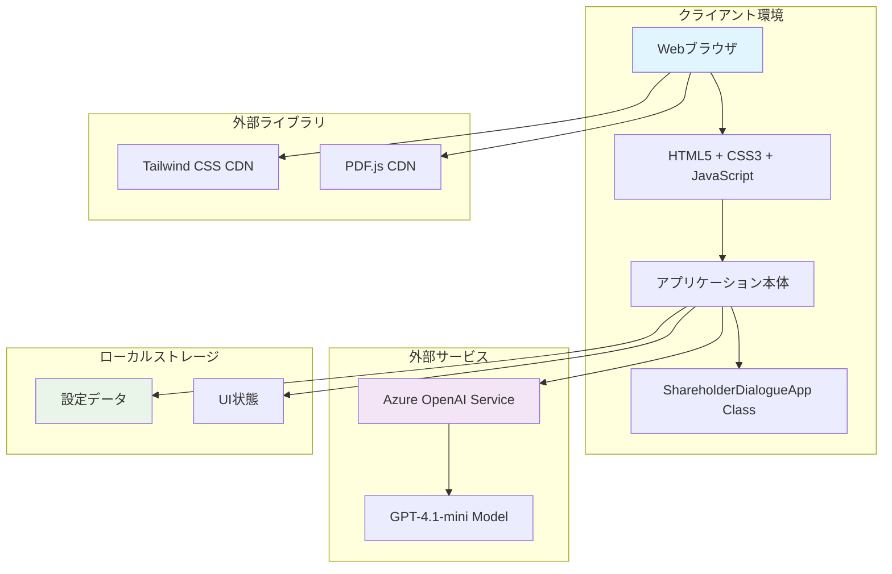

### レイヤー構成
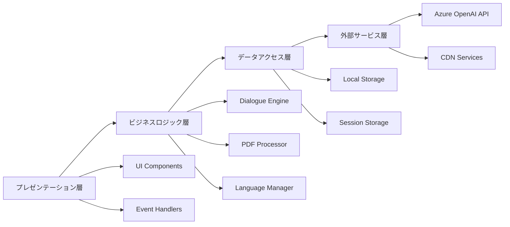

## 📊 コンポーネント設計

### 1. メインクラス設計

#### ShareholderDialogueApp クラス
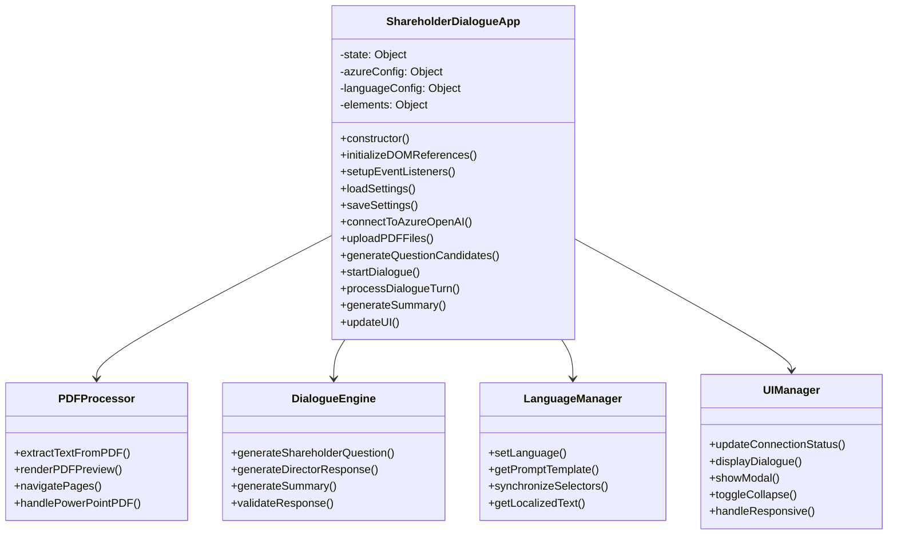

### 2. 機能別コンポーネント

#### PDF処理コンポーネント
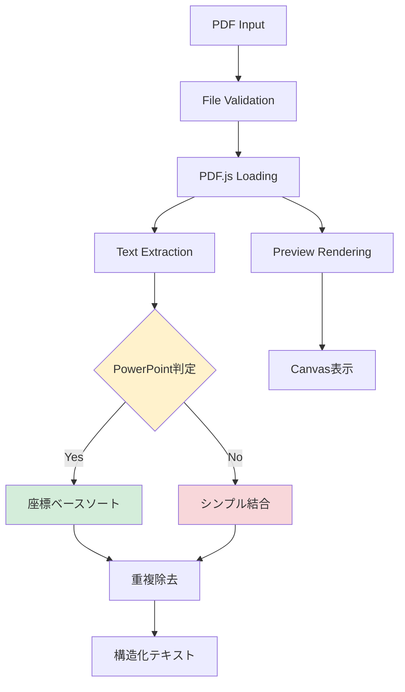

#### 対話生成コンポーネント
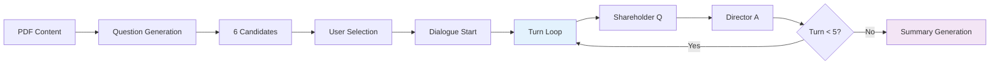

## 📋 データ構造設計

### 1. アプリケーション状態
```javascript
// メインアプリケーション状態
state = {
    // 接続状態
    isConnected: Boolean,
    
    // ファイル管理
    uploadedFiles: Array<File>,
    currentPdfData: PDFDocumentProxy,
    currentPage: Number,
    totalPages: Number,
    pdfContent: String,
    
    // 対話管理
    dialogueHistory: Array<DialogueMessage>,
    conversationTurn: Number,
    isDialogueInProgress: Boolean,
    
    // UI状態
    selectedLanguage: String,
    settingsCollapsed: Boolean,
    candidatesCollapsed: Boolean,
    questionCandidates: Array<String>,
    candidatesGenerated: Boolean
}
```

### 2. 設定データ構造
```javascript
// Azure OpenAI設定
azureConfig = {
    endpoint: String,        // "https://xxx.openai.azure.com/"
    apiKey: String,         // APIキー
    deploymentName: String, // "gpt-4o-mini"
    apiVersion: String      // "2024-02-15-preview"
}

// 言語設定
languageConfig = {
    [languageCode]: {
        name: String,
        shareholderPrompt: String,
        directorPrompt: String,
        summaryPrompt: String,
        startMessage: String,
        endMessage: String
    }
}
```

### 3. メッセージデータ構造
```javascript
// 対話メッセージ
DialogueMessage = {
    id: String,           // ユニークID
    role: String,         // "shareholder" | "director" | "system"
    content: String,      // メッセージ内容
    timestamp: Date,      // 生成時刻
    turn: Number,         // ターン番号
    language: String      // 生成言語
}

// 質問候補
QuestionCandidate = {
    id: Number,           // 1-6
    question: String,     // 質問内容
    category: String,     // 質問カテゴリ
    language: String      // 生成言語
}
```

## 🔄 データフロー設計

### 1. メインフロー
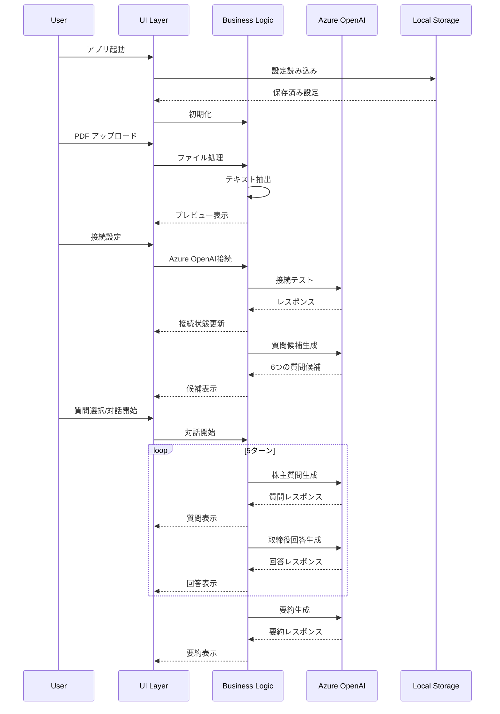

### 2. PDF処理フロー
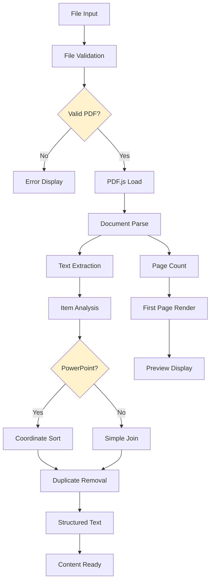

## 🌐 API インターフェース設計

### 1. Azure OpenAI API仕様

#### 接続エンドポイント
```
POST {endpoint}/openai/deployments/{deployment-name}/chat/completions?api-version={api-version}

Headers:
- api-key: {api-key}
- Content-Type: application/json
```

#### リクエスト形式
```javascript
{
    "messages": [
        {
            "role": "system",
            "content": "システムプロンプト"
        },
        {
            "role": "user", 
            "content": "ユーザー入力"
        }
    ],
    "max_tokens": 2000,
    "temperature": 0.7,
    "top_p": 0.9
}
```

#### レスポンス形式
```javascript
{
    "choices": [
        {
            "message": {
                "role": "assistant",
                "content": "AI生成テキスト"
            },
            "finish_reason": "stop"
        }
    ],
    "usage": {
        "prompt_tokens": 100,
        "completion_tokens": 50,
        "total_tokens": 150
    }
}
```

### 2. 内部API設計

#### 主要メソッド仕様
```javascript
class ShareholderDialogueApp {
    // Azure OpenAI接続テスト
    async testConnection(): Promise<boolean>
    
    // PDF テキスト抽出
    async extractPDFText(file: File): Promise<string>
    
    // 質問候補生成
    async generateQuestionCandidates(pdfContent: string, language: string): Promise<string[]>
    
    // 対話ターン実行
    async executeDialogueTurn(history: DialogueMessage[], language: string): Promise<DialogueMessage[]>
    
    // 要約生成
    async generateSummary(history: DialogueMessage[], language: string): Promise<string>
}
```

## 💾 ストレージ設計

### 1. ローカルストレージ仕様
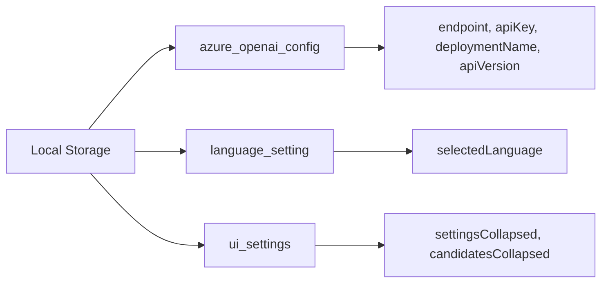

#### ストレージキー設計
| キー | データ型 | 用途 |
|------|----------|------|
| `azure_openai_config` | JSON Object | Azure OpenAI接続設定 |
| `language_setting` | String | 選択中の言語コード |
| `ui_settings` | JSON Object | UI状態（折り畳み等） |

### 2. セッションストレージ
| データ | スコープ | 永続化 |
|--------|----------|--------|
| **対話履歴** | セッション内 | なし |
| **PDFファイル** | セッション内 | なし |
| **質問候補** | セッション内 | なし |

## 🎨 UI/UX設計仕様

### 1. レスポンシブブレークポイント
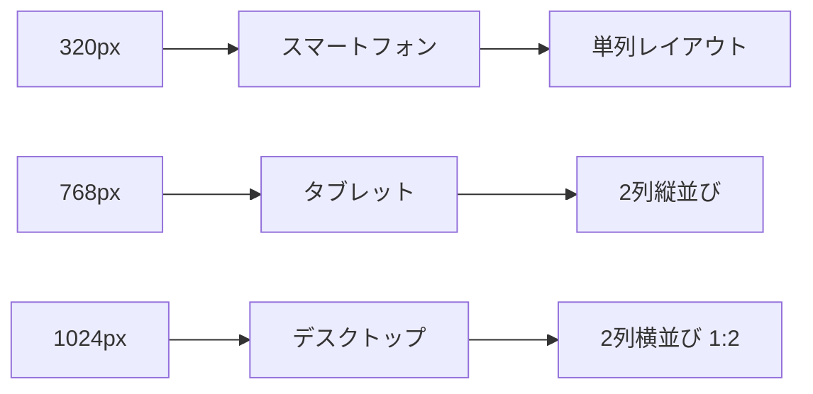

| デバイス | 画面幅 | レイアウト | PDF表示 | 対話表示 |
|----------|--------|-----------|---------|----------|
| **スマートフォン** | 320px-767px | 単列 | 100% | 100% |
| **タブレット** | 768px-1023px | 2列縦 | 100% | 100% |
| **デスクトップ** | 1024px以上 | 2列横 | 33% | 67% |

### 2. コンポーネント設計
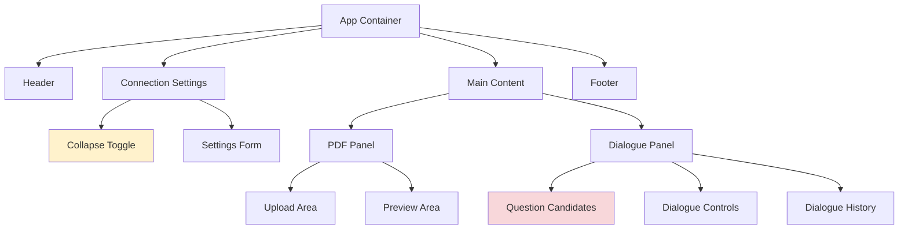

### 3. 状態遷移設計
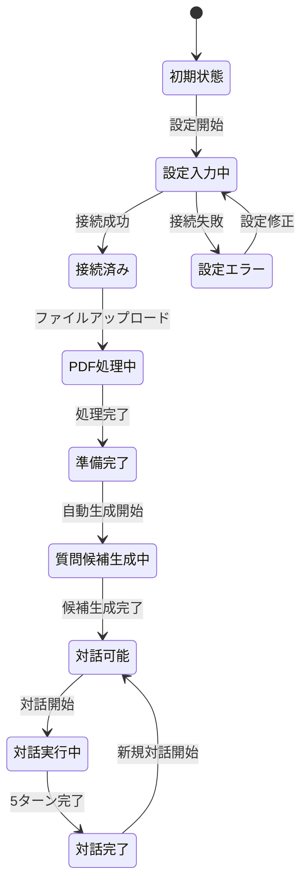

## 🔒 セキュリティ設計

### 1. 脅威モデル
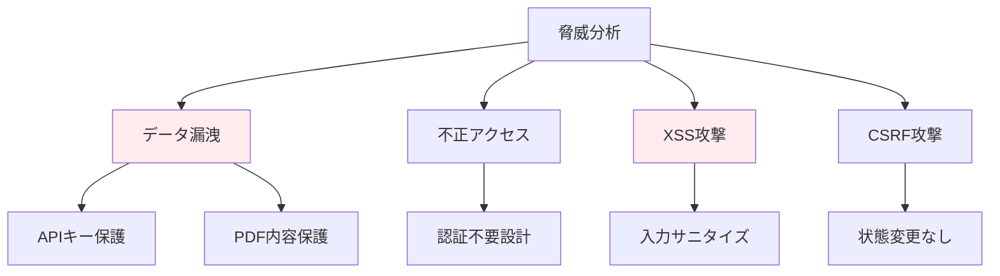

### 2. セキュリティ実装
| 領域 | 脅威 | 対策 | 実装状況 |
|------|------|------|----------|
| **認証** | 不正利用 | 認証なし設計 | ✅ パブリックアクセス |
| **API通信** | 盗聴 | HTTPS必須 | ✅ Azure OpenAI要件 |
| **データ保存** | 情報漏洩 | 最小限保存 | ✅ ローカルのみ |
| **入力処理** | XSS | サニタイズ | ✅ textContent使用 |

## ⚡ パフォーマンス設計

### 1. 最適化戦略
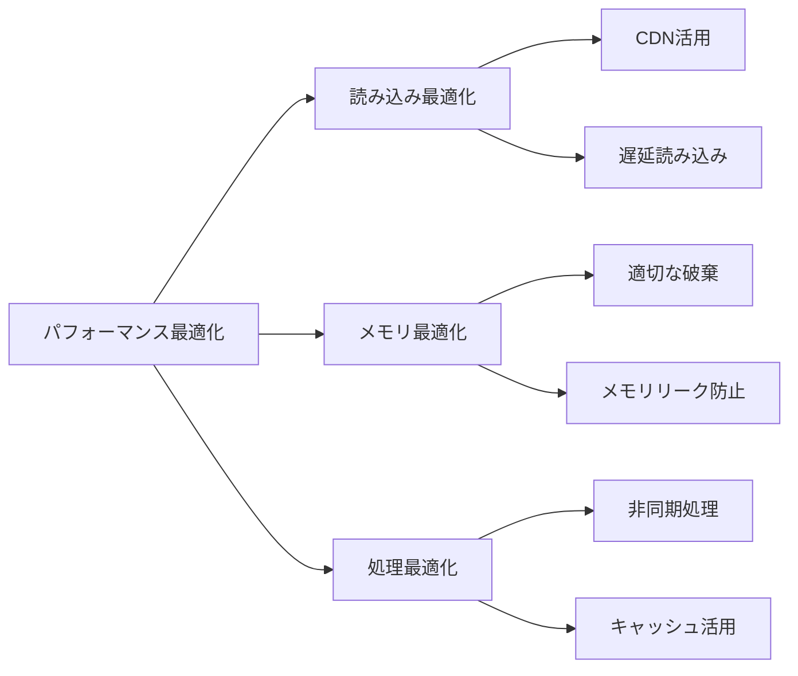

### 2. パフォーマンス指標
| 指標 | 目標値 | 測定方法 |
|------|--------|----------|
| **初期読み込み** | 3秒以下 | ページロード完了まで |
| **PDF処理** | 2秒以下 | ファイルアップロード〜プレビュー |
| **API応答** | 15秒以下 | リクエスト〜レスポンス |
| **メモリ使用量** | 500MB以下 | ブラウザDevTools |

## 🔧 拡張性設計

### 1. 拡張ポイント
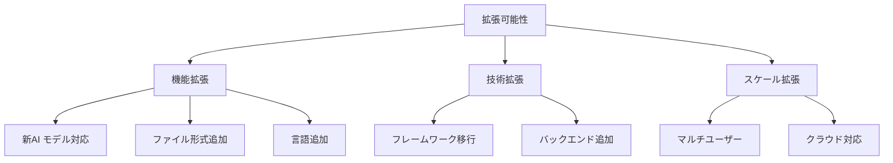

### 2. 拡張設計
| 拡張領域 | 現在設計 | 拡張方法 | 影響範囲 |
|----------|----------|----------|----------|
| **AI モデル** | Azure OpenAI専用 | プロバイダー抽象化 | API層のみ |
| **ファイル形式** | PDF のみ | 処理エンジン追加 | PDF処理層のみ |
| **言語** | 7言語対応 | 設定ファイル追加 | 言語設定のみ |
| **UI フレームワーク** | Vanilla JS | 段階的移行 | 全体 |

---

**文書バージョン**: 1.0  
**作成日**: 2025年7月31日  
**最終更新**: 2025年7月31日  
**承認者**: システムアーキテクト・開発チーム  
**次回レビュー**: 2025年10月31日