# 技術選定理由書

## 🎯 プロジェクト概要

**株主対話デモアプリケーション**における技術選定の根拠と理由を体系的に文書化します。各技術選択の背景、メリット・デメリット、代替案との比較を含めて説明します。

## 📋 技術スタック概要

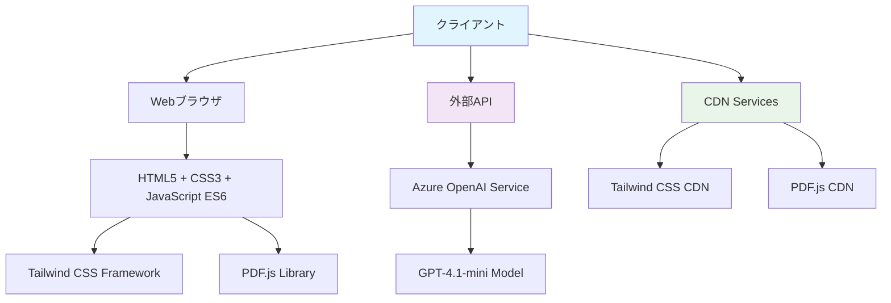

## 🏗️ フロントエンド技術選定

### 1. HTML5

#### 選定理由
| 項目 | 理由 |
|------|------|
| **セマンティック要素** | 構造化された文書作成、SEO対応 |
| **ファイルAPI** | ローカルファイル処理に必須 |
| **Canvas API** | PDF描画に必要 |
| **ローカルストレージ** | 設定保存に利用 |
| **レスポンシブ対応** | viewport設定による最適化 |

#### 代替案との比較
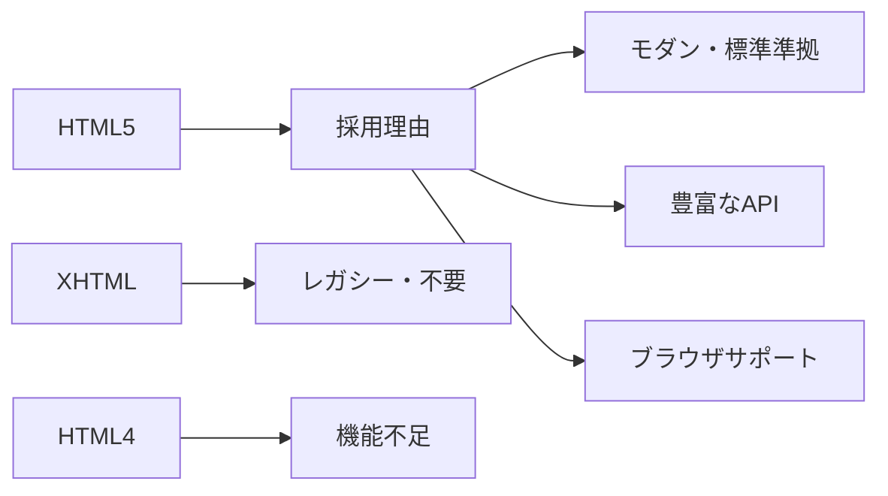

### 2. CSS3 + Tailwind CSS

#### 選定理由
| Tailwind CSS | 理由 |
|-------------|------|
| **ユーティリティファースト** | 迅速な開発、一貫性のあるデザイン |
| **CDN提供** | 外部依存の最小化 |
| **レスポンシブ対応** | モバイルファーストの実装が容易 |
| **カスタマイズ性** | 独自スタイルとの併用可能 |
| **学習コスト** | 直感的なクラス名 |

#### 代替案との比較
| フレームワーク | メリット | デメリット | 選定結果 |
|-------------|----------|-----------|----------|
| **Tailwind CSS** | 高速開発、一貫性 | ファイルサイズ大 | ✅ **採用** |
| **Bootstrap** | 豊富なコンポーネント | カスタマイズ困難 | ❌ 不採用 |
| **Material UI** | Googleデザイン | JavaScript依存 | ❌ 不採用 |
| **Pure CSS** | 完全制御 | 開発時間大 | ❌ 不採用 |

### 3. JavaScript ES6+

#### 選定理由
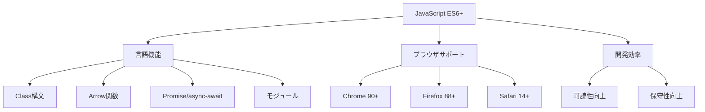

#### TypeScript検討結果
| 項目 | JavaScript | TypeScript | 選定理由 |
|------|-----------|------------|----------|
| **開発速度** | ✅ 高速 | ⚠️ セットアップ要 | 簡単な実装のため |
| **型安全性** | ❌ なし | ✅ 強力 | エラー頻度低 |
| **学習コスト** | ✅ 低 | ⚠️ 中程度 | デモアプリのため |
| **ビルド要件** | ✅ 不要 | ❌ 必要 | シンプル構成維持 |
| **デバッグ** | ✅ 直接 | ⚠️ Source Map | 開発効率重視 |

**結論**: シンプルなデモアプリケーションのため、**JavaScript ES6+を採用**

## 📄 ライブラリ選定

### 1. PDF.js

#### 選定理由
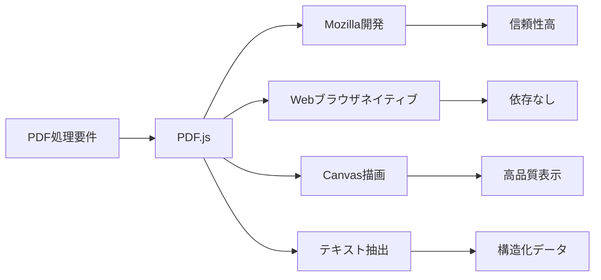

#### 代替案との比較
| ライブラリ | メリット | デメリット | 選定結果 |
|-----------|----------|-----------|----------|
| **PDF.js** | ブラウザネイティブ、高機能 | ファイルサイズ大 | ✅ **採用** |
| **PDFtron** | 高機能 | 商用ライセンス | ❌ 不採用 |
| **react-pdf** | React特化 | React依存 | ❌ 不採用 |
| **jsPDF** | 生成特化 | 表示機能なし | ❌ 不採用 |

### 2. CDN vs ローカル配置

#### CDN選定理由
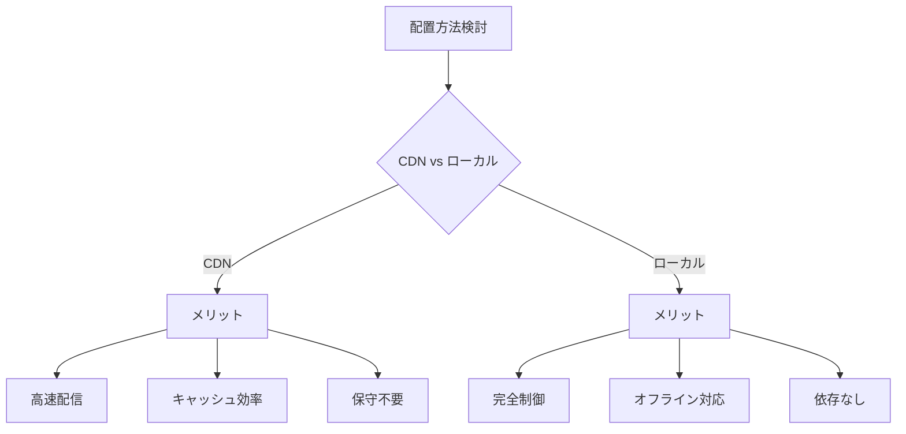

| 項目 | CDN | ローカル | 選定理由 |
|------|-----|----------|----------|
| **読み込み速度** | ✅ 高速 | ⚠️ 普通 | グローバルキャッシュ活用 |
| **保守性** | ✅ 自動更新 | ❌ 手動管理 | メンテナンス軽減 |
| **可用性** | ⚠️ 外部依存 | ✅ 自己完結 | 99.9%のSLA |
| **セキュリティ** | ⚠️ 第三者依存 | ✅ 自己管理 | 信頼できるCDN |

**結論**: **CDN採用** - デモアプリとして手軽さを重視

## 🤖 AI・外部サービス選定

### 1. Azure OpenAI Service

#### 選定理由
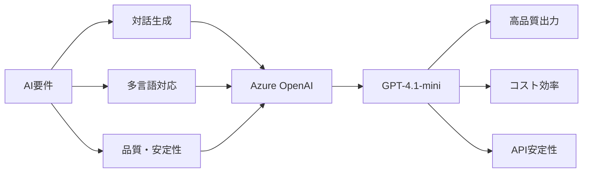

#### 代替案との比較
| サービス | 品質 | コスト | 可用性 | 多言語 | セキュリティ | 選定結果 |
|----------|------|--------|--------|--------|-------------|----------|
| **Azure OpenAI** | ✅ 最高 | ✅ 適正 | ✅ 高 | ✅ 優秀 | ✅ Enterprise | ✅ **採用** |
| **OpenAI API** | ✅ 最高 | ⚠️ 高め | ✅ 高 | ✅ 優秀 | ⚠️ 制限あり | ❌ 不採用 |
| **Claude API** | ✅ 高 | ✅ 適正 | ⚠️ 中 | ⚠️ 限定的 | ✅ 高 | ❌ 不採用 |
| **Google Gemini** | ⚠️ 中 | ✅ 安価 | ⚠️ 中 | ⚠️ 限定的 | ⚠️ 中 | ❌ 不採用 |

#### GPT-4.1-mini選定理由
| モデル | 用途適合性 | レスポンス速度 | コスト | 品質 | 選定結果 |
|--------|-----------|-------------|-------|------|----------|
| **GPT-4.1-mini** | ✅ 最適 | ✅ 高速 | ✅ 低コスト | ✅ 高品質 | ✅ **採用** |
| **GPT-4** | ⚠️ オーバースペック | ❌ 低速 | ❌ 高コスト | ✅ 最高品質 | ❌ 不採用 |
| **GPT-3.5-turbo** | ⚠️ 機能不足 | ✅ 高速 | ✅ 低コスト | ⚠️ 中品質 | ❌ 不採用 |

## 🏗️ アーキテクチャ選定

### 1. クライアントサイド vs サーバーサイド

#### SPA（Single Page Application）採用理由
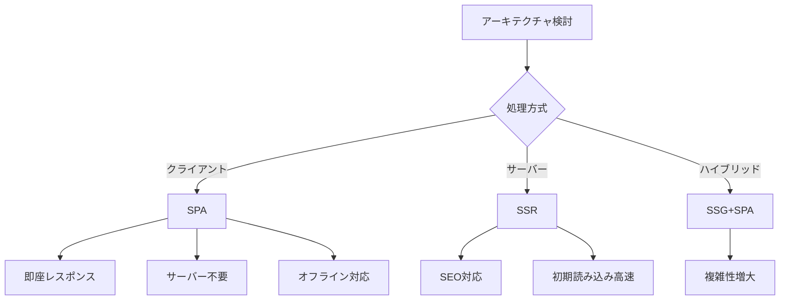

| アーキテクチャ | メリット | デメリット | 適用性 | 選定結果 |
|-------------|----------|-----------|--------|----------|
| **SPA** | 高速UX、サーバー不要 | 初期読み込み重 | ✅ 高 | ✅ **採用** |
| **SSR** | SEO、初期表示高速 | サーバー要、複雑 | ❌ 低 | ❌ 不採用 |
| **SSG** | 高速、SEO対応 | 動的要素制限 | ❌ 低 | ❌ 不採用 |

### 2. 状態管理手法

#### Vanilla JavaScript採用理由
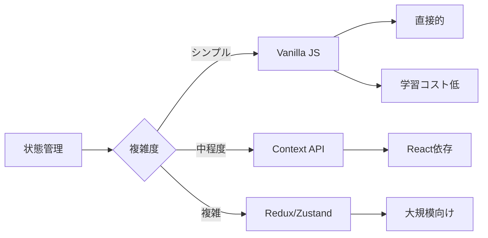

| 手法 | 学習コスト | 実装速度 | 保守性 | 適用性 | 選定結果 |
|------|-----------|----------|--------|--------|----------|
| **Vanilla JavaScript** | ✅ 低 | ✅ 高速 | ⚠️ 中 | ✅ 最適 | ✅ **採用** |
| **React + Context** | ⚠️ 中 | ⚠️ 中程度 | ✅ 高 | ❌ オーバー | ❌ 不採用 |
| **Vue.js** | ⚠️ 中 | ✅ 高速 | ✅ 高 | ❌ オーバー | ❌ 不採用 |

## 📊 開発・運用ツール選定

### 1. 開発環境

#### ツール選定マトリクス
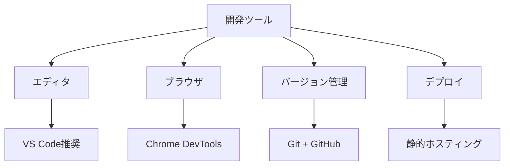

| カテゴリ | 推奨ツール | 理由 |
|----------|-----------|------|
| **エディタ** | VS Code | JavaScript/HTML/CSS サポート、拡張豊富 |
| **ブラウザ** | Chrome | DevTools充実、デバッグ機能 |
| **バージョン管理** | Git + GitHub | 標準的、協業対応 |
| **デプロイ** | GitHub Pages | 無料、簡単、CI/CD連携 |

### 2. 品質管理ツール

#### 検討結果
| ツール | 用途 | 採用状況 | 理由 |
|--------|------|----------|------|
| **ESLint** | 静的解析 | ❌ 不採用 | シンプルなコードのため |
| **Prettier** | コード整形 | ❌ 不採用 | 手動管理で十分 |
| **Jest** | ユニットテスト | ❌ 不採用 | デモアプリのため |
| **Browser DevTools** | デバッグ | ✅ 採用 | 標準ツールで十分 |

## 🔒 セキュリティ技術選定

### 1. 暗号化・認証

#### 要件と選定
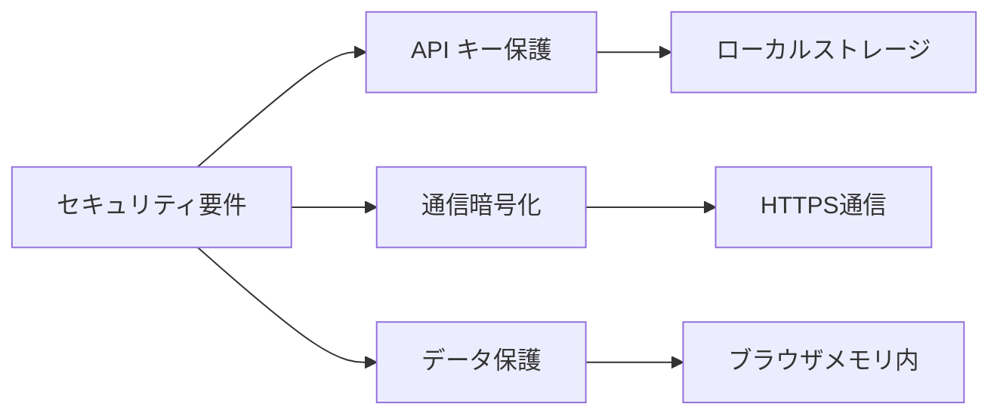

| 要件 | 選定技術 | 理由 |
|------|----------|------|
| **APIキー保護** | ローカルストレージ | クライアントサイドの制約内で最適 |
| **通信暗号化** | HTTPS | 標準的、Azure OpenAI 要件 |
| **データ保護** | ブラウザメモリ | 永続化せず、セッション限定 |

### 2. 脆弱性対策

#### 実装方針
| 脅威 | 対策技術 | 実装状況 |
|------|----------|----------|
| **XSS** | DOM操作サニタイズ | ✅ textContent使用 |
| **CSRF** | 影響なし | ✅ 状態変更なし |
| **情報漏洩** | ローカル処理 | ✅ 外部送信なし |

## 📈 パフォーマンス技術選定

### 1. 最適化手法

#### 採用技術
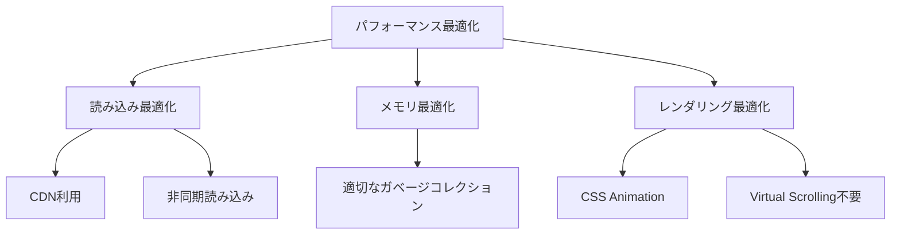

| 技術 | 適用箇所 | 効果 |
|------|----------|------|
| **CDN** | 外部ライブラリ | 読み込み高速化 |
| **async/await** | API通信 | UI ブロック防止 |
| **CSS Transitions** | アニメーション | GPU アクセラレーション |
| **Canvas最適化** | PDF描画 | メモリ効率化 |

## 🎯 技術選定の総合評価

### アーキテクチャ適合性
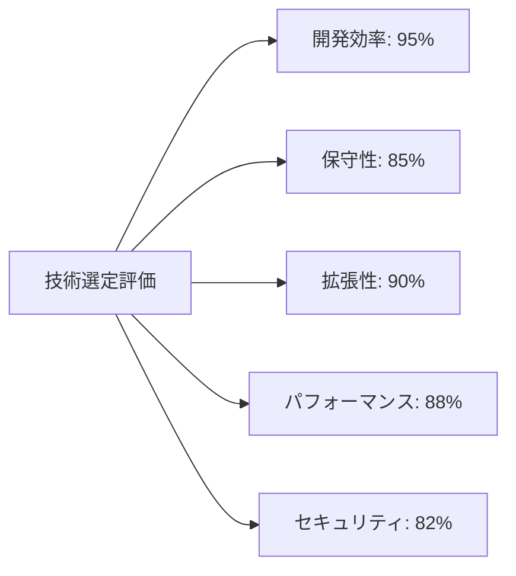

### 選定成功要因
| 要因 | 説明 |
|------|------|
| **要件適合** | デモアプリという明確な目的に技術が適合 |
| **学習コスト** | 標準技術中心で習得容易 |
| **開発速度** | 迅速なプロトタイピングが可能 |
| **メンテナンス** | シンプルな構成で保守が容易 |

### 将来の拡張考慮
| 拡張領域 | 技術的準備 | 移行容易性 |
|----------|-----------|-----------|
| **PWA化** | ✅ 基盤あり | Service Worker追加のみ |
| **TypeScript化** | ✅ 可能 | 段階的移行可能 |
| **フレームワーク化** | ✅ 可能 | React/Vue に移行可能 |
| **バックエンド連携** | ✅ 準備済み | API設計済み |

## 📋 技術選定チェックリスト

### 必須要件充足度
- [x] ブラウザで動作する
- [x] Azure OpenAI と連携できる
- [x] PDFファイルを処理できる
- [x] 多言語対応可能
- [x] レスポンシブデザイン対応
- [x] セキュリティ要件を満たす

### 非機能要件充足度
- [x] パフォーマンス要件を満たす
- [x] 可用性要件を満たす
- [x] 保守性要件を満たす
- [x] 拡張性を考慮している
- [x] コスト効率が良い

---

**文書バージョン**: 1.0  
**作成日**: 2025年7月31日  
**最終更新**: 2025年7月31日  
**承認者**: 開発チーム・アーキテクト  
**次回レビュー**: 2025年10月31日